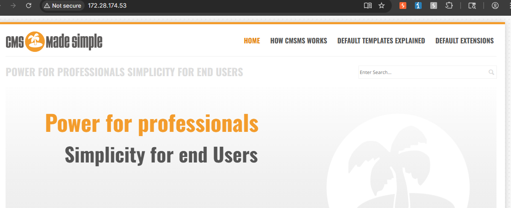
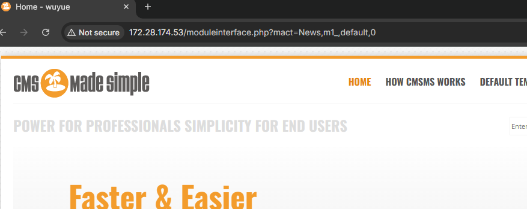
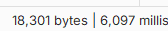
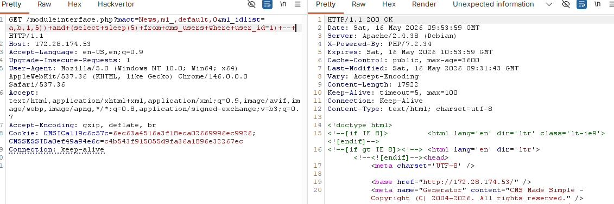

# CVE-2019-9053 - CMS Made Simple 未授权时间盲注复现

## 1. 漏洞概述

CVE-2019-9053 是 CMS Made Simple（CMSMS）中的一个未授权时间盲注漏洞。漏洞位于 **News 模块**，攻击者可以通过构造 URL 修改 `m1_idlist` 参数，使后端 SQL 查询执行条件性延迟，从而通过响应时间差异推断数据库内容。NVD 对该漏洞的描述是：CMS Made Simple 2.2.8 的 News 模块可通过 crafted URL 在 `m1_idlist` 参数处触发 unauthenticated blind time-based SQL injection，CVSS 3.0 评分为 8.1，高危。

该漏洞属于典型的 **时间型盲注 SQL Injection**。它不是回显型注入，页面不会直接返回查询结果；验证重点在于对比正常请求与注入请求的响应时间差异。

---

## 2. 影响版本与利用条件

不同来源对影响范围的描述略有差异：NVD 明确提到 CMS Made Simple 2.2.8；Exploit-DB PoC 标注影响 `<= 2.2.9`；Vulhub 环境标题为 `CMSMS < 2.2.10 Unauthenticated SQL Injection`，并提供 2.2.9.1 环境用于复现。官方 2.2.10 发布说明中提到修复了 News 模块中的 SQL 注入漏洞，因此复现文档以 Vulhub 环境和官方 2.2.10 修复说明为准。

| 条件     | 说明                                                                              |
| ------ | ------------------------------------------------------------------------------- |
| 组件条件   | CMS Made Simple / CMSMS                                                         |
| 漏洞模块   | News 模块                                                                         |
| 影响版本   | NVD 确认 2.2.8；公开 PoC 常标注 `<= 2.2.9`；Vulhub 使用 `< 2.2.10` 场景                      |
| 修复版本   | 官方 v2.2.10 发布说明提到修复 News 模块 SQL 注入                                              |
| 权限条件   | 未授权，不需要后台登录                                                                     |
| 触发参数   | `m1_idlist`                                                                     |
| 注入类型   | 时间型盲注                                                                           |
| RCE 条件 | 本漏洞本身不是 RCE；Vulhub README 提到结合后续认证后 SSTI CVE-2021-26120 可能进一步导致代码执行，但这不属于本次复现范围 |

---

## 3. 漏洞原理

该漏洞的核心触发点是 News 模块接口中的 `m1_idlist` 参数。用户可控的 `m1_idlist` 被后端用于构造 SQL 查询时，没有被安全地参数化处理，导致攻击者可以插入 SQL 片段。

由于该漏洞属于时间型盲注，数据库查询结果不会直接显示在页面中。攻击者通过构造条件表达式，让条件成立时数据库执行 `sleep()` 延迟函数；再通过 HTTP 响应时间判断条件是否为真。Exploit-DB 公开 PoC 中也体现了这种思路：对 `cms_siteprefs`、`cms_users` 等表进行条件匹配，并在条件满足时调用 `sleep(TIME)`，再根据响应耗时逐字符推断 salt、用户名、邮箱和密码哈希。

理解链路如下：

```
m1_idlist 参数可控
  ↓
News 模块处理该参数
  ↓
参数进入 SQL 查询构造
  ↓
注入条件性 sleep() 表达式
  ↓
响应时间发生稳定差异
  ↓
通过时间侧信道推断数据库内容
```

该漏洞的本质不是 `sleep()` 函数本身危险，而是后端没有把用户输入限制为纯数据，导致输入被数据库解释成 SQL 语法。

---

## 4. Vulhub 环境启动

进入 Vulhub 对应目录：

```
cd vulhub/cmsms/CVE-2019-9053
docker compose up -d
```

Vulhub README 说明，环境启动后需要访问安装页面完成 CMSMS 初始化，数据库连接信息为：数据库地址 `db`，数据库名 `cmsms`，用户名和密码均为 `root`。

浏览器访问：

```
http://127.0.0.1/install.php
```

如果本机 80 端口被占用，以 `docker compose ps` 中显示的端口映射为准。

安装时按页面提示完成初始化即可。这里不展开 Docker 和 CMSMS 安装教程，复现重点是漏洞入口和时间盲注验证。

---

## 5. 浏览器确认基础功能

环境启动并安装完成后，用浏览器完成以下确认：

| 验证项       | 预期现象                                               |
| --------- | -------------------------------------------------- |
| 访问首页      | CMS Made Simple 首页正常显示                             |
| 访问安装页     | 安装前可访问 `install.php`                               |
| 完成安装      | 页面跳转到 CMSMS 站点或后台登录相关页面                            |
| News 模块接口 | `moduleinterface.php?mact=News,m1_,default,0` 可被访问 |
| 未登录状态     | 不需要登录后台即可访问 News 模块相关接口                            |

该漏洞是未授权注入，后台登录不是复现前提。浏览器在这里主要用于确认服务正常、CMSMS 已初始化、站点页面可访问。


网站首页



未登录状态访问News模块接口



---

## 6. 使用 Burp 触发漏洞

本漏洞是普通 HTTP GET 参数触发，可以使用浏览器访问并通过 Burp Repeater 修改关键参数。这里不展示完整 HTTP 报文，只保留关键路径和关键参数。

正常访问路径：

```
/moduleinterface.php?mact=News,m1_,default,0
```

关键注入参数：

```
m1_idlist
```

可以先发送一个不带延迟的普通请求，记录响应时间作为基线。随后在 Burp 中修改 `m1_idlist` 参数，使其包含条件性延迟表达式。用于本地靶场验证的最小化样例：

```
m1_idlist=a,b,1,5))+and+(select+sleep(5)+from+cms_users+where+user_id=1)+--+
```

对应请求路径片段：

```
/moduleinterface.php?mact=News,m1_,default,0&m1_idlist=a,b,1,5))+and+(select+sleep(5)+from+cms_users+where+user_id=1)+--+
```



请求回显时间5s多，把sleep(5)改为0即可进行对照。



这个样例只用于证明 SQL 表达式被执行：如果 `cms_users` 中存在 `user_id=1` 的用户，数据库会执行 `sleep(5)`，HTTP 响应时间会明显增加。公开 PoC 中也使用类似结构：在 `m1_idlist` 中拼接 `select sleep(TIME)`，并根据耗时判断条件是否成立。

**注意点：**

- 这是时间型盲注，不应期待页面直接显示数据库内容；
- 判断依据是响应耗时，而不是页面是否出现明显回显；
- 延迟时间建议设置为 3-5 秒，避免网络波动造成误判；
- 在 Burp Repeater 中至少对比一次正常请求和一次延迟请求；

### 脚本复现

也可使用官方提供的脚本文件进行验证：

[CMS Made Simple &lt; 2.2.10 - SQL Injection - PHP webapps Exploit](https://www.exploit-db.com/exploits/46635)

```bash
python2 poc.py -u http://127.0.0.1
```


---

## 7. 浏览器验证漏洞结果

该漏洞无法像回显型 SQL 注入那样直接在浏览器中看到查询结果。验证结果主要来自 Burp 的响应时间对比。

```
正常请求：
/moduleinterface.php?mact=News,m1_,default,0

延迟请求：
/moduleinterface.php?mact=News,m1_,default,0&m1_idlist=...sleep(5)...
```

预期现象：

| 请求类型  | 预期表现           |
| ----- | -------------- |
| 正常请求  | 响应时间接近普通页面请求   |
| 延迟请求  | 响应时间稳定增加约 5 秒  |
| 多次对照  | 延迟请求持续明显慢于正常请求 |
| 条件不成立 | 不触发延迟或延迟不明显    |

预期结果是可以通过时间盲注逐步推断管理员账号相关信息。

---

## 8. 结果判断

| 现象                | 含义                                 |
| ----------------- | ---------------------------------- |
| 首页无法访问            | CMSMS 未启动、端口映射错误或安装未完成             |
| `install.php` 可访问 | 环境已启动但 CMSMS 可能尚未初始化               |
| News 模块接口可访问      | 漏洞入口具备基础访问条件                       |
| 普通请求响应正常          | 基线请求成立                             |
| 注入请求稳定延迟          | 时间盲注成立的核心证据                        |
| 注入请求无延迟           | 可能参数未进入 SQL、数据库函数未执行、条件不成立或环境版本不匹配 |
| 页面无数据库内容回显        | 符合时间盲注特征，不代表漏洞失败                   |
| PoC 能推断用户信息       | 说明时间侧信道可被自动化利用                     |

时间盲注的判断不能只看单次请求。更可靠的做法是重复发送正常请求和延迟请求，观察两者耗时是否稳定分离。

---

## 9. 修复建议

官方 CMS Made Simple v2.2.10 发布说明明确指出，该版本修复了默认动作中的 SQL 注入漏洞，并特别提到 News 模块相关安全问题，因此优先建议升级到 2.2.10 或更高版本。

修复建议如下：

| 防护项      | 建议                                   |
| -------- | ------------------------------------ |
| 版本升级     | 升级到 CMS Made Simple 2.2.10 或更高版本     |
| SQL 构造   | 对用户输入使用参数化查询，避免字符串拼接                 |
| 参数校验     | `m1_idlist` 这类 ID 列表参数应限制为数字、逗号和预期格式 |
| 模块加固     | 关闭不必要的 News 模块接口或限制访问范围              |
| 权限控制     | 数据库账号最小权限，不使用高权限账号运行业务               |
| 错误与时间侧信道 | 统一错误处理，减少数据库异常和延迟被外部观察的机会            |
| 纵深防护     | WAF 和日志监控可作为辅助，但不能替代代码修复             |

---

## 10. 复现总结

CVE-2019-9053 的触发入口是 CMS Made Simple News 模块的 `m1_idlist` 参数。该参数在未授权场景下可控，并进入后端 SQL 查询构造，导致攻击者可以通过条件性 `sleep()` 形成时间侧信道。

复现成功的关键不在于页面是否回显数据，而在于 **正常请求与注入请求之间是否存在稳定响应时间差异**。如果延迟请求多次稳定慢于基线请求，可以证明 SQL 表达式被数据库执行。


