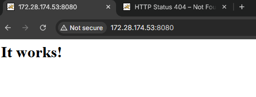
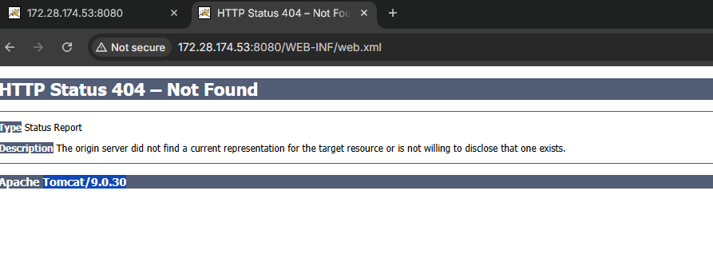
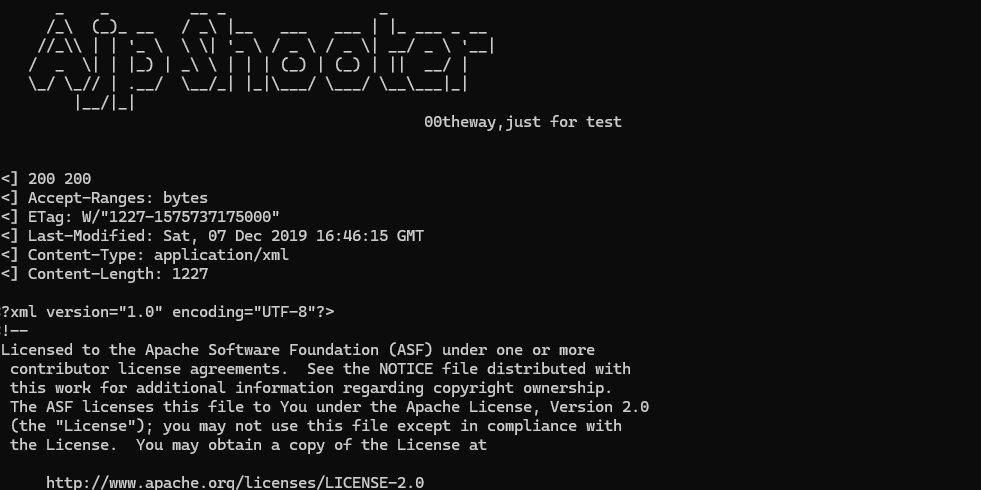

# CVE-2020-1938 - Apache Tomcat AJP 文件包含漏洞复现

## 1. 漏洞概述

CVE-2020-1938 又称 Ghostcat，是 Apache Tomcat AJP Connector 相关的文件读取 / 文件包含漏洞。漏洞的核心在于 Tomcat 对 AJP 连接的信任程度高于普通 HTTP 连接，且早期版本默认启用 AJP Connector 并监听所有地址。如果攻击者可以访问 AJP 端口，就可能通过 AJP 交互影响 Tomcat 内部请求属性，从而读取 Web 应用目录内的任意文件，或让任意文件按 JSP 方式处理。Apache Tomcat 官方将其描述为 **AJP Request Injection and potential Remote Code Execution**，并在 Tomcat 9.0.31 中修复。

NVD 对该漏洞的描述也指出，该机制可返回 Web 应用中的任意文件，并可将 Web 应用中的任意文件作为 JSP 处理；如果应用允许上传并把文件保存到 Web 应用目录内，则可能进一步形成远程代码执行。

CNVD 将该漏洞收录为 **CNVD-2020-10487**，危害级别为高，影响产品为 Apache Tomcat 服务器。

---

## 2. 影响范围与利用条件

该漏洞主要影响以下版本：

| 分支       | 受影响版本             | 修复版本        |
| -------- | ----------------- | ----------- |
| Tomcat 7 | 7.0.0 - 7.0.99    | 7.0.100 及以上 |
| Tomcat 8 | 8.5.0 - 8.5.50    | 8.5.51 及以上  |
| Tomcat 9 | 9.0.0.M1 - 9.0.30 | 9.0.31 及以上  |

Apache 官方页面明确记录 Tomcat 9.0.31 修复了 CVE-2020-1938，并说明 Tomcat 9.0.31 对默认 AJP Connector 配置做了加固。

漏洞成立依赖以下条件：

| 条件                | 说明                          |
| ----------------- | --------------------------- |
| AJP 端口可访问         | 默认端口通常为 8009                |
| 使用受影响版本           | 如 Vulhub 环境中的 Tomcat 9.0.30 |
| AJP 未正确限制来源       | 8009 暴露给不可信访问方              |
| 未配置有效 secret      | AJP 缺少认证限制                  |
| 目标文件位于 webapp 目录内 | 该漏洞主要读取 / 包含 Web 应用目录下文件    |
| RCE 需要额外条件        | 需要可控文件内容，例如上传文件落入 Web 应用目录  |

Tomcat 官方 AJP Connector 文档也强调，AJP 允许比 HTTP Connector 更直接地操作 Tomcat 内部数据结构，因此需要特别关注 `address`、`secret`、`secretRequired` 和 `allowedRequestAttributesPattern` 等配置。

---

## 3. 漏洞原理

Tomcat 中常见的连接器有两类：HTTP Connector 和 AJP Connector。

HTTP Connector 通常对外提供 Web 服务，例如访问：

```
http://127.0.0.1:8080
```

AJP Connector 则用于 Tomcat 与前置 Web 服务器之间通信，例如 Apache HTTPD 通过 AJP 将动态请求转发给 Tomcat。AJP 不是普通 HTTP，而是二进制协议。

该漏洞的关键点在于：Tomcat 处理 AJP 交互时，会将 AJP 中携带的部分内容转换为内部 `request` 对象的 Attribute。根据你提供的分析材料，利用点集中在以下属性：

```
javax.servlet.include.request_uri
javax.servlet.include.path_info
javax.servlet.include.servlet_path
```

这些属性原本用于 Servlet 内部转发、包含和路径映射。攻击者如果能通过 AJP 控制这些属性，就可能影响 Tomcat 后续的 Servlet 分发逻辑。

漏洞利用大致分为两类：

### 3.1 通过 DefaultServlet 读取文件

当访问路径没有匹配到其他 Servlet 时，Tomcat 可能交给 DefaultServlet 处理。DefaultServlet 会根据资源路径读取 Web 应用目录中的静态文件。

如果 AJP 中的 include 属性被构造为敏感路径，DefaultServlet 可能读取到正常 HTTP 无法直接访问的文件，例如：

```
/WEB-INF/web.xml
```

`WEB-INF` 默认不能被浏览器直接访问，但它仍然位于 Web 应用目录内。如果 DefaultServlet 在错误上下文中读取该路径，就会造成信息泄露。

### 3.2 通过 JspServlet 文件包含

如果路径映射到 JspServlet，Tomcat 可能将目标文件按 JSP 处理。NVD 对该漏洞的描述中也明确提到，该机制允许处理 Web 应用中的任意文件为 JSP。

因此，如果目标 Web 应用存在上传功能，并且攻击者能把可控内容保存到 Web 应用目录内，就可能先上传可控内容，再通过 AJP 文件包含触发 JSP 解析，从而扩大到远程代码执行。

这一点要写清楚：**Ghostcat 本身不是无条件 RCE。RCE 依赖可控文件内容、文件落点和 JSP 处理链。**

---

## 4. Vulhub 环境启动

进入 Vulhub 对应目录：

```
cd vulhub/tomcat/CVE-2020-1938
```

启动环境：

```
docker compose up -d
```

Vulhub 官方说明该环境会启动一个 Tomcat 9.0.30，浏览器访问 `http://your-ip:8080` 可以看到 Tomcat 示例页面，同时 AJP 端口 8009 会处于监听状态。

浏览器访问：

```
http://127.0.0.1:8080
```

正常情况下可以看到 Tomcat 默认页面。这个步骤只用于确认 HTTP 服务正常运行。



---

## 5. 浏览器与 Burp 辅助确认

浏览器配置 Burp 代理后，访问：

```
http://127.0.0.1:8080
```

在 Burp 中可以看到浏览器对 8080 端口的正常访问记录。这里的作用是确认：

```
Tomcat HTTP 服务正常
目标 Web 应用可访问
浏览器访问链路可记录
```

但这一步不能证明 CVE-2020-1938 是否存在。原因是漏洞触发点在 AJP 8009，而不是 HTTP 8080。

也就是说：

| 访问方式          | 作用               |
| ------------- | ---------------- |
| 浏览器访问 8080    | 验证 Tomcat 页面是否正常 |
| Burp 代理浏览器    | 辅助记录 HTTP 页面访问   |
| AJP 工具访问 8009 | 真正验证 Ghostcat 漏洞 |

---

## 6. AJP 文件读取验证

Vulhub 官方页面给出的验证方式是使用 AJP 相关工具，例如长亭 xray 或 `CNVD-2020-10487-Tomcat-Ajp-lfi` 这类专用工具。

在本地靶场中，验证目标可以选择：

```
/WEB-INF/web.xml
```

这个文件适合作为验证目标，因为它属于 Web 应用目录内的配置文件，正常情况下浏览器不能直接读取。

浏览器直接访问：

```
http://127.0.0.1:8080/WEB-INF/web.xml
```



正常情况下应被拒绝或无法访问。

然后使用 AJP 工具连接：

```
目标地址：127.0.0.1
AJP 端口：8009
目标文件：/WEB-INF/web.xml
```

如果漏洞存在，工具输出中会出现 `web.xml` 的 XML 内容，例如 Servlet、Filter、Welcome File 等配置内容。这里的判断依据是：**通过 AJP 读取到了浏览器无法直接访问的 Web 应用内部文件**。



结果判断：

| 现象                  | 含义                     |
| ------------------- | ---------------------- |
| 输出 `web.xml` 内容     | 文件读取成功                 |
| 连接 8009 失败          | AJP 端口未开放或未映射          |
| 提示 secret 相关错误      | AJP 配置了认证限制或版本已修复      |
| 只能访问 8080，无法访问 8009 | HTTP 正常，但 AJP 验证无法进行   |
| 读取路径无结果             | 目标文件不存在或路径不在 Web 应用目录内 |

---

## 7. 文件包含与 RCE 条件说明

Ghostcat 的危害不止文件读取。根据 NVD 描述，它还可能将 Web 应用中的任意文件作为 JSP 处理；如果 Web 应用允许文件上传，并将上传文件保存在 Web 应用目录内，攻击者可能结合 JSP 处理能力形成远程代码执行。

但是在复现文档中要区分：

```
文件读取：核心漏洞能力
文件包含：进一步影响 Servlet/JSP 处理逻辑
RCE：依赖上传点、文件内容可控、文件保存位置、JSP 解析链
```

不要直接写成“Ghostcat 必然 RCE”。准确说法是：

> CVE-2020-1938 可导致 Web 应用目录内任意文件读取和文件包含；在目标应用存在可控文件写入或上传落点的情况下，可能进一步导致远程代码执行。

Vulhub 官方描述也是类似逻辑：AJP 协议缺陷允许读取或包含 Tomcat webapp 目录下文件；如果目标 Web 应用存在上传功能，配合文件包含可能执行恶意代码。

---

# 8. 修复建议

### 8.1 升级 Tomcat

优先升级到修复版本：

```
Tomcat 7.0.100+
Tomcat 8.5.51+
Tomcat 9.0.31+
```

Apache 官方记录 CVE-2020-1938 在 Tomcat 9.0.31 中修复，并说明 9.0.31 对默认 AJP Connector 配置做了加固。

### 8.2 禁用 AJP Connector

如果业务不需要 AJP，直接在 `conf/server.xml` 中注释 AJP Connector：

```
<!--
<Connector port="8009" protocol="AJP/1.3" redirectPort="8443" />
-->
```

这是最直接的缓解方式。

### 8.3 限制 AJP 监听地址

如果必须使用 AJP，应限制其只监听本地或可信内网地址：

```
<Connector protocol="AJP/1.3"
           address="127.0.0.1"
           port="8009"
           redirectPort="8443" />
```

AJP 本身通常用于前置服务器与 Tomcat 之间通信，不应该暴露给公网或不可信网络。

### 8.4 配置 secret 与访问来源

修复版本后，如果继续使用 AJP，应配置 `secretRequired` 与 `secret`，并限制允许的来源。Tomcat 官方 AJP 文档也强调需要特别关注 `address`、`secret`、`secretRequired` 和 `allowedRequestAttributesPattern` 等属性。

示例：

```
<Connector protocol="AJP/1.3"           address="127.0.0.1"           port="8009"           secretRequired="true"           secret="change_me_to_a_strong_secret"           redirectPort="8443" />
```

## 9. 复现总结

CVE-2020-1938 的关键不在 HTTP 页面，而在 Tomcat AJP Connector 对内部请求属性的信任和处理。攻击者如果能够访问 AJP 8009 端口，就可能通过控制 include 相关属性读取 Web 应用目录中的敏感文件，例如 `/WEB-INF/web.xml`。在存在文件上传或其他可控文件写入能力时，该漏洞还可能进一步发展为文件包含到远程代码执行。
