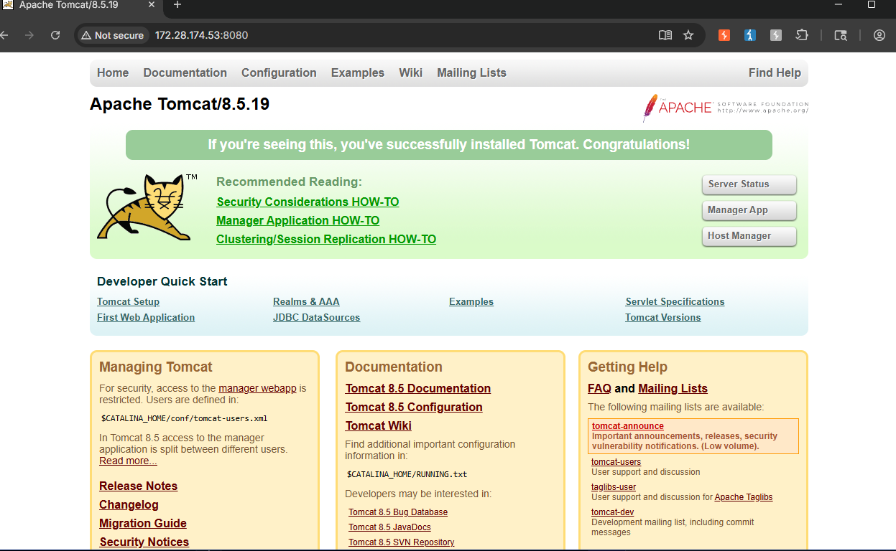
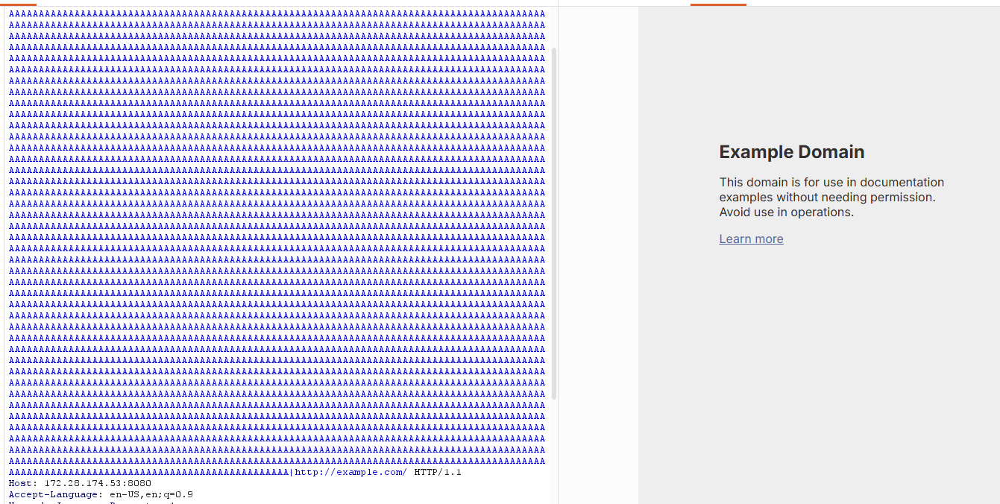

# CVE-2021-40438 - Apache HTTP Server 2.4.48 mod_proxy SSRF 漏洞复现

## 1. 漏洞概述

CVE-2021-40438 是 Apache HTTP Server `mod_proxy` 模块中的 SSRF 漏洞。漏洞触发点位于请求 URI path 的解析和代理转发逻辑中，攻击者可以构造特殊请求路径，使启用了 `mod_proxy` 的 Apache HTTP Server 将请求转发到攻击者指定的 origin server。NVD 和 Apache 官方均将该问题描述为：构造的 request uri-path 可以导致 `mod_proxy` 将请求转发到远程用户选择的源服务器，影响 Apache HTTP Server 2.4.48 及以前版本。

该漏洞属于**代理转发型 SSRF**。它不是普通业务参数中的 `url=` SSRF，而是发生在 Apache HTTP Server 反向代理模块处理请求路径时。Vulhub 官方环境中，Apache 作为前端反向代理，后端是 Tomcat，二者通过 AJP 协议通信；漏洞复现的核心是让 Apache 代理逻辑脱离预期后端，转而访问指定外部目标。

---

## 2. 影响版本与利用条件

| 条件     | 说明                                             |
| ------ | ---------------------------------------------- |
| 影响组件   | Apache HTTP Server `mod_proxy`                 |
| 影响版本   | Apache HTTP Server 2.4.48 及以前版本                |
| 修复版本   | Apache HTTP Server 2.4.49 修复该问题                |
| 功能条件   | 目标启用了 `mod_proxy`，并存在可触发的代理转发配置                |
| 权限条件   | 该问题可由远程未认证攻击者触发，具体影响取决于代理配置和网络可达性              |
| 漏洞类型   | SSRF                                           |
| RCE 条件 | 该漏洞本身不是直接 RCE；若被访问的内部服务存在高危接口、弱认证或二次漏洞，风险才可能升级 |

Apache 官方公告中将该漏洞列为 `important: mod_proxy SSRF`，说明影响 Apache HTTP Server 2.4.48 及以前版本，并在 2.4.49 发布时修复。 Vulhub 英文说明也提到该 SSRF 可使远程未认证攻击者让 httpd 将请求转发到任意服务器，影响取决于 httpd 所在网络中可访问的服务和资源。

---

## 3. 漏洞原理

该漏洞的核心是：**客户端提交的特殊 URI path 影响了 `mod_proxy` 对代理目标的解析，导致 Apache 将请求转发到非预期 origin server。**

在正常反向代理场景中，Apache 应该按照配置把请求转发给固定后端。例如 Vulhub 环境中，Apache 被配置为代理到后端 Tomcat。Dockerfile 中使用 `vulhub/httpd:2.4.43`，并启用了 `proxy_module`、`proxy_http_module`、`proxy_ajp_module`，随后配置 `ProxyPass / "ajp://tomcat:8009/" disablereuse=On`。

正常链路可以理解为：

```
浏览器请求 Apache:8080
  -> Apache mod_proxy 接收请求
  -> 根据 ProxyPass 配置转发到 ajp://tomcat:8009/
  -> Tomcat 返回示例页面
  -> Apache 将响应返回给浏览器
```

漏洞链路则是：

```
攻击者构造特殊 URI path
  -> mod_proxy 对请求路径解析异常
  -> 代理目标被用户输入影响
  -> Apache 不再只请求预期后端
  -> 请求被转发到攻击者指定的 origin server
```

这就是 SSRF 的核心问题：请求由 Apache 服务器发出，而不是由攻击者浏览器直接发出。攻击者借用了 Apache 所在网络位置，可能访问外部用户无法直接访问的内部服务、云元数据服务或其他后端资源。

该 CVE 适合归入 SSRF 笔记中的：

```
代理组件 SSRF
反向代理边界失控
服务端请求目标被 URI path 影响
```

不要把它写成“普通参数型 SSRF”。这个漏洞的关键不在业务参数，而在 Apache `mod_proxy` 对请求路径和代理目标的处理。

---

## 4. Vulhub 环境启动

进入 Vulhub 对应目录：

```
cd vulhub/httpd/CVE-2021-40438
```

启动环境：

```
docker compose build
docker compose up -d
```

Vulhub 官方 README 给出的启动方式就是先构建镜像再启动容器。环境启动后，访问 Apache 反向代理入口，可以看到后端 Apache Tomcat 示例页面。

该环境的 `docker-compose.yml` 将宿主机 `8080` 端口映射到 Apache 容器的 `80` 端口，因此浏览器访问地址为：

```
http://127.0.0.1:8080/
```

若在 WSL / Docker Desktop / 虚拟机中运行，根据实际网络环境也可以访问：

```
http://<靶机IP>:8080/
```

Vulhub 的 compose 文件中包含 `apache` 和 `tomcat` 两个服务，`apache` 对外暴露 `8080:80`，`tomcat` 使用 `vulhub/tomcat:8.5.19` 镜像。

---

## 5. 浏览器确认基础功能

浏览器访问：

```
http://127.0.0.1:8080/
```



可以看到 Tomcat 示例页面。这个现象说明：

```
Apache 前端服务正常
Apache 到 Tomcat 的反向代理链路正常
AJP 后端通信正常
```

普通访问链路如下：

```
浏览器
  -> Apache HTTP Server:8080
  -> mod_proxy / mod_proxy_ajp
  -> Tomcat:8009
  -> 返回 Tomcat 示例页面
```

这一阶段只用于确认靶场服务正常，不代表漏洞已经触发。

---

## 6. 使用 Burp 触发漏洞

该漏洞是 HTTP 请求路径层面的 SSRF，浏览器地址栏不适合直接构造长 payload。复现时建议使用 Burp Repeater 修改请求行。你的提示词要求“能用浏览器访问的页面用浏览器验证，需要修改请求路径、参数、Header 时使用 Burp”，这个漏洞正好属于后者。

操作思路：

```
浏览器访问首页
  -> Burp Proxy 捕获正常 GET /
  -> 发送到 Repeater
  -> 修改请求行中的 path
  -> 发送构造后的 SSRF 请求
  -> 观察响应是否变成外部目标页面
```

Vulhub 官方复现请求的核心结构如下：

```
GET /?unix:<大量A填充>|http://example.com/ HTTP/1.1
Host: 127.0.0.1:8080
Connection: close
```

Vulhub 官方 README 中给出的完整请求使用了较长的 `A` 字符填充，并在后面拼接 `|http://example.com/`，预期响应会返回 `http://example.com` 的页面内容。

这里不要把 `<大量A填充>` 理解成普通参数值，它是该 CVE 触发结构的一部分。关键修改点是请求行：

```
原始请求：
GET / HTTP/1.1

修改为：
GET /?unix:<大量A填充>|http://example.com/ HTTP/1.1
```

### Burp 中需要关注的点

| 项目      | 说明                               |
| ------- | -------------------------------- |
| 请求方法    | `GET`                            |
| 修改位置    | Request line 中的 URI path         |
| 目标 Host | 本地 Vulhub 环境，例如 `127.0.0.1:8080` |
| SSRF 目标 | 官方示例为 `http://example.com/`      |
| 验证重点    | 响应内容是否来自 SSRF 目标，而不是原始 Tomcat 页面 |

### 注意点

如果 Burp 自动编码或改写了请求路径，可能导致触发失败。这个漏洞的关键在原始请求路径结构，尤其是 `unix:`、长填充和 `|http://example.com/` 之间的组合关系。复现时建议在 Repeater 中直接按官方请求包结构修改，不要经过浏览器地址栏自动处理。

---

## 7. 结果验证

发送构造请求后，预期现象是：

```
响应内容不再是 Tomcat 示例页面
而是 example.com 的页面内容
```

这说明 Apache 没有只按照预期 `ProxyPass` 规则转发到 Tomcat，而是被构造请求影响，向 `http://example.com/` 发起了服务端请求，并将响应返回给客户端。



成功判断不应只看状态码。真正的验证点是：

```
响应主体是否来自被指定的 SSRF 目标
```

如果返回的是 Example Domain 页面，说明 Apache 服务器作为请求发起方访问了外部目标，SSRF 触发成功。

---

## 8. 结果判断

| 现象                    | 含义                                   |
| --------------------- | ------------------------------------ |
| 普通访问返回 Tomcat 页面      | Vulhub 环境启动正常，Apache 到 Tomcat 代理链路正常 |
| 构造请求返回 example.com 页面 | SSRF 触发成功，Apache 请求了指定外部 origin      |
| 返回 400 / 403          | 请求路径可能被改写、payload 结构错误，或代理配置不满足触发条件  |
| 返回 404                | 请求未进入预期代理逻辑，或 URI path 被错误处理         |
| 仍返回 Tomcat 页面         | 请求仍按正常 ProxyPass 转发，漏洞未触发            |
| 连接超时                  | SSRF 目标不可达、容器网络无法访问外网，或 DNS / 出站策略受限 |
| Burp 中请求被自动编码         | 可能破坏触发结构，需要检查 Repeater 原始请求行         |

如果你的环境不能访问公网，`example.com` 可能无法作为验证目标。这时不能直接判断漏洞不存在，只能说明 SSRF 目标不可达。更稳的做法是在可控网络中准备一个 HTTP 服务作为目标，但文档中不要写公网扫描或批量探测。

---

## 9. 漏洞风险分析

该漏洞的风险不在于访问 `example.com` 本身，而在于攻击者可以让 Apache 服务器向非预期目标发起请求。若 Apache 所在网络能访问内部服务，则 SSRF 目标可以从公网网站扩展到：

```
内部管理后台
内网 API
云元数据服务
仅内网开放的中间件
受防火墙保护的后端系统
```

风险链路可以概括为：

```
外部用户
  -> 构造特殊 URI path
  -> Apache mod_proxy 解析异常
  -> Apache 代替用户请求指定 origin
  -> 内网资源或外部资源被间接访问
```

这个漏洞本身不应直接描述为 RCE。更准确的表述是：它提供了服务端请求能力，若被访问的内部服务存在危险接口、弱认证、敏感数据泄露或可触发的二次漏洞，才可能进一步扩大影响。

---

## 10. 修复建议

官方修复方式是升级 Apache HTTP Server。Apache 官方公告显示 CVE-2021-40438 已在 Apache HTTP Server 2.4.49 中修复，影响范围为 2.4.48 及以前版本。

建议措施：

| 修复项    | 说明                                                       |
| ------ | -------------------------------------------------------- |
| 升级版本   | 升级到 Apache HTTP Server 2.4.49 或更高版本                      |
| 检查代理模块 | 确认是否启用了 `mod_proxy`、`mod_proxy_http`、`mod_proxy_ajp` 等模块 |
| 收敛代理规则 | 避免开放式代理配置，明确限制可代理后端                                      |
| 限制出站访问 | 通过防火墙、容器网络策略限制 Apache 对内网和云元数据地址的访问                      |
| 监控异常请求 | 关注请求路径中异常的 `unix:`、长填充、非预期 URL 结构                        |
| 最小化暴露  | 对反向代理入口、管理接口和后端服务做网络隔离                                   |

防护重点不是简单过滤字符串，而是避免代理组件将用户可控输入解释为新的 origin server。对于 SSRF 类问题，应用层修复和网络层出站限制要同时做，别指望单点过滤兜底，那个很脆。

---

## 11. 复现总结

CVE-2021-40438 是 Apache HTTP Server `mod_proxy` 中的代理转发型 SSRF。漏洞触发入口不是常规业务参数，而是特殊构造的 URI path。成功复现的关键现象是：普通请求返回后端 Tomcat 页面，而构造请求使 Apache 返回指定 SSRF 目标页面。

该漏洞适合沉淀到 SSRF 专题中的“反向代理组件 SSRF”案例。它能说明 SSRF 不只存在于业务代码中的 `url` 参数，也可能出现在 Webserver、代理模块和中间件转发逻辑中。

推荐归档路径：

```
cve-labs/ssrf/apache-httpd-cve-2021-40438.md
```

配套截图：

```
screenshots/cve-2021-40438/01-homepage-tomcat-normal.png
screenshots/cve-2021-40438/02-burp-normal-request.png
screenshots/cve-2021-40438/03-burp-ssrf-request.png
screenshots/cve-2021-40438/04-result-comparison.png
```

这篇复现文档的重点要放在：**Apache 作为反向代理时，请求路径影响了代理目标，导致服务端请求边界失控**。


