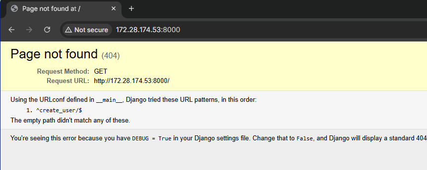
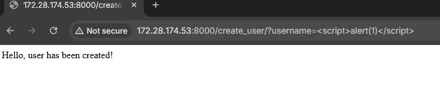
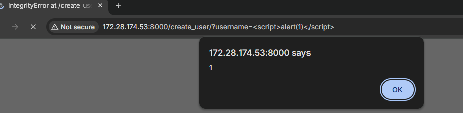
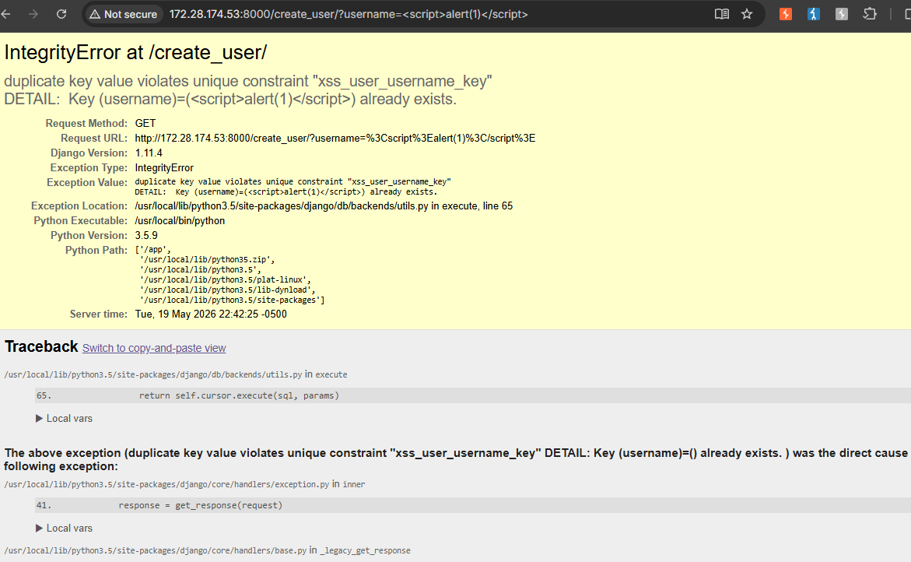

# CVE-2017-12794 - Django 调试页面跨站脚本漏洞复现

## 1. 漏洞概述

CVE-2017-12794 是 Django 技术调试错误页面中的一个跨站脚本漏洞。漏洞影响 Django 1.10.x before 1.10.8 与 Django 1.11.x before 1.11.5。其核心问题是：Django 的 technical 500 debug page 中一部分模板关闭了 HTML 自动转义，在特定异常场景下，未经转义的异常信息会被渲染到调试页面中，从而造成 XSS。

该漏洞不属于常规业务页面 XSS，而是依赖 **DEBUG=True** 暴露 Django 技术 500 页面。官方也明确指出，生产环境本不应启用 `DEBUG=True`，因此该漏洞通常更容易影响错误配置的测试环境、预发布环境、内部系统或误将调试配置带入生产的 Django 应用。

Vulhub 提供的复现环境使用 Django 1.11.4，通过构造包含 JavaScript 的用户名并重复创建用户，触发数据库唯一约束异常，使恶意用户名进入 Django debug error page 并被浏览器解析执行。

---

## 2. 影响版本与利用条件

| 条件     | 说明                                            |
| ------ | --------------------------------------------- |
| 版本条件   | Django 1.10.x < 1.10.8；Django 1.11.x < 1.11.5 |
| 修复版本   | Django 1.10.8、Django 1.11.5                   |
| 配置条件   | 应用启用 `DEBUG=True`，技术 500 调试页面可被访问             |
| 触发条件   | 用户可控内容进入数据库异常信息，并在 500 debug page 中展示         |
| 权限条件   | Vulhub 场景下无需登录；真实环境取决于触发异常的业务入口权限             |
| 漏洞类型   | XSS，CWE-79                                    |
| RCE 条件 | 该漏洞本身不是服务端 RCE，不应写成命令执行漏洞                     |

NVD 对该漏洞的 CVSS v3.0 评分为 6.1，严重性为 Medium，攻击复杂度低，但需要用户交互，影响主要集中在浏览器端的机密性和完整性。

---

## 3. 漏洞原理

Django 的技术 500 调试页面用于在开发阶段展示异常调用栈、异常原因和相关上下文。正常情况下，这类页面只应该在开发环境中使用，因为它会暴露大量调试信息。CVE-2017-12794 的问题点在于旧版本 Django 的调试页面模板中，部分区域关闭了 HTML 自动转义，导致异常信息中的 HTML 片段可能被原样输出到页面。

Vulhub 的复现链路利用了数据库唯一约束异常。第一次访问创建用户接口时，包含脚本内容的用户名被写入数据库。第二次使用相同用户名创建用户时，数据库触发唯一约束错误，Django 捕获数据库异常后生成 technical 500 debug page。由于异常信息中包含用户可控的用户名，而旧版本调试页面没有在对应位置正确转义，浏览器最终把用户名中的 `<script>` 当作 HTML/JavaScript 执行。

理解链路可以压缩成：

```
用户可控 username
→ Django 业务逻辑写入数据库
→ 重复 username 触发数据库唯一约束异常
→ Django technical 500 debug page 展示异常信息
→ 异常信息中的 HTML 未正确转义
→ 浏览器执行用户注入的 JavaScript
```

这个漏洞的关键点不是“创建用户接口本身有 XSS”，而是 **用户可控数据进入数据库异常信息后，被 Django 调试页面以不安全方式渲染**。所以它更适合作为“框架调试页面 XSS / 错误页面信息渲染风险”的案例，而不是普通反射型 XSS 案例。

---

## 4. Vulhub 环境启动

进入 Vulhub 对应目录：

```
cd vulhub/django/CVE-2017-12794
docker compose up -d
```

Vulhub 官方说明中，该环境启动后访问：

```
http://127.0.0.1:8000
```

如果页面显示 Django 默认首页，说明基础 Web 服务已经正常启动。Vulhub 说明该靶场使用的 Django 版本为 1.11.4，属于受影响版本范围。

如需查看容器状态：

```
docker compose ps
```

这一步只用于确认靶场运行，不需要扩展成 Docker 教程。

---

## 5. 浏览器确认基础页面

浏览器访问：

```
http://127.0.0.1:8000
```

预期现象：

| 页面现象           | 含义                        |
| -------------- | ------------------------- |
| 显示 Django 默认首页 | Web 服务启动成功                |
| 无法访问 / 连接失败    | 容器未启动、端口未映射或本机地址不正确       |
| 返回 500         | 服务已启动但应用内部异常，需要查看容器日志     |
| 返回其他应用页面       | 端口可能被其他服务占用，需确认 Docker 映射 |

基础页面只证明 Django 服务正常，不能证明漏洞存在。真正的漏洞验证点在后续数据库异常触发后的 500 debug page。



---

## 6. 使用浏览器与 Burp 触发漏洞

该漏洞可以直接使用浏览器触发，Burp 的作用主要是观察请求路径、参数和响应内容。这里不需要构造复杂请求包，主人别把简单场景写成“HTTP 报文堆叠”，那样反而显得不工程化。

### 6.1 创建包含脚本内容的用户名

在浏览器访问：

```
http://127.0.0.1:8000/create_user/?username=<script>alert(1)</script>
```

第一次访问时，应用会尝试创建该用户名。Vulhub 官方复现流程说明，第一次请求会成功创建用户。



如果使用 Burp，可以只观察关键参数：

```
GET /create_user/?username=<script>alert(1)</script>
```

关键点：

| 字段                          | 作用                       |
| --------------------------- | ------------------------ |
| `username`                  | 用户可控输入点                  |
| `<script>alert(1)</script>` | 最小化 XSS 验证内容             |
| 第一次访问                       | 将该用户名写入数据库，为后续唯一约束异常创造条件 |

### 6.2 再次访问相同 URL 触发数据库异常

再次访问同一个 URL：

```
http://127.0.0.1:8000/create_user/?username=<script>alert(1)</script>
```

第二次访问时，因为数据库中已经存在相同用户名，应用会触发唯一约束错误。Vulhub 官方说明中，错误页面会在错误消息中包含未转义的用户名，浏览器因此执行用户名中的 JavaScript。

这个过程的本质是：

```
重复创建相同 username
→ 数据库唯一约束异常
→ Django 500 debug page 展示异常详情
→ 未转义 username 被插入 HTML
→ script 执行
```

---

## 7. 浏览器验证漏洞结果

第二次访问后，浏览器预期弹出：

```
1
```

这说明 `<script>alert(1)</script>` 没有被当作普通文本显示，而是被浏览器作为脚本执行。





验证时建议同时观察页面主体：如果页面是 Django 的 technical 500 debug page，并且页面中能看到数据库异常、traceback、异常原因等调试信息，则说明漏洞触发点确实是调试错误页，而不是普通业务页面反射。

如果弹窗没有出现，优先检查：

| 检查项                 | 说明                                   |
| ------------------- | ------------------------------------ |
| 是否第一次已经成功创建用户       | 如果没有成功写入数据库，第二次不会触发唯一约束错误            |
| 是否访问了完全相同的 username | 唯一约束异常依赖重复值                          |
| 浏览器是否拦截弹窗           | 部分浏览器配置可能影响弹窗表现                      |
| Django 版本是否为 1.11.4 | 修复版本不会按该方式触发                         |
| 是否启用 DEBUG          | 没有 technical 500 debug page，该漏洞链路不成立 |

---

## 8. 结果判断

| 现象                                       | 含义                        |
| ---------------------------------------- | ------------------------- |
| 第一次访问创建用户成功                              | 数据已进入数据库，后续可触发重复约束        |
| 第二次访问出现 Django technical 500 debug page  | 数据库异常被 Django 调试页面展示      |
| 页面弹出 `alert(1)`                          | XSS 触发成功                  |
| 页面只显示转义后的 `<script>alert(1)</script>` 文本 | HTML 被正确转义，漏洞未触发或版本已修复    |
| 返回普通错误页而非 Django debug page              | `DEBUG` 可能未开启，或错误页面被自定义处理 |
| 返回 404                                   | 路径错误、靶场未启动或访问地址不正确        |
| 连接失败                                     | 容器未运行、端口映射异常或端口被占用        |

这里的成功判断不能只看 HTTP 状态码。500 状态码只说明服务端发生异常，真正证明 XSS 的是：**异常页面中用户可控内容被浏览器当作脚本执行**。

---

## 9. 修复建议

官方修复方式是升级到 Django 1.10.8 或 Django 1.11.5。Django 官方在 2017 年 9 月 5 日发布安全更新，并说明修复补丁已经应用到 master、1.11 和 1.10 分支。

生产环境还必须关闭调试模式：

```
DEBUG = False
```

NVD 和 Django 官方都指出，该漏洞主要依赖 technical 500 debug page 可访问，而生产环境不应开启 `DEBUG=True`。

建议的加固措施：

| 修复项  | 建议                                     |
| ---- | -------------------------------------- |
| 版本升级 | 升级到 Django 1.10.8 / 1.11.5 或更高受支持版本    |
| 调试配置 | 生产环境设置 `DEBUG=False`                   |
| 错误页面 | 使用自定义错误页面，不向用户暴露 traceback、SQL 异常、内部路径 |
| 输出编码 | 所有进入 HTML 页面渲染的数据都必须经过上下文相关转义          |
| 异常处理 | 数据库异常不应直接带着用户输入展示给客户端                  |
| 环境隔离 | 开发、测试、生产配置分离，避免调试配置被带入生产               |
| 日志策略 | 详细异常写入服务端日志，不直接暴露到浏览器                  |

注意：单纯过滤 `<script>` 不是可靠修复方式。该漏洞发生在框架调试页面的异常渲染链路中，优先级最高的是 **升级修复版本 + 关闭生产 DEBUG**。

---

## 10. 复现总结

CVE-2017-12794 的触发入口是 Vulhub 环境中的 `/create_user/` 接口，用户可控点是 `username` 参数。第一次访问负责把包含脚本内容的用户名写入数据库，第二次访问相同用户名触发数据库唯一约束异常，Django 旧版本 technical 500 debug page 在展示异常信息时没有正确转义对应内容，最终造成 XSS。

该漏洞的本质不是数据库唯一约束问题，而是 **框架调试错误页面在渲染异常信息时破坏了 HTML 输出编码边界**。数据库异常只是一个稳定触发路径，真正的安全边界失效发生在 Django debug page 的模板渲染阶段。

这个案例的价值在于理解：**XSS 不只发生在业务模板中，也可能发生在框架错误页、调试页和异常信息展示链路中。**
