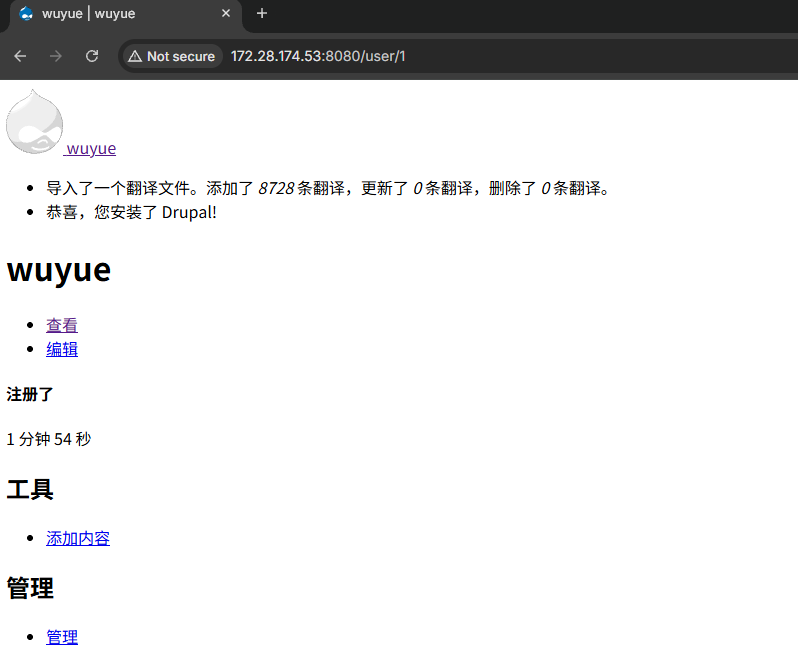
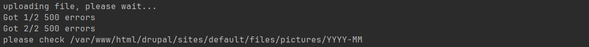

# CVE-2019-6341 - Drupal 文件上传导致跨站脚本执行复现

## 1. 漏洞概述

CVE-2019-6341 是 Drupal Core 文件模块 / 文件子系统中的跨站脚本漏洞。Drupal 官方公告将其定义为 **Moderately critical - Cross Site Scripting**，漏洞编号为 SA-CORE-2019-004。其核心问题是：在特定条件下，Drupal 的文件模块允许攻击者上传一个可触发 XSS 的文件，当其他用户访问该文件链接时，文件内容可能被浏览器作为 HTML/JavaScript 解析执行。([Drupal.org](https://www.drupal.org/sa-core-2019-004 "Drupal core - Moderately critical - Cross Site Scripting - SA-CORE-2019-004 | Drupal.org"))

该漏洞不是普通表单回显型 XSS，而是 **文件上传链路中的存储型 XSS**。Vulhub 复现场景中，攻击者上传一个表面上符合图片特征的特殊 GIF 文件，但该文件实际包含 HTML 与 JavaScript 内容；上传后文件被存放在 Drupal 的公开文件目录下，访问对应文件地址即可触发脚本执行。([GitHub](https://github.com/vulhub/vulhub/blob/master/drupal/CVE-2019-6341/README.md "vulhub/drupal/CVE-2019-6341/README.md at master · vulhub/vulhub · GitHub"))

需要注意：CVE-2019-6341 本身是 XSS，不应直接写成 RCE。ZDI 的研究文章说明，该 XSS 可与另一个 PHP 反序列化漏洞链式组合，在管理员点击恶意链接的条件下进一步导致代码执行；但这属于漏洞链升级条件，不是本 CVE 单独成立时的默认影响。([Zero Day Initiative](https://www.zerodayinitiative.com/blog/2019/4/11/a-series-of-unfortunate-images-drupal-1-click-to-rce-exploit-chain-detailed "Zero Day Initiative — A Series of Unfortunate Images: Drupal 1-click to RCE Exploit Chain Detailed"))

---

## 2. 影响版本与利用条件

| 条件     | 说明                                                                                         |
| ------ | ------------------------------------------------------------------------------------------ |
| 影响组件   | Drupal Core File module / subsystem                                                        |
| 影响版本   | Drupal 7.x >= 7.0 且 < 7.65；Drupal 8.x >= 8.0.0 且 < 8.5.14；Drupal 8.6.x >= 8.6.0 且 < 8.6.13 |
| 修复版本   | Drupal 7.65、Drupal 8.5.14、Drupal 8.6.13                                                    |
| 漏洞类型   | 存储型 XSS，CWE-79                                                                             |
| 权限条件   | 需要具备上传文件的业务入口；Vulhub 场景使用靶场 PoC 自动完成上传流程                                                   |
| 触发条件   | 特制文件上传成功，并且其他用户访问上传后的文件 URL                                                                |
| 风险升级条件 | 若与 CVE-2019-6339 等漏洞链组合，并诱导管理员交互，可能进一步造成更高影响                                               |
| RCE 条件 | CVE-2019-6341 单独不是 RCE，不要把“上传触发 XSS”写成“上传直接 getshell”                                      |

Drupal 官方公告明确给出受影响版本和升级目标版本，NVD 也将该漏洞归类为 CWE-79，并给出 CVSS v3.0 评分 5.4 Medium，向量中包含 `PR:L` 与 `UI:R`，说明该漏洞通常需要一定权限和用户交互。([Drupal.org](https://www.drupal.org/sa-core-2019-004 "Drupal core - Moderately critical - Cross Site Scripting - SA-CORE-2019-004 | Drupal.org"))

---

## 3. 漏洞原理

该漏洞的核心触发点在 Drupal 对上传文件名和文件类型的处理边界。ZDI 的技术分析指出，Drupal 在处理上传文件名时使用 PCRE 对文件名进行替换；当文件名中包含无效 UTF-8 字节时，`preg_replace()` 可能出现 `PREG_BAD_UTF8_ERROR`，而旧代码没有正确处理该错误，导致文件名处理逻辑异常，最终可能使上传文件丢失扩展名并以类似 `_0` 的名称落盘。([Zero Day Initiative](https://www.zerodayinitiative.com/blog/2019/4/11/a-series-of-unfortunate-images-drupal-1-click-to-rce-exploit-chain-detailed "Zero Day Initiative — A Series of Unfortunate Images: Drupal 1-click to RCE Exploit Chain Detailed"))

在利用链中，攻击者准备一个特殊文件：它表面上带有 GIF 特征，能够通过图片上传校验；但文件内容中同时嵌入 HTML / JavaScript。ZDI 分析提到，给 HTML 文件添加 GIF 相关头部足以满足部分上传检查。当该文件被 Drupal 存储到公开目录后，如果响应缺少合适的 `Content-Type` 或浏览器被引导按 HTML 方式解析该资源，文件中的脚本就可能执行。([Zero Day Initiative](https://www.zerodayinitiative.com/blog/2019/4/11/a-series-of-unfortunate-images-drupal-1-click-to-rce-exploit-chain-detailed "Zero Day Initiative — A Series of Unfortunate Images: Drupal 1-click to RCE Exploit Chain Detailed"))

Vulhub 对该漏洞的复现路径更直接：通过来自 thezdi/PoC 的脚本创建并上传恶意 GIF 文件，文件上传成功后访问图片位置，触发 XSS。Drupal 默认将上传图片存储在 `/sites/default/files/pictures/<YYYY-MM>/` 目录下，靶场中上传后的文件名可能以 `_0` 结尾，这是 Drupal 文件名规则机制导致的现象。([GitHub](https://github.com/vulhub/vulhub/blob/master/drupal/CVE-2019-6341/README.md "vulhub/drupal/CVE-2019-6341/README.md at master · vulhub/vulhub · GitHub"))

理解链路可以压缩成：

```text
特制 GIF/HTML 文件
→ 通过 Drupal 图片上传校验
→ 文件名处理异常导致扩展名被丢弃或改写
→ 文件落到公开可访问目录
→ 用户访问上传文件 URL
→ 浏览器按 HTML/脚本内容解析
→ 触发存储型 XSS
```

这个漏洞的关键不是“任意文件上传后被服务端执行”，而是 **上传文件被客户端浏览器错误解析为可执行 HTML/JavaScript**。所以复现判断点应当是浏览器端脚本执行，而不是服务器端命令执行。上传类漏洞必须区分普通上传、目录可访问、文件是否被解析、以及是否存在 RCE 条件；这个区分在你的复现模板里也被明确要求。

---

## 4. Vulhub 环境启动

进入 Vulhub 对应目录：

```bash
cd vulhub/drupal/CVE-2019-6341
docker compose up -d
```

Vulhub 官方 README 说明，该环境启动的是 Drupal 8.5.0，属于受影响版本。环境启动后访问：

```text
http://127.0.0.1:8080/
```

页面会进入 Drupal 安装流程。由于 Vulhub 该环境没有 MySQL 服务，安装时选择 SQLite 作为数据库即可。([GitHub](https://github.com/vulhub/vulhub/blob/master/drupal/CVE-2019-6341/README.md "vulhub/drupal/CVE-2019-6341/README.md at master · vulhub/vulhub · GitHub"))

安装阶段重点确认：

| 项目    | 建议                                 |
| ----- | ---------------------------------- |
| 访问地址  | `http://127.0.0.1:8080/` 或宿主机对应 IP |
| 数据库类型 | SQLite                             |
| 站点配置  | 本地靶场默认配置即可                         |
| 管理员账号 | 自行设置，后续只用于靶场验证                     |
| 环境边界  | 仅限本地 Docker 靶场或授权环境                |

如需确认容器运行状态：

```bash
docker compose ps
```

---

## 5. 浏览器确认基础功能

浏览器访问：

```text
http://127.0.0.1:8080/
```

预期现象：

| 页面现象              | 含义                      |
| ----------------- | ----------------------- |
| 出现 Drupal 安装页面    | Web 服务启动成功              |
| 安装完成后进入 Drupal 首页 | 基础业务环境可访问               |
| 无法连接              | 容器未启动、端口映射异常或端口被占用      |
| 返回 500            | Drupal 初始化或配置异常，需查看容器日志 |
| 页面跳转异常            | 安装配置未完成或站点状态不一致         |

完成安装后，浏览器只需要确认 Drupal 站点可以正常访问。普通页面访问不能证明漏洞存在，漏洞验证点在 **特制文件上传成功后访问其公开 URL 是否触发脚本执行**。



---

## 6. 使用 PoC、浏览器与 Burp 触发漏洞

该漏洞的关键动作是上传特制 GIF/HTML 文件。Vulhub 官方 README 使用 thezdi/PoC 中的脚本生成并上传恶意 GIF 文件，命令格式如下：([GitHub](https://github.com/vulhub/vulhub/blob/master/drupal/CVE-2019-6341/README.md "vulhub/drupal/CVE-2019-6341/README.md at master · vulhub/vulhub · GitHub"))

```bash
php cve-2019-6341-exp.php 127.0.0.1 8080
```

其中：

| 参数                      | 含义              |
| ----------------------- | --------------- |
| `127.0.0.1`             | Vulhub 靶场所在主机地址 |
| `8080`                  | Drupal Web 服务端口 |
| `cve-2019-6341-exp.php` | 用于靶场复现的 PoC 脚本  |

建议开启代理后执行 PoC，观察其中涉及的关键 HTTP 行为：

```text
注册 / 登录 / 上传头像或图片
→ multipart 上传特制 GIF 文件
→ Drupal 返回或生成公开文件路径
→ 访问 /sites/default/files/pictures/<YYYY-MM>/_0
```



---

## 7. 浏览器验证漏洞结果

上传成功后，访问 Drupal 公开文件目录中的目标文件。Vulhub 官方说明中，Drupal 默认图片路径为：

```text
/sites/default/files/pictures/<YYYY-MM>/
```

上传后的特殊文件名可能表现为：

```text
/sites/default/files/pictures/<YYYY-MM>/_0
```

因此浏览器访问形式通常类似：

```text
http://127.0.0.1:8080/sites/default/files/pictures/<YYYY-MM>/_0
```

如果漏洞触发成功，浏览器会执行文件中嵌入的 JavaScript，表现为弹窗或其他前端脚本效果。Vulhub README 说明，上传成功后访问图片位置即可触发 XSS，并备注 Chrome、Firefox 的过滤机制可能影响测试表现，建议使用 Edge 或 IE 进行验证；实际测试时浏览器版本差异可能导致表现不同，因此文档中应写“预期触发”而不是伪造成固定环境结论。([GitHub](https://github.com/vulhub/vulhub/blob/master/drupal/CVE-2019-6341/README.md "vulhub/drupal/CVE-2019-6341/README.md at master · vulhub/vulhub · GitHub"))

验证时重点观察：

| 验证点                  | 说明                              |
| -------------------- | ------------------------------- |
| 文件是否能通过 URL 直接访问     | 证明上传文件位于公开目录                    |
| 文件名是否变成 `_0` 或无扩展名形式 | 证明 Drupal 文件名处理异常被触发            |
| 浏览器是否执行脚本            | 证明 XSS 成立                       |
| 响应头是否缺少明确图片类型        | 辅助解释浏览器解析行为                     |
| 页面是否只是下载文件           | 说明浏览器没有按 HTML 执行，可能与响应头或浏览器策略有关 |

---

## 8. 结果判断

| 现象                                               | 含义                                               |
| ------------------------------------------------ | ------------------------------------------------ |
| Drupal 安装页面可访问                                   | 靶场 Web 服务正常                                      |
| Drupal 安装完成并可进入首页                                | 基础应用环境正常                                         |
| PoC 输出上传成功或可定位上传文件 URL                           | 特制文件已进入 Drupal 文件系统                              |
| `/sites/default/files/pictures/<YYYY-MM>/_0` 可访问 | 文件落入公开目录，且文件名规则异常符合预期                            |
| 浏览器访问文件后触发弹窗                                     | XSS 复现成功                                         |
| 文件被下载而不是执行                                       | 浏览器或响应头按下载 / 非 HTML 内容处理，需检查 Content-Type 与浏览器行为 |
| 返回 404                                           | 上传路径、日期目录或文件名不正确                                 |
| 返回 403                                           | 文件目录权限、Web 访问控制或 Drupal 配置限制                     |
| 只显示图片或纯文本                                        | 文件内容、浏览器解析方式或 PoC 生成结果不符合预期                      |
| 上传失败                                             | Drupal 未完成安装、上传入口不可用、权限不足或 PoC 参数错误              |

该漏洞成功判断不能只看“文件上传成功”。上传成功只说明文件进入系统，真正的漏洞结果是：**其他用户访问上传文件链接时，浏览器执行其中的 JavaScript**。

---

## 9. 修复建议

Drupal 官方给出的修复方式是升级到对应安全版本：Drupal 8.6 升级到 8.6.13，Drupal 8.5 或更早的受支持版本升级到 8.5.14，Drupal 7 升级到 7.65。官方同时提醒，Drupal 8 中早于 8.5.x 的版本已经 EOL，不再获得安全支持。([Drupal.org](https://www.drupal.org/sa-core-2019-004 "Drupal core - Moderately critical - Cross Site Scripting - SA-CORE-2019-004 | Drupal.org"))

建议修复措施：

| 修复项    | 建议                                                                 |
| ------ | ------------------------------------------------------------------ |
| 版本升级   | 按官方公告升级到 Drupal 7.65 / 8.5.14 / 8.6.13 或更高受支持版本                    |
| 文件上传限制 | 限制可上传文件类型、扩展名、MIME 类型与内容特征                                         |
| 文件名处理  | 对上传文件名进行严格规范化，避免无效编码、控制字符、特殊字节影响命名逻辑                               |
| 响应头控制  | 对用户上传文件设置明确且安全的 `Content-Type` 与 `X-Content-Type-Options: nosniff` |
| 存储隔离   | 用户上传目录与可执行 / 可解析 Web 内容隔离                                          |
| 权限控制   | 只允许可信角色上传公开可访问文件                                                   |
| 业务层防护  | 对评论、头像、附件等所有上传入口进行统一安全策略管理                                         |
| 漏洞链防护  | 管理员访问用户上传内容时应降低信任边界，避免上传型 XSS 变成后台操作触发器                            |

不要只写“过滤 `<script>`”。这个漏洞发生在文件上传、文件名处理、文件存储和浏览器内容解析多个边界之间，单点字符串过滤不可靠。

---

## 10. 复现总结

CVE-2019-6341 的触发入口是 Drupal 文件上传功能，Vulhub 环境中通过 thezdi/PoC 上传特制 GIF/HTML 文件。该文件表面上符合图片上传条件，但在特定文件名处理异常下可能被存储为无扩展名或 `_0` 文件，并位于 `/sites/default/files/pictures/<YYYY-MM>/` 这类公开目录中。用户访问该文件 URL 时，浏览器可能将文件内容作为 HTML/JavaScript 解析，从而触发存储型 XSS。([GitHub](https://github.com/vulhub/vulhub/blob/master/drupal/CVE-2019-6341/README.md "vulhub/drupal/CVE-2019-6341/README.md at master · vulhub/vulhub · GitHub"))

该漏洞的本质是 **上传文件处理边界失效 + 浏览器内容解析边界失效**，不是服务端直接执行代码。ZDI 的研究进一步说明，该 XSS 可以作为漏洞链中的第一阶段，用于诱导管理员触发后续反序列化漏洞，但在复现文档中应将“XSS 成功”和“漏洞链导致 RCE”严格区分。([Zero Day Initiative](https://www.zerodayinitiative.com/blog/2019/4/11/a-series-of-unfortunate-images-drupal-1-click-to-rce-exploit-chain-detailed "Zero Day Initiative — A Series of Unfortunate Images: Drupal 1-click to RCE Exploit Chain Detailed"))


