# 03S - 访问控制漏洞

## 1. 漏洞本质

访问控制漏洞的本质是：**应用没有正确判断当前用户是否有权访问某个功能、资源或业务操作**。

在 Web 应用中，访问控制通常依赖三层机制：

| 机制                                | 作用           | 常见问题                            |
| --------------------------------- | ------------ | ------------------------------- |
| 认证 Authentication                 | 确认用户是谁       | 登录态伪造、弱认证、会话失效                  |
| 会话管理 Session Management           | 识别后续请求属于哪个用户 | Session 固定、Token 泄露、Cookie 配置错误 |
| 授权 Authorization / Access Control | 判断用户能做什么     | 水平越权、垂直越权、IDOR、流程绕过             |

访问控制漏洞重点不在“用户是否登录”，而在于：**登录后的每一次敏感请求，服务端是否重新判断该用户是否有权执行该操作或访问该对象**。

典型错误是开发者只控制了前端入口，例如菜单、按钮、页面链接，却没有在服务端接口层做权限校验。攻击者不需要看到按钮，只要能构造对应请求，就可能直接访问受限功能。

理解样例：

```
GET /admin HTTP/1.1
Cookie: session=普通用户会话
```

如果普通用户仅因为知道 `/admin` 路径就能访问后台页面，问题不在 URL 被猜到，而在于服务端没有对该请求执行管理员权限校验。

---

## 2. 垂直越权

垂直越权是指**低权限用户访问或执行高权限用户才能使用的功能**。常见场景是普通用户访问管理员接口、执行用户删除、权限修改、订单审核、后台配置等操作。

垂直越权通常属于**功能级授权失败**。判断重点是：某个功能是否应当只允许特定角色访问。

典型样例：

```
POST /admin/deleteUser HTTP/1.1
Cookie: session=普通用户会话

username=carlos
```

如果普通用户可以成功删除用户，说明服务端没有在 `/admin/deleteUser` 接口上验证当前用户是否具备管理员权限。

### （1）未受保护的功能

最直接的垂直越权是敏感功能没有任何服务端保护。开发者可能认为只要普通用户页面不显示后台入口，就无法访问后台功能。这属于把“入口隐藏”误当成“访问控制”。

例如：

```
/admin/administrator-panel/manage/users
```

如果这些路径只是不出现在普通用户页面中，但后端没有鉴权，那么普通用户仍然可以通过直接访问 URL 触发功能。

有些系统会把后台路径改得更复杂，例如：

```
/administrator-panel-yb556
```

这属于安全性依赖路径不可预测，本质仍然是“隐蔽式安全”。只要路径通过 JavaScript、接口响应、前端资源、历史记录、配置文件或错误信息泄露，访问控制就会失效。

### （2）基于参数的访问控制

部分应用会把用户角色或权限状态存放在用户可控位置，例如 URL 参数、Cookie、隐藏表单字段等：

```html
/my-account?admin=true
Cookie: role=admin
<input type="hidden" name="isAdmin" value="false">
```

这种做法不可靠，因为这些值都可以被用户修改。权限信息可以参与展示逻辑，但不能作为服务端最终授权依据。

正确做法是服务端根据可信数据源判断权限，例如服务端 Session、数据库角色字段、权限表、策略引擎，而不是信任客户端传来的角色标记。

---

## 3. 水平越权与IDOR

水平越权是指**用户访问了同权限级别下其他用户的数据或资源**。它不一定涉及管理员权限，但通常会造成隐私数据泄露、订单泄露、账号资料修改等问题。

典型样例：

```
GET /my-account?id=123 HTTP/1.1Cookie: session=用户A
```

如果用户 A 将 `id=123` 修改为 `id=124` 后，可以查看用户 B 的账户信息，这就是水平越权。

漏洞点不在“ID 可以被修改”，而在于服务端只根据对象 ID 查询数据，却没有验证该对象是否属于当前用户。

### （1）IDOR 的核心机制

IDOR，全称 Insecure Direct Object Reference，即**不安全的直接对象引用**。它通常发生在应用直接使用用户可控输入定位后端对象，例如数据库记录、文件、订单、发票、聊天记录等。

常见对象引用形式包括：

| 对象类型        | 示例                       |
| ----------- | ------------------------ |
| 用户 ID       | `/user?id=1002`          |
| 订单 ID       | `/order/77881`           |
| 文件名         | `/files/report_2026.pdf` |
| 消息 ID       | `/message?mid=9527`      |
| UUID / GUID | `/invoice/9f3e2a7c-...`  |

使用 UUID、GUID、随机文件名可以降低枚举概率，但不能替代授权校验。只要对象标识符泄露，攻击者仍然可能访问不属于自己的资源。

理解样例：

```
GET /download?file=chatlog-12144.txt HTTP/1.1
Cookie: session=用户A
```

如果服务端只根据 `file` 参数读取静态文件，而不判断该文件是否属于用户 A，那么修改文件名就可能读取其他用户的聊天记录。

### （2）从水平越权到垂直越权

水平越权有时可以进一步转化为垂直越权。典型链路是：普通用户通过水平越权访问管理员用户的数据、配置或账号页面，进而获得高权限能力。

例如：

```
/my-account?id=456
```

如果 `456` 对应管理员账号，而页面中包含修改密码、查看 API Key、管理入口或敏感配置，那么攻击者虽然最初利用的是水平越权，最终影响会升级为垂直权限提升。

这类问题的风险评估不能只看“是否拿到管理员页面”，还要看目标对象是否具备更高业务权限。

---

## 4. 平台配置与请求匹配差异

部分访问控制不在业务代码中实现，而是交给框架、网关、反向代理、路由层或平台配置处理。这类机制容易因为不同组件对请求的理解不一致而失效。

### （1）URL 覆盖头导致的绕过

一些后端框架或中间件支持通过非标准请求头覆盖原始 URL，例如：

```
POST / HTTP/1.1
X-Original-URL: /admin/deleteUser
```

如果前端访问控制只检查请求行中的 `/`，但后端实际按照 `X-Original-URL` 路由到 `/admin/deleteUser`，就可能出现访问控制绕过。

该机制对应的是**前端控制层和后端路由层对真实目标 URL 的理解不一致**。

#### 实验一：URL 覆盖头导致的绕过

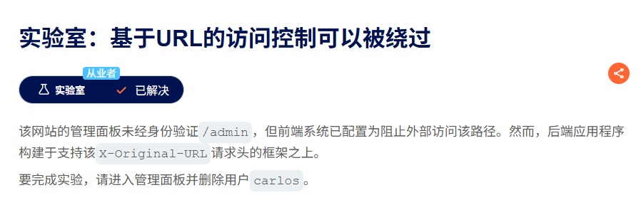

在请求方法中添加X-Original-URL参数即可绕过

第一步，直接访问admin panel是被拒绝的。

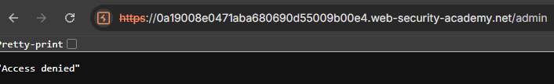

第二步，将请求包的路径更改为/，即网站首页，再添加`X-Original-URL`参数，值为`/access`，使用不存在的路径，目的是确认该参数是否被后端校验。

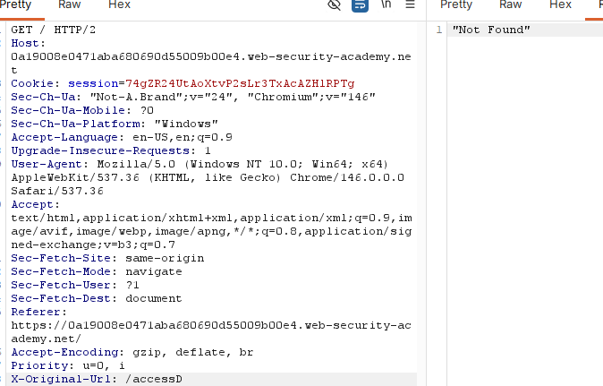

第三步，修改为`/admin`后，成功绕过校验并进入到admin panel。

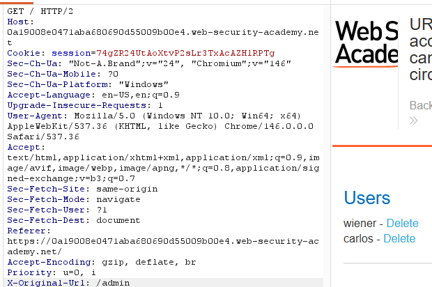

第四步，修改请求路径为`/admin/delete`，报错发现缺少参数username。

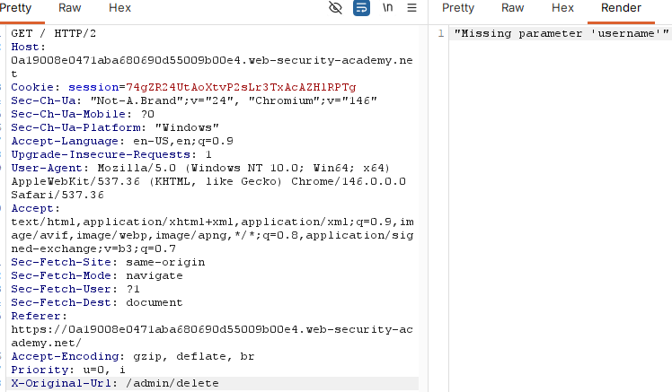

第五步，修改请求方法为POST，并添加参数`username=carlos`，删除成功。

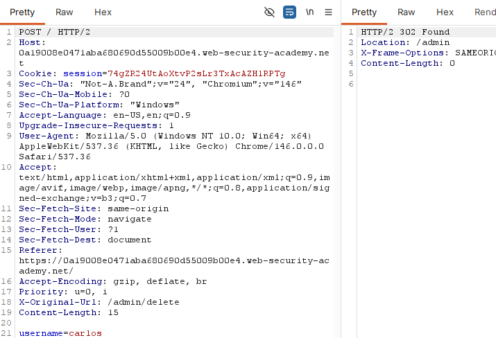

### （2）HTTP 方法差异

有些系统只限制特定方法，例如只禁止：

```
POST /admin/deleteUser
```

但同一操作可能也接受：

```
GET /admin/deleteUser?username=carlos
```

如果访问控制规则只覆盖 `POST`，而业务接口又允许 `GET`、`HEAD`、`PUT` 等方法触发相同逻辑，就可能被绕过。

这类漏洞成立依赖两个条件：

1. 平台层访问控制按 URL + Method 进行匹配；
2. 后端业务逻辑对请求方法过于宽松，允许非预期方法执行敏感操作。

#### 实验二：不同HTTP方法绕过

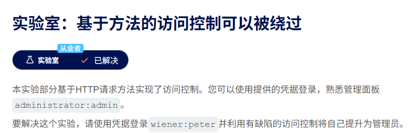

先使用题目给的管理员账户，得到admin panel的结构和请求响应包。

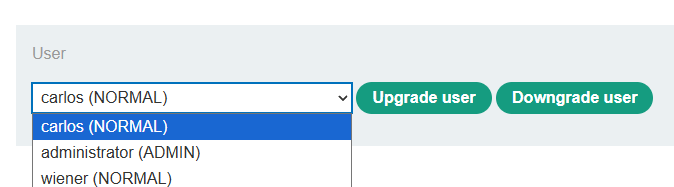

我们的目标是使用wiener账户，升级到admin权限。

请求包：

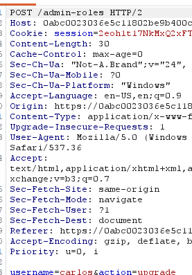

接下来使用wiener账户越权进行账户升级。

第一步，在浏览器中直接访问`/admin-roles`目录，生成请求包。

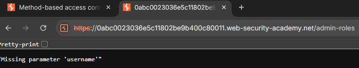

第二步，将GET请求改为POST，并添加参数`username=wiener`，发现这里不允许

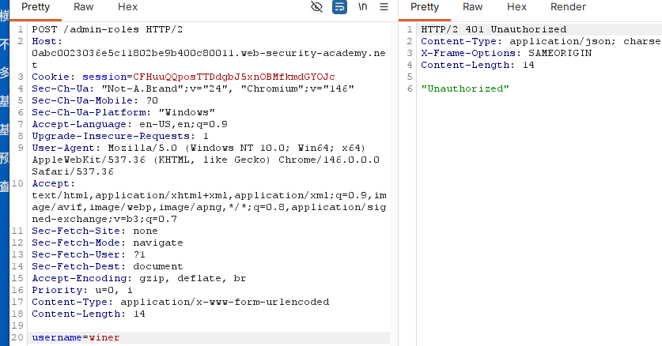

第三步，改回GET，再在请求路径后面加上`?username=wiener`

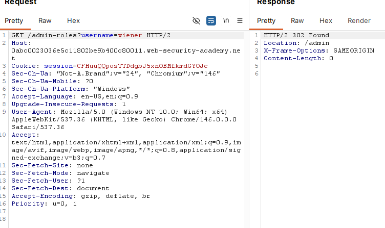

这里发现并没有成功，再回头看admin的包，缺少`action=upgrade`参数。

添加之后，升级admin成功。

### （3）URL 匹配差异

不同组件对 URL 的规范化、大小写、后缀、斜杠处理可能不一致。例如：

```
/admin/deleteUser
/admin/deleteUser/
/ADMIN/DELETEUSER
/admin/deleteUser.anything
```

如果访问控制模块认为这些是不同路径，而业务路由最终将它们映射到同一个处理函数，就可能导致限制规则没有命中。

这种问题的核心不是某个特定路径写法，而是：

> 访问控制判断使用了一套 URL 解释规则，业务路由使用了另一套路由匹配规则。

因此防护时应保证访问控制发生在规范化之后，并且与最终业务路由保持一致。

---

## 5. 多步骤流程中的访问控制缺陷

很多敏感操作不是单个请求完成，而是由多个步骤组成。例如：

1. 加载用户修改页面；
2. 提交修改内容；
3. 确认修改结果。

常见错误是开发者只在前几个步骤做权限校验，却默认用户只有通过合法流程才能到达最后一步。攻击者可以跳过受保护步骤，直接构造后续请求。

理解样例：

```html
POST /admin/confirm-change-role HTTP/1.1
Cookie: session=普通用户会话

username=carlos&role=admin
```

如果该确认接口没有独立验证当前用户是否具备角色修改权限，那么即使前面的表单页面受保护，最终操作仍然可能被未授权触发。

多步骤流程中的访问控制原则是：**不能只保护入口页面，也不能只保护第一步；每一个会造成状态变化或敏感数据返回的步骤都必须独立鉴权**。

### 实验三：多流程步骤中的访问控制缺陷

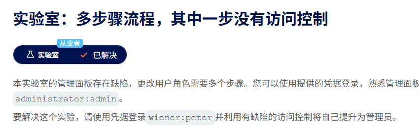

这里还是使用admin账户查看全部流程。

1

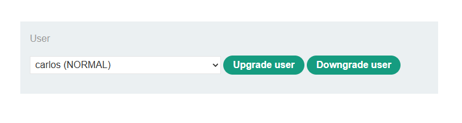

2

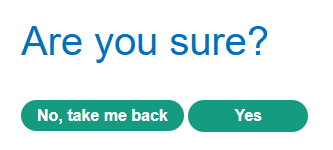

3

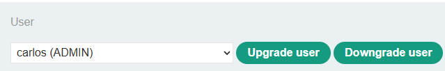

拿到三个请求包，第一个是admin面板的请求包，后两个分别是升级表单发送数据包，和确认数据包。

确认数据包中带有表单的全部数据。

分别对三个请求包进行尝试。

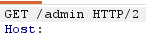

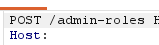

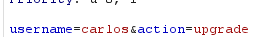

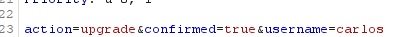

回到wiener账户。

第一步，使用浏览器直接访问路径`/admin`，发现权限不足。

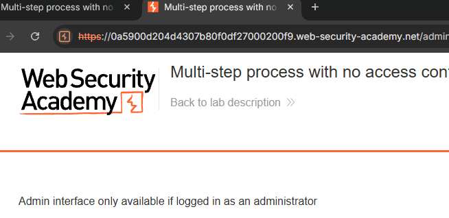

第二步，使用浏览器直接访问路径`/admin-roles`，依旧权限不足。

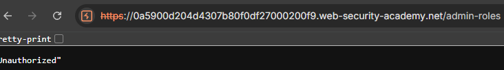

第三步，使用wiener会话的`GET /admin-roles`请求包。先将请求方法修改为POST，再添加两个参数，`username=carlos&action=upgrade`，发现依旧权限不足。

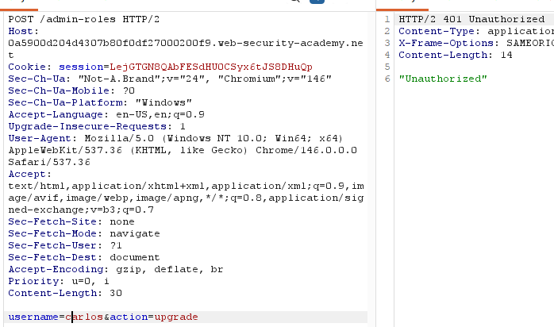

第四步，前两个请求包证明了这个流程的前两步的访问控制是有校验的，无法直接越权修改，但是接下来通过添加参数`confirmed=true`来提交确认表单，达成绕过，证明这个流程是有缺陷的。

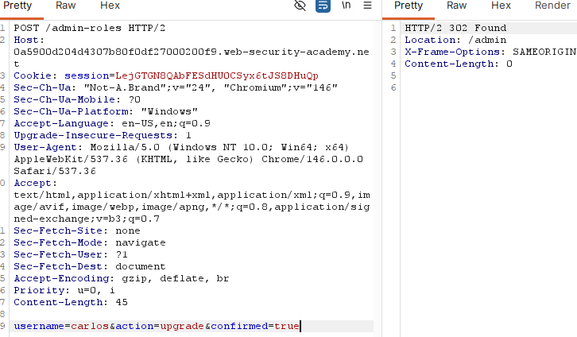

---

## 6. 基于 Referer 和地理位置的访问控制缺陷

### 基于 Referer 的访问控制

部分应用会根据 `Referer` 请求头判断请求是否来自授权页面。例如：

```
POST /admin/deleteUser HTTP/1.1
Referer: https://example.com/admin
```

如果应用只检查 `Referer` 中是否包含 `/admin`，就允许访问子功能，那么攻击者可以伪造该请求头，从而直接访问受限接口。

`Referer` 只能作为辅助审计或防误操作信号，不能作为权限判断依据。原因很简单：它由客户端提供，可能缺失、被浏览器策略裁剪，也可能被手动构造。

#### 实验四：Referer头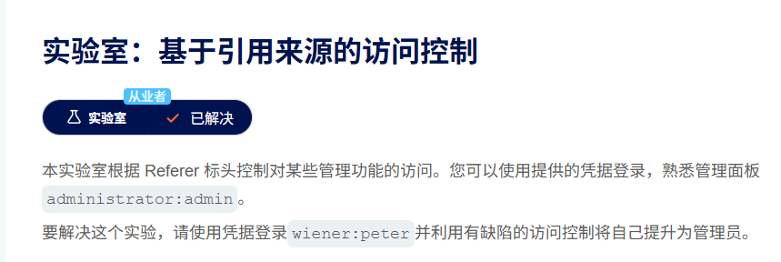

此lab不再赘述，使用GET请求，`/admin-roles?username=carlos&action=upgrade`作为请求路径，并在请求头中添加值为`Referer: https://xxxx.com/admin`

### 基于地理位置的访问控制

有些应用会根据 IP 地理位置、浏览器定位、地区配置限制访问，例如媒体服务、银行业务、地区合规功能等。

这类控制的问题在于，地理位置本身通常不是强身份凭证。用户可以通过代理、VPN、移动网络出口、浏览器定位伪造等方式改变表现出来的位置。

基于地理位置的控制可以作为业务限制或风控信号，但不应替代用户身份、角色、对象归属和操作权限校验。

---

## 7. 风险边界与常见成因

访问控制漏洞的影响取决于被绕过的权限边界。常见风险包括：

| 类型     | 风险                            |
| ------ | ----------------------------- |
| 垂直越权   | 普通用户执行管理员操作、修改权限、删除用户         |
| 水平越权   | 访问其他用户资料、订单、账单、私信、文件          |
| IDOR   | 通过对象 ID、文件名、记录号直接访问敏感资源       |
| 流程绕过   | 跳过确认、审批、支付、身份校验步骤             |
| 配置绕过   | 通过 URL、HTTP 方法、请求头差异绕过网关或框架限制 |
| 来源信任错误 | 伪造 Referer、Origin、客户端参数完成敏感操作 |

常见成因可以归纳为四类：

1. **只做认证，不做授权**  
   用户登录后默认可以访问过多资源。
2. **只保护页面，不保护接口**  
   前端按钮被隐藏，但后端 API 仍可直接访问。
3. **只验证对象存在，不验证对象归属**  
   服务端根据 ID 查到了数据，但没有判断该数据是否属于当前用户。
4. **信任客户端状态**  
   将角色、来源、步骤状态、地理位置等放在客户端或请求头中，并据此做权限决策。

---

## 8. 防护原则

访问控制防护的核心原则是：**服务端默认拒绝，按用户、角色、资源、操作进行显式授权**。

具体措施包括：

- 默认拒绝访问，除非明确允许；
- 所有敏感功能必须在服务端做权限校验；
- 所有对象访问必须校验对象归属或授权关系；
- 不依赖隐藏 URL、前端菜单、按钮显示作为访问控制；
- 不信任客户端传来的角色字段、权限字段、流程状态；
- 不使用 `Referer`、地理位置等弱信号作为最终授权依据；
- 统一 URL 规范化和路由匹配逻辑，避免前后端解释差异；
- 对状态变更接口严格限制 HTTP 方法；
- 多步骤流程中，每个关键步骤都独立鉴权；
- 将权限逻辑集中到统一中间件、策略层或权限框架中，避免散落在业务代码中；
- 对访问控制进行专项测试，覆盖水平越权、垂直越权、IDOR、方法变换、路径变体和流程跳转。

一个稳定的授权判断通常至少包含四个要素：

```
当前用户是谁？
他拥有什么角色或权限？
他要访问哪个对象？
他要对该对象执行什么操作？
```

只有这四个问题同时成立，访问才应被允许。
