# 04S - 文件上传漏洞

## 1. 漏洞本质

    文件上传漏洞的本质，是应用在接收、校验、保存和访问用户上传文件的过程中，对文件内容、文件类型、文件名、保存路径或执行权限产生了错误信任。

    它不是单纯的“允许用户上传文件”。正常业务中，头像、附件、图片、文档、富文本资源都需要上传功能。真正的问题在于：

    服务端是否把用户上传的文件放进了一个可被访问、可被解析、甚至可被执行的位置。

文件上传的风险链路通常是：

    -> 用户上传文件

    -> 服务端校验文件

    -> 文件写入服务器或对象存储

    -> 应用返回文件访问路径

    -> 浏览器、Web服务器或后端组件处理该文件

    -> 触发脚本执行、文件读取、XSS、路径穿越、解析器漏洞或拒绝服务

    其中最**严重**的情况是：攻击者上传服务端**脚本**文件，并且该文件被 Web 服务器**执行**。此时**文件上传漏洞**会升级为 **WebShell 或远程代码执行**。

    但文件上传漏洞不一定都以 RCE 作为结果。即使上传目录不执行脚本，攻击者仍然可能通过上传 HTML、SVG、XML、压缩包、超大文件或特殊格式文件，触发存储型 XSS、XXE、路径穿越、文件覆盖、解析器漏洞或 DoS。

所以判断文件上传漏洞时，重点不是“能不能上传”，而是：

- 上传的文件是否可靠；

- 服务端校验是否可靠；

- 文件名和路径是否可控；

- 上传后的文件是否可访问；

- 访问时文件是被下载、渲染、源码返回，还是被执行；

- 后续是否存在解析、预览、转换、压缩、解压等处理流程。

---

## 2. 风险成立条件

    文件上传漏洞的风险不是固定的，而是由多个条件叠加决定。

- 如果攻击者只能上传正常图片，服务器会重新命名文件，并且上传目录不执行脚本，那么风险相对较低。  

- 如果攻击者能够上传脚本文件，控制文件名，并访问上传路径，同时服务器会把该文件交给脚本解释器执行，那么风险就会变成高危 RCE。

文件上传漏洞通常需要关注以下几个成立条件。

### （1）文件内容是否可控

    攻击者能否上传非预期内容，是第一个判断点。

- 如果服务端只做前端限制，或者只信任 **Content-Type**，那么攻击者可以通过 Burp 直接修改请求内容。  

- 如果服务端只检查扩展名，攻击者可能通过**双后缀**(.p.phphp)、**大小写**(.Php)、**编码**(%2f)、**空字节**(%00)、**替代后缀**(.php;.jpg)等方式绕过。  

- 如果服务端检查文件头或图片尺寸，攻击者仍然可能尝试构造多语言文件或利用元数据注入。

### （2）文件名和路径是否可控

    如果服务端直接使用用户提供的原始文件名保存文件，就可能引入**文件覆盖**、**路径穿越**和**解析差异**问题。

    例如，攻击者可能尝试通过文件名影响保存路径，或者构造构造特殊文件名，**使得文件被上传到能够解析脚本文件的目录**，让校验逻辑和最终解析逻辑看到不同的结果。

```html
filename="../webshell.php"
```

    安全设计中，服务端不应信任用户提供的文件名，而应**生成随机文件名**，并将原始文件名仅作为元数据保存。

### （3）文件是否可访问

    上传成功并不等于漏洞成立。如果文件上传后无法被外部访问，**攻击链就会被阻断**。

    但很多业务为了**展示头像**、**下载附件**或**预览文件**，会返回上传文件的访问路径。此时就要继续判断文件访问时的行为。

    访问上传文件时，可能出现几种情况：

- 文件被下载；

- 文件被浏览器渲染；

- 文件内容以纯文本返回；

- 文件被服务端脚本解释器执行；

- 文件被后端组件解析或转换。

    不同访问方式对应不同风险。

### （4）文件是否会被执行或危险解析

    **RCE**的核心条件不是“上传了 PHP 文件”，而是“**PHP 文件被服务器执行**”。

    如果服务器把 PHP 文件当作文本返回，那么不会形成 WebShell，但可能**泄露源码**。  
如果服务器把上传目录中的 PHP 文件交给 PHP 解释器执行，那么攻击者就可能获得**远程代码执行**能力。

    类似地，上传 **HTML** 或 **SVG** 文件不需要服务端执行，也可能在浏览器中造成**存储型 XSS**。上传 **XML**、**Office**、**图片**、**压缩包**等文件，可能在后端解析阶段触发其他漏洞。

    文件上传漏洞的风险判断，必须覆盖“**服务端执行**”和“**客户端/后端危险解析**”两类情况。

---

## 3. 服务端解析机制

    （1）文件上传漏洞和 **Web 服务器**的**文件解析机制**关系很大。

    当浏览器请求一个文件时，Web 服务器会根据**请求路径**找到对应文件，再根据**扩展名**、**MIME 映射**、**目录配置**和**服务器规则**决定如何处理。普通静态文件通常会被直接返回。例如图片、CSS、JavaScript、HTML 文件通常作为静态资源发送给客户端。

    **服务端脚本文件**则不同。例如 PHP、JSP、ASP、ASPX 等文件，如果服务器配置了对应解释器，就可能被执行。服务器执行脚本后，返回的是脚本输出结果，而不是脚本源码。

    这就解释了为什么文件上传漏洞能否形成 RCE，取决于上传目录是否允许脚本执行。

    例如：

    同样是上传 `exploit.php`：

- 如果上传目录禁止 PHP 执行，访问时可能返回源码或报错。  

- 如果上传目录启用了 PHP 解析，访问时就可能执行脚本。  

- 如果文件被上传到其他可执行目录，也可能绕过上传目录本身的限制。

（2）不同目录的解析规则可能不同。  

    例如站点根目录支持 PHP，静态资源目录不支持 PHP，上传目录禁止脚本执行。攻击者如果能通过路径穿越、配置覆盖或服务器解析差异改变文件落点，就可能绕过原本的安全限制。目录级配置也是文件上传中需要关注的点。  

    Apache 的 `.htaccess` 和 IIS 的 `web.config` 可以影响当前目录的解析规则。如果应用允许上传这些配置文件，攻击者可能改变目录内文件的 MIME 映射或执行行为。

**常见解析样例：**

Apache目录级配置：

- `.htaccess`

- `AddType application/x-httpd-php .l33t`

- 作用：让 `.l33t` 后缀按照 PHP 脚本解析。

IIS目录级配置：

- `web.config`

- 作用：修改当前目录下某些文件类型的处理方式。

历史解析差异：

- Apache 旧配置下可能出现 `1.php.xxx` 向前解析；

- IIS 旧版本可能出现 `1.asp;.jpg`、`xxx.asp/1.jpg` 类型解析问题；

- Nginx + PHP-FastCGI 配置不当时，可能出现路径信息解析风险。

    这类问题的**本质**是：上传文件不只是“文件内容”的问题，还涉及 Web 服务器如何解释这个文件。

【Lab 复现插入：Web shell upload via path traversal】  

---

## 4. 校验机制缺陷

    现实环境中，完全不做限制的文件上传点并不常见。更多时候，服务端确实做了限制，但限制依据不可靠，或者不同处理阶段之间存在差异。

    文件上传**校验绕过**的本质，**是让服务端在校验阶段认为文件是安全的，但在保存、访问或解析阶段让它表现为危险文件**。

### 4.1 MIME-Type 校验缺陷

    上传文件时，浏览器通常使用 `multipart/form-data` 格式提交文件。每个文件字段中会包含 `filename` 和 `Content-Type`。

正常图片上传：

- `filename="avatar.jpg"`

- `Content-Type: image/jpeg`

攻击者图片上传：

- `filename="shell.php"`

- `Content-Type: image/jpeg`

    如果服务端只检查上传部分中的 `Content-Type` 是否为 `image/jpeg` 或 `image/png`，但不检查真实文件内容，那么攻击者可以把脚本文件伪装成图片上传。

    这类漏洞的本质是：**服务端把客户端声明的类型当成真实类型**。

    正确的文件类型判断不能只依赖 Content-Type，而应结合扩展名白名单、文件内容特征、文件结构解析和业务场景综合判断。

### 4.2 扩展名黑名单缺陷

    黑名单是文件上传防护中常见但不可靠的方式。

    例如服务端禁止 `.php`，但可能遗漏 `.php5`、`.phtml`、`.phar` 等同样可能被解析执行的后缀。不同语言、不同中间件、不同服务器配置下，危险扩展名集合并不完全一致。

```
PHP：.php5、.phtml、.phar、.pht

ASP/IIS：.asp、.aspx、.asa、.cer、.cdx

JSP：.jsp、.jspx
```

    黑名单的更大问题是，它默认“只要不是已知危险后缀，就是安全的”。但攻击者可以利用扩展名变体、服务器解析规则、大小写差异和编码差异绕过校验。

    文件上传场景中，白名单比黑名单更可靠。  

    服务端应只允许业务需要的少数类型，例如图片上传只允许 jpg、png、gif，并且还要验证真实文件内容。

---

### 实验一：通过路径遍历上传 Web shell

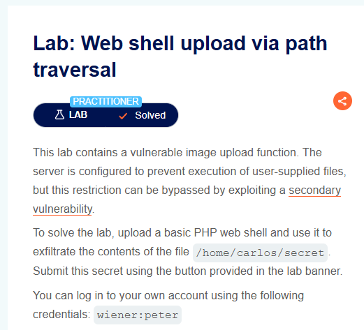

第一步，登录账户，进入Avatar上传界面。

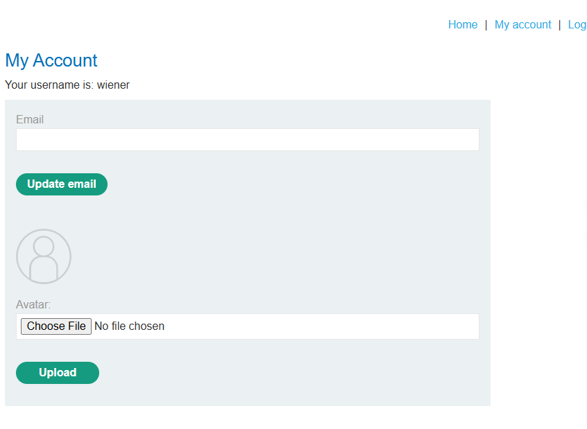

第二步，抓包上传的图片，并将filename参数值修改为'..%2fexploit.php'，这样就可以导致上传图片或者webshell进入上级目录。

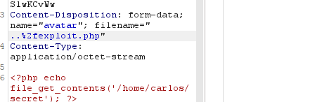

第三步，提示上传成功。在burp中找到我们上传图片的路径，或者在上传后的预览图中右键打开链接。

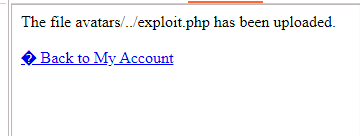

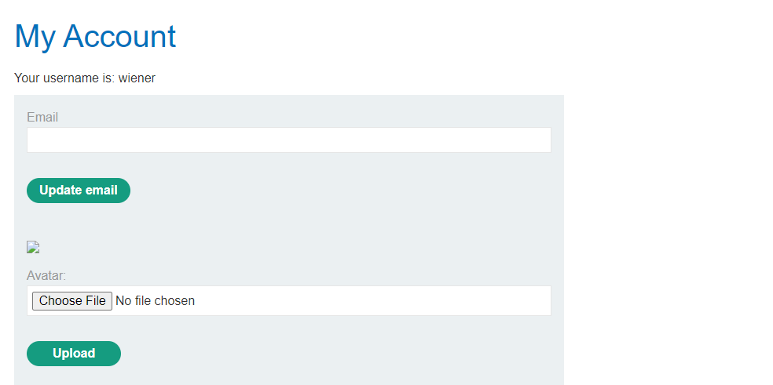

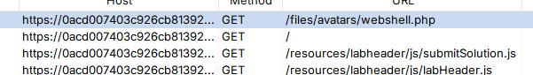

第四步，访问上传的图片，得到key并提交。

---

### 4.3 文件扩展名混淆

    扩展名混淆利用的是校验逻辑和最终解析逻辑之间的不一致。

    常见情况包括：

- **校验代码**区分大小写，但**服务器解析**不区分大小写； 

- 校验逻辑只看最后一个后缀，但服务器可能按其他规则解析；  

- 服务端保存文件时去除了**尾随点、空格或特殊字符**；  

- 校验前后** URL 解码**顺序不同；  

- 旧组件或底层函数存在**空字节截断**；  

- 过滤器只移除一次危险字符串，导致非递归替换后重新组成危险后缀。

| 类型       | 样例                 | 适用点                      |
| -------- | ------------------ | ------------------------ |
| 大小写绕过    | `shell.pHp`        | 校验区分大小写，解析不区分            |
| 双后缀      | `shell.php.jpg`    | 校验看最后后缀，解析规则存在差异         |
| 尾点绕过     | `shell.php.`       | Windows 或组件规范化时去除尾点      |
| 空格绕过     | `shell.php`        | Windows 或组件规范化时去除尾随空格    |
| URL 编码   | `shell%2Ephp`      | 校验前后解码顺序不同               |
| 双重编码     | `shell%252Ephp`    | 多层解码场景                   |
| 空字节截断    | `shell.php%00.jpg` | 老旧组件或底层函数截断              |
| 分号差异     | `shell.asp;.jpg`   | IIS 历史解析差异               |
| 非递归替换    | `shell.p.phphp`    | 删除一次 `.php` 后重新形成 `.php` |
| NTFS ADS | `shell.php::$DATA` | Windows NTFS 文件流场景       |

    这类绕过的核心不是记某个固定 payload，而是理解：

    校验阶段看到的文件名，和保存、规范化、解析阶段看到的文件名可能不是同一个语义。

    因此，测试扩展名混淆时，要特别关注服务端最终保存的文件名，以及访问路径中实际生效的文件名。

---

### 实验二：通过扩展文件绕过黑名单

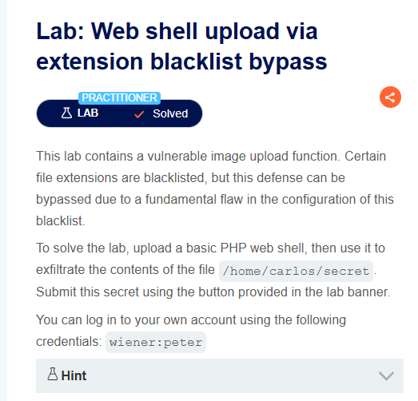

这道实验是关于黑名单绕过的，我们首先需要了解的是，黑名单一般禁止了.php等脚本文件的上传，但是并不像白名单，我们可以通过上传其他任何不在黑名单里的后缀的文件。

结合这一点，以及apache配置文件存在的一个扩展功能，通过上传`.htaccess`文件，并添加相应的扩展，就可以使得上传目录自定义的后缀名被当做脚本执行。

`AddType application/x-httpd-php .shell`

第一步，登录账户，并准备两个文件。

一个是`.htaccess`文件，内容是`AddType application/x-httpd-php .shell`。

另一个是脚本文件，名称`exploit.shell`，内容是`<?php ?>`

首先上传前者，再上传后者。

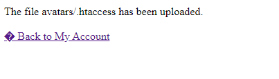

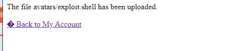

第二步，访问脚本文件，文件路径`files/avatars/exploit.shell`。得到key。

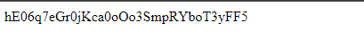

---

### 4.4 文件内容校验缺陷

    （1）更严格的服务端不会只看扩展名和 Content-Type，而是**检查文件内容**。

    例如图片上传功能可能检查**图片文件头**、**图片尺寸**、**文件尾**、**魔术字节**或**图像结构**。这种校验比单纯检查 Content-Type 更可靠，但仍然不是绝对安全。

    （2）攻击者可以构造多语言文件，使文件同时满足两种解释方式。  

    例如文件从图片解析器角度看是合法图片，但从脚本解释器角度看又包含可执行代码。

    文件内容校验的绕过通常依赖特定格式、特定解析器或特定后处理流程。它说明一个问题：即使文件“看起来像图片”，也不能让它进入可执行环境。

    （3）文件头：

- JPEG / JPG：`FF D8 FF`

- PNG：`89 50 4E 47`

- GIF：`47 49 46 38`

    （4）图片马不是“图片直接执行”，而是：

- 图片文件通过内容校验；  

- 文件内部包含脚本片段；  

- 后续被包含、解析或以脚本上下文处理；  

- 最终触发脚本执行。

`copy normal.jpg /b + shell.php /a polyglot.jpg`

    文件内容校验必须和上传目录禁止执行、隔离存储、重命名、访问控制配合使用。

---

### 实验三：使用混淆技术绕过上传webshell

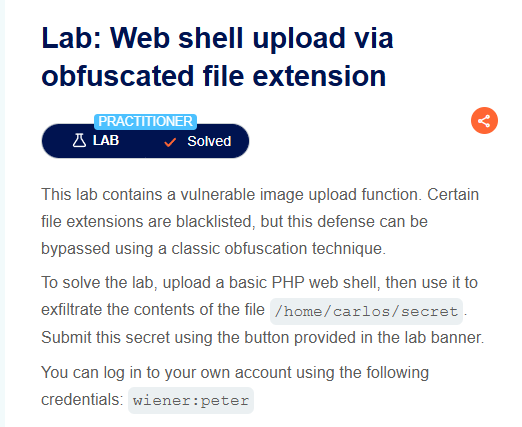

第一步，抓取上传脚本的包，并filename值改为`webshell.php%00.jpg`

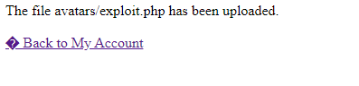

第二步，访问上传的脚本文件，得到key。

---

### 实验四：通过多种文件特征上传webshell代码执行

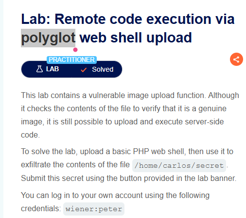

首先了解一下背景，图片上传各种后缀名被禁止，只能上传白名单文件。

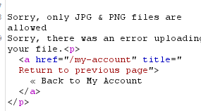

可以通过exiftool工具，修改上传的图片的属性，但是保持文件头不变，让后端以为文件是png格式从而突破限制，并在图片中添加一些特殊属性脚本代码，在服务器解析的时候，触发脚本代码。

第一步，准备一张正常的jpg或png图片，然后使用exiftool查看其属性。

```bash
exiftool marlina.jpg
```

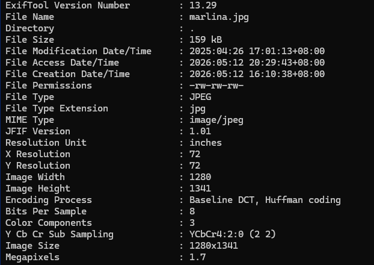

第二步，添加comment参数，再次查看属性，会发现多了一条comment。

```
exiftool -comment="test" marlina.jpg
```

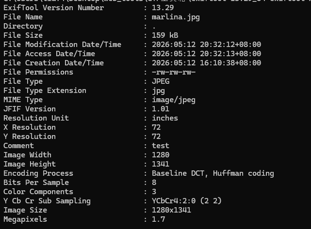

第三步，修改图片comment值为，并重命名文件为`webshell.php`

```
exiftool -comment="<?php echo 'Here is key-->' . file_get_contents('/home/carlos/secret') . '<--'; ?>" marlina.jpg -o webshell.php
```

第四步，查看生成重命名后的webshell.php，然后将其上传。可以看到，图片扩展名还是jpg，但是我们的后缀是php，上传之后就突破了限制，可以直接访问。

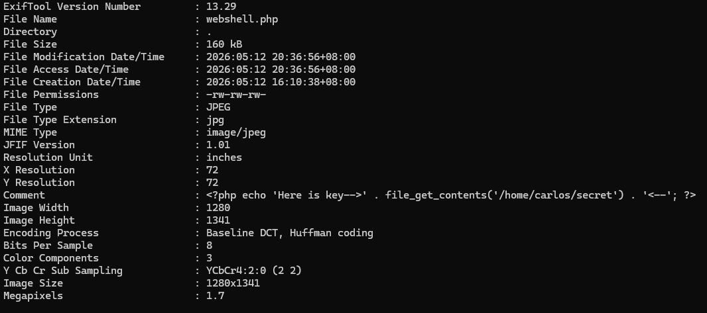

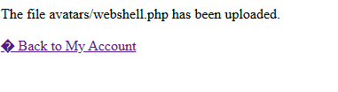

第五步，访问文件，通过payload中的关键字箭头，找到key。

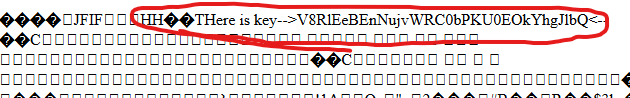

---

### 4.5 上传流程竞态条件（TOCTOU, Time-of-Check to Time-of-Use）

    **安全**的上传流程应该是：文件进入不可访问的临时区域，完成校验后再移动到正式存储位置。

    **危险**的上传流程是：

1. 文件上传到可访问目录；

2. 服务端开始检查病毒或文件类型；

3. 检查失败后删除文件；

4. 攻击者在删除前并发访问文件。

    这种流程会产生短暂的攻击窗口。攻击者可以**在文件被删除前访问它，尝试触发执行**。

    竞态型文件上传漏洞通常比较隐蔽，因为它依赖极短时间窗口和并发请求。 它的核心问题不是校验规则弱，而是**校验顺序错误**。

---

### 实验五：通过条件竞争上传Webshell

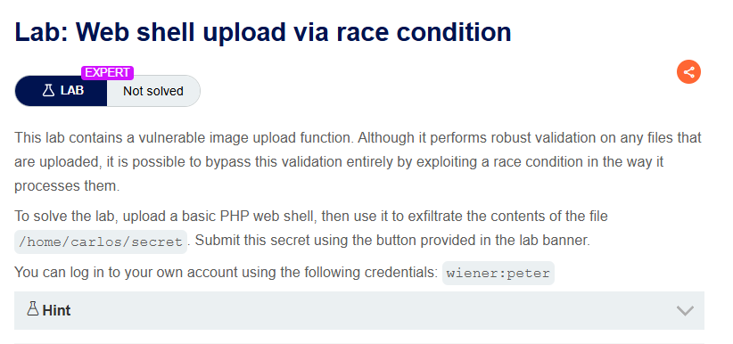

```php
<?php
$target_dir = "avatars/";
$target_file = $target_dir . $_FILES["avatar"]["name"];

// temporary move
move_uploaded_file($_FILES["avatar"]["tmp_name"], $target_file);

if (checkViruses($target_file) && checkFileType($target_file)) {
    echo "The file ". htmlspecialchars( $target_file). " has been uploaded.";
} else {
    unlink($target_file);
    echo "Sorry, there was an error uploading your file.";
    http_response_code(403);
}

function checkViruses($fileName) {
    // checking for viruses
    ...
}

function checkFileType($fileName) {
    $imageFileType = strtolower(pathinfo($fileName,PATHINFO_EXTENSION));
    if($imageFileType != "jpg" && $imageFileType != "png") {
        echo "Sorry, only JPG & PNG files are allowed\n";
        return false;
    } else {
        return true;
    }
}
?>
```

进行简单的代码审计，move_uploaded_file函数在检查病毒文件之前就已经执行了，而这两个检查函数会消耗相对较长的时间，可以利用这个时间差，用并发进程访问上传好的，还没有经过删除的文件，访问代码即执行。

第一步，登录账号，上传一个正常的图片然后拿到上传文件路径`/files/avatars/xxx.jpg`，再抓到上传脚本`exploit.php`的包，发送给Repeater，并把浏览器中访问上传图片的路径GET包改为我们上传脚本的名称，如图。

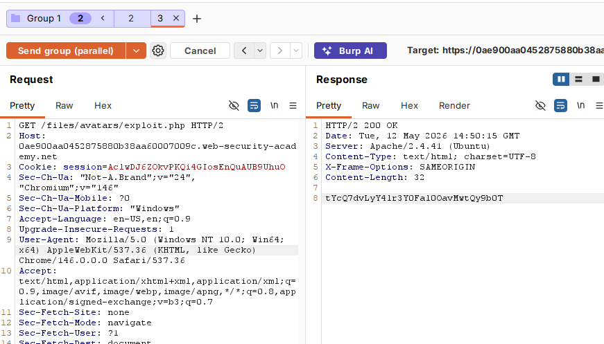

第二步，使用burp的group功能的parallel，同时发送这两个数据包，之后得到key。提一点，我们脚本的内容是`<?php system('cat /home/carlos/secret'); ?>`

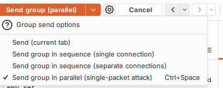

---

### 4.6 PUT 方法上传风险

    文件上传入口不一定只存在于业务表单。  

    如果 Web 服务器配置允许 `PUT` 方法，攻击者可能直接向目标路径写入文件。

    这类问题本质上属于 HTTP 方法和服务器权限配置错误。

    风险成立需要继续判断：

- 目标路径是否允许 PUT；  

- PUT 是否需要认证；  

- 写入后的文件是否可访问；  

- 写入后的文件是否会被解析或执行。

    如果 PUT 可以写入 Web 可访问目录，并且该目录支持脚本执行，就可能形成和普通文件上传类似的 RCE 风险。

---

## 5. 非 RCE 风险

    文件上传漏洞不一定要形成 WebShell 才有价值。很多情况下，上传文件不会被服务端执行，但仍然可能造成安全问题。

### 5.1 客户端脚本执行

    如果应用允许上传 HTML 或 SVG 文件，并且这些文件会被浏览器直接渲染，就可能造成**存储型 XSS**。

这种风险依赖几个条件：

- 上传文件能被其他用户访问；  

- 浏览器会渲染该文件而不是下载；  

- 文件与目标站点处于同源上下文；  

- 响应头没有正确限制内容执行。

**SVG** 尤其需要注意，因为它既是图像格式，又可能包含脚本或外部资源引用。

HTML文件：

`<script>alert(document.domain)</script>`

SVG文件：

`<svg onload=alert(document.domain)>`

### 5.2 文件覆盖和业务破坏

    如果服务端使用用户原始文件名保存文件，攻击者可能上传同名文件覆盖已有资源。

    在某些场景中，覆盖配置文件、静态资源、模板文件或用户文件，可能造成业务异常、页面篡改或进一步攻击。

    即使不能执行代码，文件覆盖仍然属于安全风险。

### 5.3 解析器与后处理风险

    上传文件后，服务端可能会进行图片压缩、文档预览、格式转换、压缩包解压、病毒扫描或内容提取。这些后处理流程会引入新的攻击面。

例如：

- XML 或 Office 文档可能触发 XXE；  

- 压缩包可能触发 Zip Slip 路径穿越；  

- 图片文件可能触发图像库解析漏洞；  

- PDF 或文档预览组件可能存在历史漏洞；  

- 超大文件或复杂格式可能造成资源消耗型 DoS。

因此，文件上传安全不仅发生在上传瞬间，也发生在后续处理链路中。

---

## 6. 防护原则

文件上传防护**不能依赖单个检查点，而应采用纵深防御**。

**核心原则**是：

- 不信任用户提供的文件名；  

- 不信任用户提供的 Content-Type；  

- 不信任用户提供的扩展名；  

- 不让上传文件进入可执行环境；  

- 不让用户控制最终保存路径；  

- 不让未校验文件被外部访问。

### （1）使用白名单

服务端应使用**扩展名白名单**，而不是危险后缀黑名单，只允许业务需要的文件类型。  

例如头像上传只允许 jpg、png、gif，而不是“禁止 php、jsp、asp”。

白名单还应结合真实文件内容校验，不能只检查扩展名。

### （2）服务端重命名

上传文件应由服务端生成随机文件名。  

用户原始文件名可以作为展示信息保存，但**不应**作为最终存储文件名。

这样可以降低文件覆盖、路径穿越、解析差异和特殊文件名攻击的风险。

### （3）隔离存储

上传文件应尽量存储在 Web 根目录之外，或使用对象存储。  

外部访问应通过受控接口完成，而不是直接暴露文件系统路径。

如果必须放在 Web 可访问目录，也必须确保该目录禁止脚本执行。

### （4）禁止上传目录执行脚本

这是防止文件上传升级为 RCE 的关键防线。

即使攻击者绕过类型校验上传了脚本文件，只要上传目录不会执行脚本，风险就会明显下降。在工程实践中，应确保 Web 服务器不会把上传目录中的文件转发给 PHP-FPM、JSP 容器或其他脚本解释器。

### （5）校验真实内容

服务端应校验文件内容和结构，而不是只看 Content-Type。

对于图片，可以检查文件头、文件结构、尺寸，并进行安全重编码，去除危险元数据。对于文档和压缩包，应限制复杂格式处理，并在隔离环境中解析。

### （6）校验流程顺序安全

文件在完成校验前，不应放入外部可访问目录。  

正确流程应该是：

-> 文件先进入不可访问临时目录；  

-> 完成扩展名、大小、内容、结构和安全扫描；  

-> 生成安全文件名；  

-> 移动到非执行存储位置；  

-> 通过受控接口访问。

这样可以避免**竞态条件**。

### （7）限制大小和权限

必须限制文件大小、数量、上传频率和用户权限。

否则攻击者可能通过上传大量文件或超大文件造成磁盘耗尽、资源消耗或拒绝服务。

### （8）日志与审计

上传行为应记录日志，包括用户、时间、文件名、文件大小、文件类型、保存位置和访问记录。

这些日志对于安全审计、溯源和异常检测很重要。

## 附录：上传请求格式扰动

- `Content-Disposition` 字段大小写变化；
- `filename` 引号变化；
- `filename` 重复；
- `name` 和 `filename` 顺序变化；
- multipart 中插入无关字段；
- 文件名中插入换行或分隔符。
