# 05S-路径遍历漏洞

## 1. 漏洞本质

路径遍历漏洞，也称目录遍历漏洞。该漏洞的本质是：**应用将用户可控输入作为文件路径的一部分，并把拼接后的路径交给文件系统API处理，导致最终解析路径逃逸出预期目录边界。**

在正常业务中，服务端可能只希望读取固定目录下的图片、附件、模板、日志或导出文件。例如图片接口只应读取：

```
/var/www/images/218.png
```

但如果接口直接使用用户传入的文件名：

```
GET /loadImage?filename=218.png
```

后端逻辑可能变成：

```
/var/www/images/ + filename
```

当 `filename` 可控时，攻击者可以通过父目录跳转序列影响最终路径解析结果，使文件系统访问目录外的资源。

CWE-22 对这类问题的描述是：**软件本意是在受限目录内访问文件，但特殊路径元素可能使路径解析逃逸到目录外部**。

举例：

```
GET /loadImage?filename=../../../etc/passwd

服务端拼接后得到：
/var/www/images/../../../etc/passwd

文件系统解析 ../ 后，最终访问的并不是图片目录，而是：
/etc/passwd
```

路径遍历的关键不在于某个固定 payload，而在于：**用户输入影响了文件路径语义，应用没有在最终解析路径层面确认访问边界**。

---

#### 2. 风险成立条件

路径遍历风险通常依赖三个条件。

第一，用户输入能够影响文件路径。输入位置可以是**查询参数、URL 路径片段、下载接口参数、模板名、语言包名、日志文件名、导出文件名**，也可以是 `multipart/form-data` 中的 `filename` 字段。

第二，后端确实把该输入用于**文件系统操作**。仅在**前端**展示文件名**不构成**路径遍历；风险发生在**服务端**执行**读取、写入、删除、移动、包含、解压、渲染**等操作时。

第三，服务端没有校验**最终解析路径是否仍位于允许目录内**。**只过滤 `../`、只检查字符串前缀、只检查扩展名、只替换一次危险序列**，通常都不是稳定边界。

风险成立链路可以概括为：

```
用户输入 → 拼接文件路径 → 解码/规范化 → 文件系统解析 → 访问目录外资源
```

只要应用在这条链路中把“原始字符串安全”误认为“最终访问路径安全”，路径遍历就可能成立。 

---

## 3. 路径解析机制

路径遍历依赖的是文件系统路径解析语义，而不是 Web 参数本身。

`../` 表示返回上一级目录。多个 `../` 可以连续回退目录层级，直到到达更高层目录。类 Unix 系统通常使用 `/` 作为路径分隔符；Windows 中既可能接受 `\`，也可能在部分 Web 框架或运行时中兼容 `/`。OWASP 社区文档也将路径遍历描述为通过 `../` 及其变体或绝对路径访问 Web 根目录之外的文件。

理解样例：

```
基础目录：
/var/www/images/

用户输入：
../../../etc/passwd

拼接后：
/var/www/images/../../../etc/passwd

规范化后：
/etc/passwd
```

Windows 场景中的理解样例：

```
..\..\..\windows\win.ini
```

该样例只说明 Windows 路径分隔符差异，不代表所有 Windows Web 应用都一定可读该文件。实际是否成功取决于运行用户权限、路径处理方式、框架限制和部署环境。

路径遍历判断不能只看输入中是否包含危险字符。更准确的判断应关注：

```
原始输入是什么
↓
应用是否解码
↓
是否拼接基础目录
↓
是否进行路径规范化
↓
是否解析符号链接
↓
最终路径是否仍在允许目录内
```

其中“最终路径”才是安全判断对象。原始字符串通过了检查，不代表文件系统最终访问位置安全。

---

## 4. 常见成因与高风险入口

路径遍历最常见的成因是开发者把“文件名”误当作普通字符串处理，而忽略了文件路径中的特殊语义。文件名一旦可以携带**路径分隔符、父目录跳转、绝对路径、编码变体或特殊设备名**，就不再只是业务参数。

常见**高风险入口**包括：

| 场景          | 典型风险               |
| ----------- | ------------------ |
| 图片加载接口      | 读取图片目录外的系统文件、配置文件  |
| 文件下载接口      | 越权下载其他用户文件或服务器敏感文件 |
| 日志查看接口      | 读取任意日志、配置、源码       |
| 模板/主题/语言包加载 | 文件包含、模板渲染链路扩大影响    |
| 文件导出/保存     | 任意路径写入、覆盖文件        |
| 压缩包解压       | Zip Slip 类路径逃逸写入   |
| 上传文件名处理     | 利用原始文件名影响保存路径      |

常见实现错误包括：

| 错误做法          | 问题              |
| ------------- | --------------- |
| 直接拼接基础目录和用户输入 | 用户输入可以改变路径结构    |
| 黑名单过滤 `../`   | 编码、嵌套、分隔符变体容易绕过 |
| 只检查路径前缀       | 规范化后可能逃逸目录      |
| 只检查扩展名        | 扩展名不等于最终路径安全    |
| 允许用户传完整路径     | 业务边界直接暴露给调用方    |
| Web 进程权限过大    | 漏洞影响扩大到系统敏感文件   |

OWASP WSTG 将**目录遍历和文件包含**放在授权测试相关内容中讨论，因为攻击者可能借此读取本不应访问的目录或文件，甚至访问 Web 根目录之外的数据。

---

## 5. 核心绕过与 Lab 对应

路径遍历绕过的核心不是“payload 多”，而是**应用校验逻辑与最终路径解析逻辑不一致**。下面按机制归类，不按 Lab 顺序堆叠。

### 5.1 绝对路径绕过

如果应用只拦截 `../`，但允许用户直接传入绝对路径，攻击者可能不需要目录回退序列就能访问目录外文件。

理解样例：

```
GET /loadImage?filename=/etc/passwd
```

适用条件：

```
应用过滤或拦截了 ../
但没有限制输入必须是安全文件名
并且后端会接受绝对路径作为有效文件路径
```

#### 实验一：绝对路径绕过

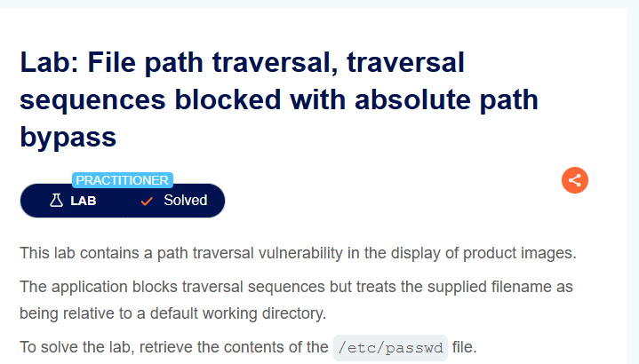

第一步，访问图片渲染路径。


第二步，把filename参数更改为`/etc/passwd`，回显成功。

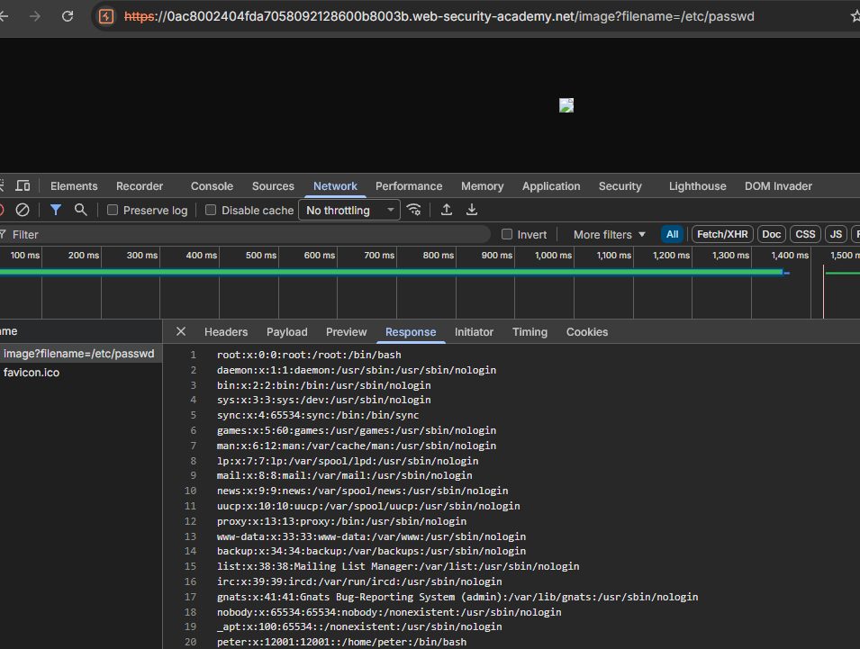

该 Lab 适合插在“绝对路径绕过”处，用来说明：**只拦截遍历序列不能替代路径边界校验**。

### 5.2 非递归过滤绕过

部分应用会删除输入中的 `../`，但只处理一次。如果过滤逻辑不是递归执行，嵌套构造可能在一次清理后重新形成有效遍历序列。

理解样例：

```
....//
```

如果应用只删除中间的 `../`，剩余内容可能重新组合成：

```
../
```

适用条件：

```
应用使用字符串替换清理危险序列
过滤只执行一次
清理后没有重新检查结果
```

#### 实验二：绕过非递归的过滤

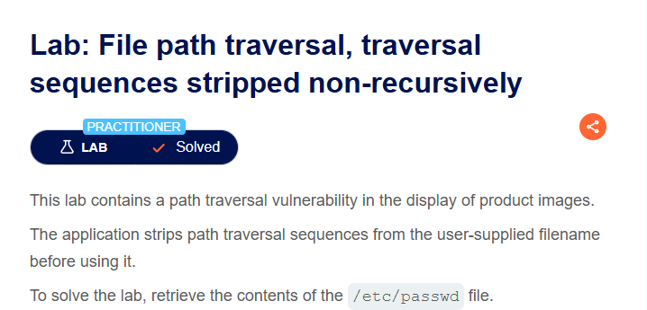

此处对只会对每一个../进行过滤并取出一次，可以通过构造....//来绕过。

原始payload:

```
../../../etc/passwd
```

优化之后的payload：

```
....//....//....//etc/passwd
```

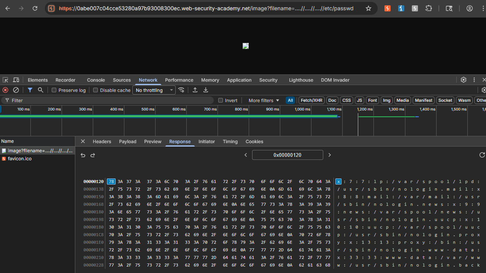

这个 Lab 说明的是过滤逻辑缺陷，不是某个固定字符串的万能性。实际环境中能否成立，取决于过滤规则、替换顺序和路径规范化行为。

### 5.3 编码与解码顺序绕过

Web 请求中的路径参数通常会经历 URL 解码、框架解析、应用层处理等多个阶段。如果校验发生在一次解码之前，而文件操作前又发生了额外解码，就可能出现“校验时安全，使用时危险”的差异。

理解样例：

```
../        → %2e%2e%2f
%2e%2e%2f → %252e%252e%252f
```

适用条件：

```
拦截层或校验层看到的是编码后的字符串
后续业务逻辑或框架再次 URL 解码
最终进入文件系统 API 时恢复为 ../
```

#### 实验三：双重URL编码绕过

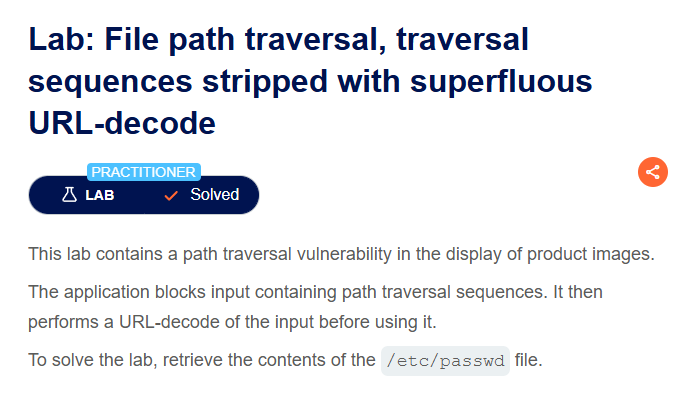

该lab会对一次url编码的结果进行过滤，因此需要双重URL编码，后端才能成功解析../

将../进行url双重编码：

```
../
..%2f
..%252f
```

使用payload

```
..%252f..%252f..%252fetc/passwd
```

回显成功

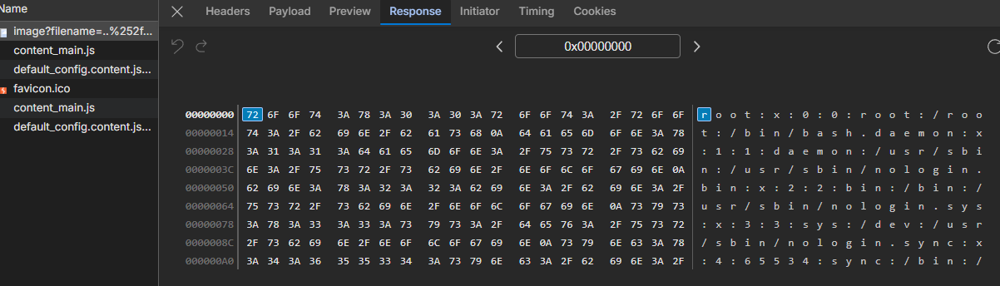

该类问题的重点是处理顺序。不是所有双重编码都会绕过，只有当服务端存在**多阶段解码或校验顺序错误时才有意义。**PortSwigger 的路径遍历学习路径也将常见利用障碍与绕过作为单独内容处理。

### 5.4 路径前缀校验绕过

有些应用允许用户传入完整路径，并检查路径是否以指定基础目录开头。例如要求路径必须以：

```
/var/www/images/
```

开头。

看似安全的输入：

```
/var/www/images/../../../etc/passwd
```

在字符串层面确实以 `/var/www/images/` 开头，但规范化后可能变成：

```
/etc/passwd
```

适用条件：

```
应用检查的是原始路径字符串前缀
没有对路径规范化后的结果做边界确认
```

#### 实验四：绕过完整路径检查

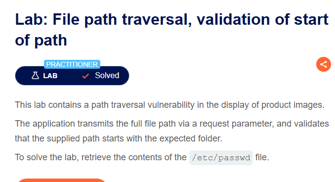

必须在规范化路径前缀之后，再进行路径校验。

第一步，可见图片完整路径

```
/var/www/images/48.jpg
```

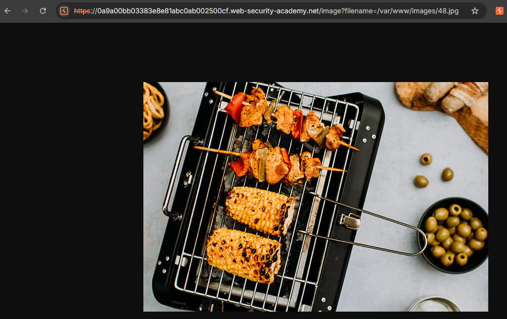

第二步，通过../来穿越到顶级目录，读取/etc/passwd文件。

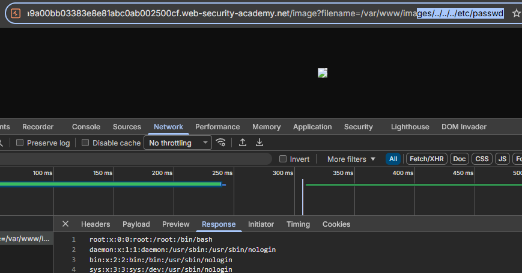

这个 Lab 适合说明：**路径前缀校验必须发生在规范化之后，而不是原始字符串阶段**。

### 5.5 扩展名校验与空字节截断

部分应用要求文件名必须以 `.png`、`.jpg` 等扩展名结尾。这类校验只能证明字符串形式符合预期，不能证明最终访问路径安全。

理解样例：

```
../../../etc/passwd%00.png
```

这里的 `%00` 表示空字节截断思路：上层校验看到字符串以 `.png` 结尾，但底层文件 API 在特定旧组件或特定语言绑定中可能在空字节处截断，使最终访问目标变成前半段路径。

适用条件：

```
存在扩展名后缀校验
底层组件或运行时存在空字节截断行为
校验层与文件 API 对字符串结束位置理解不一致
```

#### 实验五：空字节绕过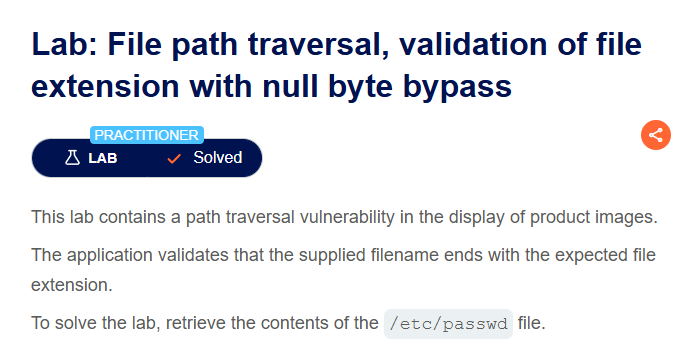

使用%00绕过文件路径的校验。

```
../../../etc/passwd.png
```

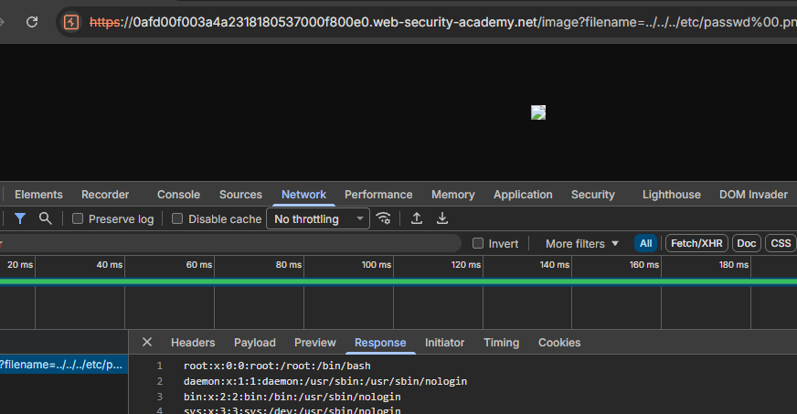

边界说明：空字节截断不是现代 Web 应用中的通用绕过方式。许多现代语言、框架和文件 API 会拒绝包含空字节的路径或直接报错。这里应将其作为“校验层与底层解析差异”的理解样例，而不是默认可用技巧。

---

## 6. 典型风险与影响升级

路径遍历最直接的影响是任意文件读取。常见目标包括：

```
应用源码
配置文件
数据库连接信息
密钥文件
环境变量文件
日志文件
备份文件
系统账户信息
```

PortSwigger 的漏洞知识库也指出，路径遍历可能导致敏感配置、密钥、密码、源码和其他高权限数据泄露，严重时可进一步导致服务器被控制。

路径遍历本身通常不等于 RCE，但它经常作为攻击链的前置能力。读取源码后，攻击者可能发现隐藏接口、硬编码密钥、调试开关、数据库凭据、反序列化入口或其他漏洞点。

如果路径遍历发生在写入型功能中，影响会明显扩大。例如：

```
导出文件路径可控 → 覆盖敏感文件
日志路径可控 → 写入恶意内容
上传保存路径可控 → 写入 Web 可访问目录
解压路径未校验 → 目录逃逸覆盖文件
```

如果路径遍历与文件包含结合，风险也会升级。单纯读取文件通常属于信息泄露；如果用户可控路径进入 `include`、`require`、模板渲染、插件加载等执行型逻辑，就可能发展为 LFI、RFI、模板执行或代码执行链条。

需要注意的是，能否读取敏感文件取决于运行用户权限。即使路径遍历成立，如果 Web 进程没有权限读取目标文件，利用也可能失败。因此权限隔离是降低影响面的关键。

 ---

## 7. 防护原则

最稳的防护方式是：**不要让用户直接控制真实文件路径**。

业务接口应优先传递资源 ID，而不是磁盘路径：

```
GET /download?id=123
```

后端根据 ID 查询数据库记录，再映射到内部文件路径。这样用户无法直接构造文件系统语义。

如果业务必须接收文件名，应使用允许列表或严格映射。例如只允许访问数据库中存在的文件记录，只允许固定文件名集合，或只允许 UUID 化后的文件名。不要依赖黑名单过滤危险字符，因为路径分隔符、编码方式、平台差异和解析顺序都可能带来绕过。

必须处理用户输入路径时，应采用以下顺序：

```
输入校验
↓
拼接基础目录
↓
使用平台 API 规范化路径
↓
确认规范化后的最终路径仍在基础目录内
↓
执行文件操作
```

PortSwigger 对路径遍历防护的建议也是：先验证用户输入，理想情况下与允许值白名单比较；随后将输入追加到基础目录，使用平台文件系统 API 规范化路径，并确认规范化后的路径仍以预期基础目录开头。

防护重点可以压缩为：

| 防护点        | 作用             |
| ---------- | -------------- |
| 使用资源 ID 映射 | 避免用户直接控制路径     |
| 文件名允许列表    | 限制输入表达能力       |
| 路径规范化      | 消除 `../` 等路径语义 |
| 校验最终路径边界   | 确认访问仍在基础目录内    |
| 最小权限运行     | 降低漏洞影响面        |
| 上传/执行目录隔离  | 避免读写类问题升级为代码执行 |

示意代码逻辑：

```java
File file = new File(BASE_DIRECTORY, userInput);
String canonicalPath = file.getCanonicalPath();

if (!canonicalPath.startsWith(BASE_DIRECTORY)) {
    throw new SecurityException("Invalid file path");
}
```

这个示例只表达防护思路。实际工程中还要注意基础目录自身也应使用规范化后的绝对路径，并处理路径分隔符、大小写敏感性、符号链接、尾随分隔符等细节。
